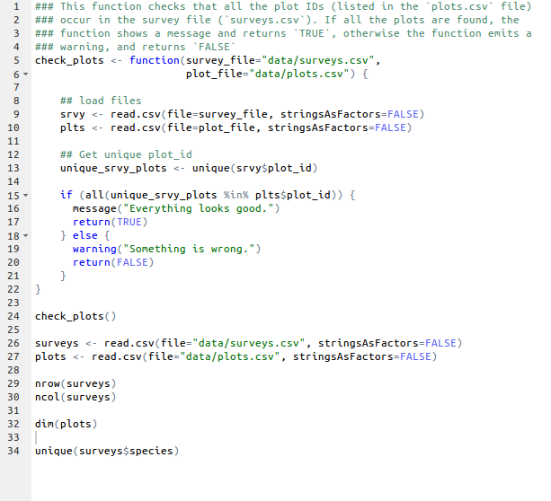

```{r, echo=FALSE, purl=FALSE}
knitr::opts_chunk$set(results='hide', fig.path='img/r-lesson-')
```

------------

> ## Learning Objectives
>
> After completing this module, the learner should be able to:
>
> * Describe the purpose of the RStudio script, console, environment, and plot windows.
> * Organize files and directories for a set of analysis in an R Project.
> * Define the following terms as they relate to R: script, function, working directory, assign, object, variable.
> * Assign values to variables.
> * Call functions with zero or more named or unnamed arguments.
> * Use the built-in RStudio help interface to search for more information on R
>   functions.
> * Demonstrate how to provide sufficient information for troubleshooting with the R user community.

------------

# Before we get started

It is good practice to keep a set of related data, analyses, and text
self-contained in a single folder, called the **working directory**. All of the
scripts within this folder can then use *relative paths* to files that indicate
where inside the project a file is located (as opposed to absolute paths, which
point to where a file is on a specific computer). Working this way makes it
a lot easier to move your project around on your computer and share it with
others without worrying about whether or not the underlying scripts will still
work.

RStudio provides a helpful set of tools to do this through its "Projects"
interface, which not only creates a working directory for you but also
remembers its location (allowing you to quickly navigate to it) and optionally
preserves custom settings and open files to make it easier to resume work after
a break. Below, we will go through the steps for creating an RProject for this
tutorial.

* Start RStudio (presentation of RStudio -below- should happen here)
* Under the `File` menu, click on `New project`, choose `New directory`, then
  `Empty project`
* Enter a name for this new folder (or "directory", in computer science), and
  choose a convenient location for it. This will be your **working directory**
  for the rest of the day (e.g., `~/data-carpentry`)
* Click on "Create project"
* Under the `Files` tab on the right of the screen, click on `New Folder` and
  create a folder named `data` within your newly created working directory. (e.g., `~/data-carpentry/data`)
* Create a new R script (File > New File > R script) and save it in your working
  directory (e.g. `data-carpentry-script.R`)

Your working directory should now look like this:


## Organizing your working directory

Using a consistent folder structure across your projects will
help keep things organized, and will also make it easy find/file things in the
future. This can be especially helpful when you have multiple projects. In
general, you may create directories (folders) for **scripts**, **data**, and
**documents**.

 - **`data/`** Use this folder to store your raw data and intermediate
   datasets you may create for the need of a particular analysis. For the sake
   of transparency and [provenance](https://en.wikipedia.org/wiki/Provenance),
   you should *always* keep a copy of your raw data accessible and do as much
   of your data cleanup and preprocessing programmatically (i.e. with scripts,
   rather than manually) as possible. Separating raw data from processed data
   is also a good idea. For example, you could have files
   `data/raw/tree_survey.plot1.txt` and `...plot2.txt` kept separate from
   a `data/processed/tree.survey.csv` file generated by the
   `scripts/01.preprocess.tree_survey.R` script.
 - **`documents/`** This would be a place to keep outlines, drafts, and other text.
 - **`scripts/`** This would be the location to keep your R scripts for
   different analyses or plotting, and potentially a separate folder for your
   functions (more on that later).

You may want additional directories or subdirectories depending on your project
needs, but these should form the backbone of your working directory. For this
workshop, you only need a `data/` folder.


# Presentation of RStudio

Let's start by learning about [RStudio](https://www.rstudio.com/), the Integrated Development Environment (IDE).

The RStudio IDE open source product is free under the [Affero General Public License (AGPL) v3](https://www.gnu.org/licenses/agpl-3.0.en.html). RStudio IDE is also available with a commercial license and priority email support from RStudio, Inc.

We will use RStudio IDE to write code, navigate the files found on our computer, inspect the variables we are going to create, and visualize the plots we will generate. RStudio can also be used for other things (e.g., version control, developing packages, writting Shiny apps) that we will not cover during the workshop.

RStudio is divided into 4 "Panes": the editor for your scripts and documents
(top-left, in the default layout), the R console (bottom-left), your
environment/history (top-right), and your files/plots/packages/help/viewer
(bottom-right). The placement of these panes and their content can be customized
(see menu, RStudio -> Preferences -> Pane Layout). One of the advantages of
using RStudio is that all the information you need to write code is available in
a single window. Additionally, with many shortcuts, autocompletion, and
highlighting for the major file types you use while developing in R, RStudio
will make typing easier and less error-prone.


# Interacting with R

The basis of programming is that we write down instructions for the computer to
follow, and then we tell the computer to follow those instructions. We write, or
*code*, instructions in R because it is a common language that both the computer
and we can understand. We call the instructions *commands* and we tell the
computer to follow the instructions by *executing* (also called *running*) those
commands.

There are two main ways of interacting with R: using the console or by using
script files (plain text files that contain your code). We want our code and
workflow to be reproducible. In other words, we want to write code in a way that
anyone can easily replicate our results on their computer.

The console pane (in RStudio, the bottom left panel) is the place where R is
waiting for you to tell it what to do, and where it will show the results of a
command that has been executed.  You can type commands directly into the console
and press `Enter` to execute those commands, but they will be forgotten when you
close the session. It is better to enter the commands in the script editor, and
save the script. This way, you have a complete record of what you did, you can
easily show others how you did it and you can do it again later on if needed.
RStudio allows you to execute commands directly from the script editor by using
the <kbd>`Ctrl`</kbd> + <kbd>`Enter`</kbd> shortcut. The command on the current
line in the script or all of the commands in the currently selected text will be
sent to the console and executed when you press <kbd>`Ctrl`</kbd> +
<kbd>`Enter`</kbd>.

At some point in your analysis you may want to check the content of a variable or
the structure of an object, without necessarily keeping a record of it in your
script. You can type these commands and execute them directly in the console.
RStudio provides the <kbd>`Ctrl`</kbd> + <kbd>`1`</kbd> and <kbd>`Ctrl`</kbd> +
<kbd>`2`</kbd> shortcuts allow you to jump between the script and the console
windows.

If R is ready to accept commands, the R console shows a `>` prompt. If it
receives a command (by typing, copy-pasting or sent from the script editor using
<kbd>`Ctrl`</kbd> + <kbd>`Enter`</kbd>), R will try to execute it, and when
ready, will show the results and come back with a new `>`-prompt to wait for new
commands.

If R is still waiting for you to enter more data because it isn't complete yet,
the console will show a `+` prompt. It means that you haven't finished entering
a complete command. This is because you have not 'closed' a parenthesis or
quotation, i.e. you don't have the same number of left-parentheses as
right-parentheses, or the same number of opening and closing quotation marks. If
you're in RStudio and this happens, click inside the console window and press
`Esc`; this will cancel the incomplete command and return you to the `>` prompt.

# Basics of R

R is a versatile, open source programming/scripting language inspired by the
programming language S, which is useful both for statistics and data science.

* Free/Libre/Open Source Software under the [GPL version 2](https://www.gnu.org/licenses/old-licenses/gpl-2.0.html).
* Superior (if not just comparable) to commercial alternatives. R has over 7,000
  user contributed packages at this time. It's widely used both in academia and
  industry.
* Available on all platforms.
* Not just for statistics, but also general purpose programming.
* For people who have experience in programmming: R is both an object-oriented
  and a so-called [functional language](http://adv-r.had.co.nz/Functional-programming.html).
* Large and growing community of peers.

## The R syntax

_Start by showing an example of a script_

* Point to the different parts:
    + a function
    + the assignment operator `<-`
    + the `=` for arguments
    + the comments `#` and how they are used to document function and its content
    + the `$` operator
* Point to indentation and consistency in spacing to improve clarity



### Commenting

Use `#` signs to comment. Anything to the right of a `#` is ignored by R,
meaning it won't be executed. Comments are a great way to describe what your
code does within the code itself, so comment liberally in your R scripts.

### Assignment operator

`<-` is the assignment operator. It assigns values on the right to objects on
the left. So, after executing `x <- 3`, the value of `x` is `3`. The arrow can
be read as 3 **goes into** `x`.  For historical reasons, you can also use `=` for assignments,
but not in every context. Because of the [slight](http://blog.revolutionanalytics.com/2008/12/use-equals-or-arrow-for-assignment.html) [differences](https://web.archive.org/web/20130610005305/https://stat.ethz.ch/pipermail/r-help/2009-March/191462.html) in syntax,
it is good practice to use always `<-` for assignments, except when specifying the values of
arguments in functions, when only `=` should be used, see below.

In RStudio, typing <kbd>Alt</kbd> + <kbd>-</kbd> (push <kbd>Alt</kbd> at the
same time as the <kbd>-</kbd> key) will write ` <- ` in a single keystroke.

### Functions and their arguments

Functions are "canned scripts" that automate something complicated or convenient
or both.  Many functions are predefined, or can be made available by importing R
*packages* (more on that later). A function usually gets one or more inputs
called *arguments*. Functions often (but not always) return a *value*. A typical
example would be the function `sqrt()`. The input (the argument) must be a
number, and the return value (in fact, the output) is the square root of that
number. Executing a function ('running it') is called *calling* the function. An
example of a function call is:

`b <- sqrt(a)`

Here, the value of `a` is given to the `sqrt()` function, the `sqrt()` function
calculates the square root, and returns the value which is then assigned to
variable `b`. This function is very simple, because it takes just one argument.

The return 'value' of a function need not be numerical (like that of `sqrt()`),
and it also does not need to be a single item: it can be a set of things, or
even a data set. We'll see that when we read data files into R.

Arguments can be anything, not only numbers or filenames, but also other
objects. Exactly what each argument means differs per function, and must be
looked up in the documentation (see below). Some functions take arguments which
may either be specified by the user, or if left out, take on a *default* value:
these are called *options*. Options are typically used to alter the way the
function operates, such as whether it ignores 'bad values', or what symbol to
use in a plot.  However, if you want something specific, you can specify a value
of your choice which will be used instead of the default.

Let's try a function that can take multiple arguments: `round()`.

```{r, results='show', purl=FALSE}
round(3.14159)
```

Here, we've called `round()` with just one argument, `3.14159`, and it has
returned the value `3`.  That's because the default is to round to the nearest
whole number. If we want more digits we can see how to do that by getting
information about the `round` function.  We can use `args(round)` or look at the
help for this function using `?round`.

```{r, results='show', purl=FALSE}
args(round)
```

```{r, eval=FALSE, purl=FALSE}
?round
```

We see that if we want a different number of digits, we can
type `digits=2` or however many we want.

```{r, results='show', purl=FALSE}
round(3.14159, digits=2)
```

If you provide the arguments in the exact same order as they are defined you
don't have to name them:

```{r, results='show', purl=FALSE}
round(3.14159, 2)
```

And if you do name the arguments, you can switch their order:

```{r, results='show', purl=FALSE}
round(digits=2, x=3.14159)
```

It's good practice to put the non-optional arguments (like the number you're
rounding) first in your function call, and to specify the names of all optional
arguments.  If you don't, someone reading your code might have to look up the
definition of a function with unfamiliar arguments to understand what you're
doing.


# Seeking help

## I know the name of the function I want to use, but I'm not sure how to use it

If you need help with a specific function, let's say `barplot()`, you can type:

```{r, eval=FALSE, purl=FALSE}
?barplot
```

If you just need to remind yourself of the names of the arguments, you can use:

```{r, eval=FALSE, purl=FALSE}
args(lm)
```

## I want to use a function that does X, there must be a function for it but I don't know which one...

If you are looking for a function to do a particular task, you can use
`help.search()` function, which is called by the double question mark `??`.
However, this only looks through the installed packages for help pages with a
match to your search request

```{r, eval=FALSE, purl=FALSE}
??kruskal
```

If you can't find what you are looking for, you can use the
[rdocumention.org](http://www.rdocumentation.org) website that searches through
the help files across all packages available.

Finally, a generic Google or internet search "R \<task\>" will often either send you to the appropriate package documentation or a helpful forum question that someone else already asked.

## I am stuck... I get an error message that I don't understand

Start by googling the error message. However, this doesn't always work very well
because often, package developers rely on the error catching provided by R. You
end up with general error messages that might not be very helpful to diagnose a
problem (e.g. "subscript out of bounds"). If the message is very generic, you might
also include the name of the function or package you're using in your query.

However, you should check Stack Overflow. Search using the `[r]` tag. Most
questions have already been answered, but the challenge is to use the right
words in the search to find the answers:
[http://stackoverflow.com/questions/tagged/r](http://stackoverflow.com/questions/tagged/r)

The [Introduction to R](http://cran.r-project.org/doc/manuals/R-intro.pdf) can
also be dense for people with little programming experience but it is a good
place to understand the underpinnings of the R language.

The [R FAQ](http://cran.r-project.org/doc/FAQ/R-FAQ.html) is dense and technical
but it is full of useful information.

## Asking for help

The key to get help from someone is for them to grasp your problem rapidly. You
should make it as easy as possible to pinpoint where the issue might be.

Try to use the correct words to describe your problem. For instance, a package
is not the same thing as a library. Most people will understand what you meant,
but others have really strong feelings about the difference in meaning. The key
point is that it can make things confusing for people trying to help you. Be as
precise as possible when describing your problem.

If possible, try to reduce what doesn't work to a simple *reproducible
example*. If you can reproduce the problem using a very small `data.frame`
instead of your 50,000 rows and 10,000 columns one, provide the small one with
the description of your problem. When appropriate, try to generalize what you
are doing so even people who are not in your field can understand the
question. For instance instead of using a subset of your real dataset, create a
small (3 columns, 5 row) generic one. For more information on how to write a
reproducible example see [this article by Hadley Wickham](http://adv-r.had.co.nz/Reproducibility.html).

To share an object with someone else, if it's relatively small, you can use the
function `dput()`. It will output R code that can be used to recreate the exact
same object as the one in memory:

```{r, results='show', purl=FALSE}
dput(head(iris)) # iris is an example data.frame that comes with R
```

If the object is larger, provide either the raw file (i.e., your CSV file) with
your script up to the point of the error (and after removing everything that is
not relevant to your issue). Alternatively, in particular if your questions is
not related to a `data.frame`, you can save any R object to a file:

```{r, eval=FALSE, purl=FALSE}
saveRDS(iris, file="/tmp/iris.rds")
```

The content of this file is however not human readable and cannot be posted
directly on Stack Overflow. It can however be sent to someone by email who can
read it with this command:

```{r, eval=FALSE, purl=FALSE}
some_data <- readRDS(file="~/Downloads/iris.rds")
```

Last, but certainly not least, **always include the output of `sessionInfo()`**
as it provides critical information about your platform, the versions of R and
the packages that you are using, and other information that can be very helpful
to understand your problem.

```{r, results='show', purl=FALSE}
sessionInfo()
```

## Where to ask for help?

* Your friendly colleagues: if you know someone with more experience than you,
  they might be able and willing to help you.
* [Stack Overflow](http://stackoverflow.com/questions/tagged/r): if your question
  hasn't been answered before and is well crafted, chances are you will get an
  answer in less than 5 min. Remember to follow their guidelines on [how to ask
  a good question](http://stackoverflow.com/help/how-to-ask).
* The [R-help mailing list](https://stat.ethz.ch/mailman/listinfo/r-help): it is
  read by a lot of people (including most of the R core team), a lot of people
  post to it, but the tone can be pretty dry, and it is not always very
  welcoming to new users. If your question is valid, you are likely to get an
  answer very fast but don't expect that it will come with smiley faces. Also,
  here more than everywhere else, be sure to use correct vocabulary (otherwise
  you might get an answer pointing to the misuse of your words rather than
  answering your question). You will also have more success if your question is
  about a base function rather than a specific package.
* If your question is about a specific package, see if there is a mailing list
  for it. Usually it's included in the DESCRIPTION file of the package that can
  be accessed using `packageDescription("name-of-package")`. You may also want
  to try to email the author of the package directly, or open an issue on the
  code repository (e.g., GitHub).
* There are also some topic-specific mailing lists (GIS, phylogenetics, etc...),
  the complete list is [here](http://www.r-project.org/mail.html).

## More resources

* The [Posting Guide](http://www.r-project.org/posting-guide.html) for the R
  mailing lists.
* [How to ask for R help](http://blog.revolutionanalytics.com/2014/01/how-to-ask-for-r-help.html)
  useful guidelines
* [This blog post by Jon Skeet](http://codeblog.jonskeet.uk/2010/08/29/writing-the-perfect-question/)
  has quite comprehensive advice on how to ask programming questions.
