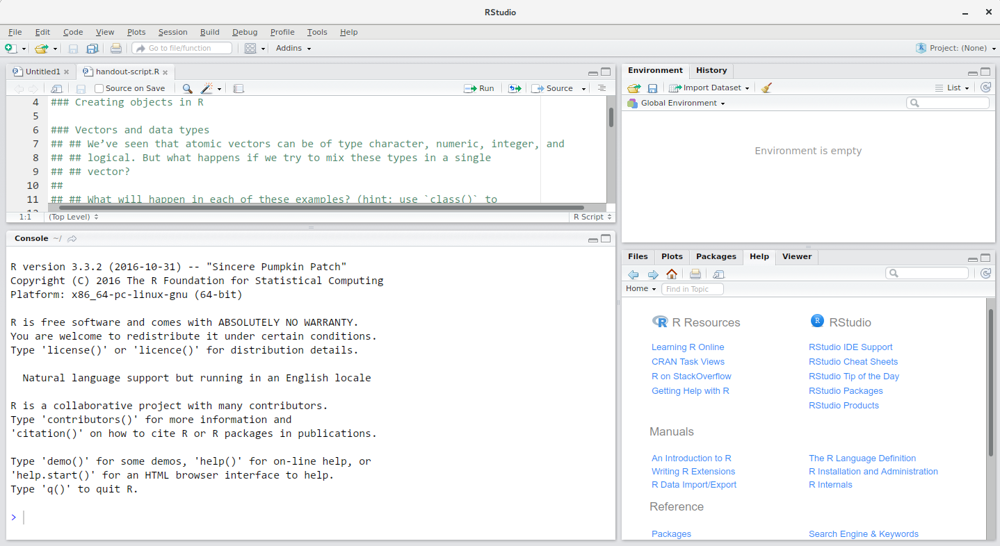
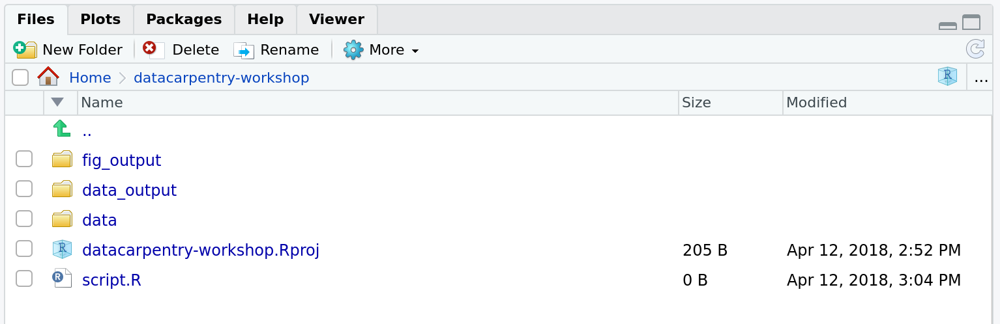
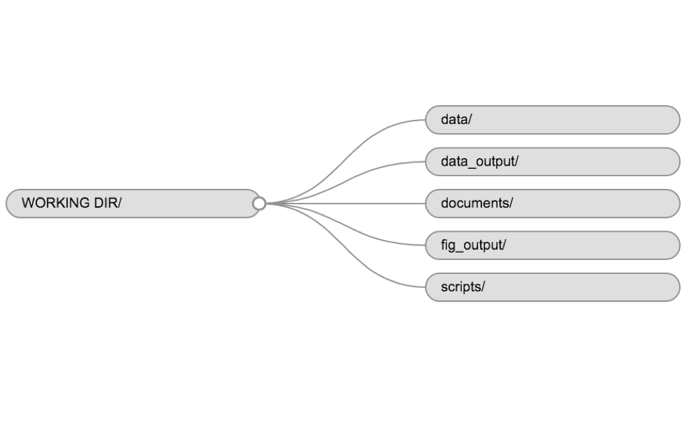
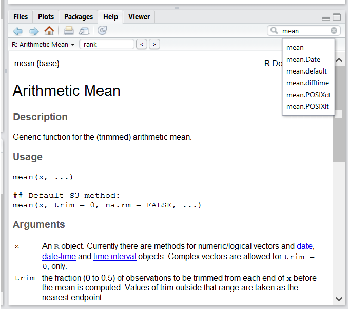

```{r, echo=FALSE, purl=FALSE}
knitr::opts_chunk$set(results='hide', fig.path='img/r-lesson-')
```

------------

> ### Learning Objectives
>
> * Describe the purpose of the RStudio Script, Console, Environment, and Plots
>   panes.
> * Organize files and directories for a set of analyses as an R
>   Project, and understand the purpose of the working directory.
> * Use the built-in RStudio help interface to search for more information on R
>   functions.
>  * Demonstrate how to provide sufficient information for
>   troubleshooting with the R user community.

------------


## What is R? What is RStudio?

The term "R" is used to refer to both the programming language and the software
that interprets the scripts written using it.

RStudio is currently a very popular way to not only write your R scripts but
also to interact with the R software. To function correctly, RStudio needs R and
therefore both need to be installed on your computer.


## Why learn R?

### R does not involve lots of pointing and clicking, and that's a good thing

The learning curve might be steeper than with other software, but with R, the
results of your analysis does not rely on remembering a succession of pointing
and clicking, but instead on a series of written commands, and that's a good
thing! So, if you want to redo your analysis because you collected more data,
you don't have to remember which button you clicked in which order to obtain
your results, you just have to run your script again.

Working with scripts makes the steps you used in your analysis clear, and the
code you write can be inspected by someone else who can give you feedback and
spot mistakes.

Working with scripts forces you to have a deeper understanding of what you are
doing, and facilitates your learning and comprehension of the methods you use.

### R code is great for reproducibility

Reproducibility is when someone else (including your future self) can obtain the
same results from the same dataset when using the same analysis.

R integrates with other tools to generate manuscripts from your code. If you
collect more data, or fix a mistake in your dataset, the figures and the
statistical tests in your manuscript are updated automatically.

An increasing number of journals and funding agencies expect analyses to be
reproducible, so knowing R will give you an edge with these requirements.


### R is interdisciplinary and extensible

With 10,000+ packages that can be installed to extend its capabilities, R
provides a framework that allows you to combine statistical approaches from many
scientific disciplines to best suit the analytical framework you need to analyze your
data. For instance, R has packages for image analysis, GIS, time series, population
genetics, and a lot more.


### R works on data of all shapes and sizes

The skills you learn with R scale easily with the size of your dataset. Whether
your dataset has hundreds or millions of lines, it won't make much difference to
you.

R is designed for data analysis. It comes with special data structures and data
types that make handling of missing data and statistical factors convenient.

R can connect to spreadsheets, databases, and many other data formats, on your
computer or on the web.


### R produces high-quality graphics

The plotting functionalities in R are endless, and allow you to adjust any
aspect of your graph to convey most effectively the message from your data.


### R has a large community

Thousands of people use R daily. Many of them are willing to help you through
mailing lists and websites such as [Stack Overflow](https://stackoverflow.com/).


### Not only is R free, but it is also open-source and cross-platform

Anyone can inspect the source code to see how R works. Because of this
transparency, there is less chance for mistakes, and if you (or someone else)
find some, you can report and fix bugs.


## Knowing your way around RStudio

Let's start by learning about [RStudio](https://www.rstudio.com/), which is an
Integrated Development Environment (IDE) for working with R.

The RStudio IDE open-source product is free under the
[Affero General Public License (AGPL) v3](https://www.gnu.org/licenses/agpl-3.0.en.html).
The RStudio IDE is also available with a commercial license and priority email
support from RStudio, Inc.

We will use RStudio IDE to write code, navigate the files on our computer,
inspect the variables we are going to create, and visualize the plots we will
generate. RStudio can also be used for other things (e.g., version control,
developing packages, writing Shiny apps) that we will not cover during the
workshop.



RStudio is divided into 4 "Panes": the **Source** for your scripts and documents
(top-left, in the default layout), the R **Console** (bottom-left), your
**Environment/History** (top-right), and your
**Files/Plots/Packages/Help/Viewer** (bottom-right). The placement of these
panes and their content can be customized (see menu, Tools -> Global Options ->
Pane Layout). One of the advantages of using RStudio is that all the information
you need to write code is available in a single window. Additionally, with many
shortcuts, autocompletion, and highlighting for the major file types you use
while developing in R, RStudio will make typing easier and less error-prone.

## Getting set up

It is good practice to keep a set of related data, analyses, and text
self-contained in a single folder, called the **working directory**. All of the
scripts within this folder can then use *relative paths* to files that indicate
where inside the project a file is located (as opposed to absolute paths, which
point to where a file is on a specific computer). Working this way makes it
a lot easier to move your project around on your computer and share it with
others without worrying about whether or not the underlying scripts will still
work.

RStudio provides a helpful set of tools to do this through its "Projects"
interface, which not only creates a working directory for you but also remembers
its location (allowing you to quickly navigate to it) and optionally preserves
custom settings and open files to make it easier to resume work after a
break. Below, we will go through the steps for creating an "R Project" for this
tutorial.

* Start RStudio (presentation of RStudio -below- should happen here)
* Under the `File` menu, click on `New project`, choose `New directory`, then
  `New project`
* Enter a name for this new folder (or "directory"), and choose a convenient
  location for it. This will be your **working directory** for the rest of the
  day (e.g., `~/data-carpentry`)
* Click on `Create project`
* Under the `Files` tab on the right of the screen, click on `New Folder` and
  create a folder named `data` within your newly created working directory (e.g., `~/data-carpentry/data`)
* Download the [code handout](./code-handout.R), place it in your working directory and rename it (e.g., `data-carpentry-script.R`).

Your working directory should now look like this:



### Organizing your working directory

Using a consistent folder structure across your projects will help keep things
organized, and will also make it easy to find/file things in the future. This
can be especially helpful when you have multiple projects. In general, you may
create directories (folders) for **scripts**, **data**, and **documents**.

 - **`data/`** Use this folder to store your raw data and intermediate
   datasets you may create for the need of a particular analysis. For the sake
   of transparency and [provenance](https://en.wikipedia.org/wiki/Provenance),
   you should *always* keep a copy of your raw data accessible and do as much
   of your data cleanup and preprocessing programmatically (i.e., with scripts,
   rather than manually) as possible. Separating raw data from processed data
   is also a good idea. For example, you could have files
   `data/raw/tree_survey.plot1.txt` and `...plot2.txt` kept separate from
   a `data/processed/tree.survey.csv` file generated by the
   `scripts/01.preprocess.tree_survey.R` script.
 - **`documents/`** This would be a place to keep outlines, drafts, and other
   text.
 - **`scripts/`** This would be the location to keep your R scripts for
   different analyses or plotting, and potentially a separate folder for your
   functions (more on that later).

You may want additional directories or subdirectories depending on your project
needs, but these should form the backbone of your working directory. For this
workshop, we will need a `data/` folder to store our raw data, and we will
create later a `data_output/` folder when we learn how to export data as CSV
files.




## Interacting with R

The basis of programming is that we write down instructions for the computer to
follow, and then we tell the computer to follow those instructions. We write, or
*code*, instructions in R because it is a common language that both the computer
and we can understand. We call the instructions *commands* and we tell the
computer to follow the instructions by *executing* (also called *running*) those
commands.

There are two main ways of interacting with R: by using the console or by using
script files (plain text files that contain your code). The console pane (in
RStudio, the bottom left panel) is the place where commands written in the R
language can be typed and executed immediately by the computer. It is also where
the results will be shown for commands that have been executed. You can type
commands directly into the console and press `Enter` to execute those commands,
but they will be forgotten when you close the session.

Because we want our code and workflow to be reproducible, it is better to type
the commands we want in the script editor, and save the script. This way, there
is a complete record of what we did, and anyone (including our future selves!)
can easily replicate the results on their computer.

RStudio allows you to execute commands directly from the script editor by using
the <kbd>`Ctrl`</kbd> + <kbd>`Enter`</kbd> shortcut (on Macs, <kbd>`Cmd`</kbd> +
<kbd>`Return`</kbd> will work, too). The command on the current line in the
script (indicated by the cursor) or all of the commands in the currently
selected text will be sent to the console and executed when you press
<kbd>`Ctrl`</kbd> + <kbd>`Enter`</kbd>.

At some point in your analysis you may want to check the content of a variable
or the structure of an object, without necessarily keeping a record of it in
your script. You can type these commands and execute them directly in the
console.  RStudio provides the <kbd>`Ctrl`</kbd> + <kbd>`1`</kbd> and
<kbd>`Ctrl`</kbd> + <kbd>`2`</kbd> shortcuts allow you to jump between the
script and the console panes.

If R is ready to accept commands, the R console shows a `>` prompt. If it
receives a command (by typing, copy-pasting or sent from the script editor using
<kbd>`Ctrl`</kbd> + <kbd>`Enter`</kbd>), R will try to execute it, and when
ready, will show the results and come back with a new `>` prompt to wait for new
commands.

If R is still waiting for you to enter more data because it isn't complete yet,
the console will show a `+` prompt. It means that you haven't finished entering
a complete command. This is because you have not 'closed' a parenthesis or
quotation, i.e. you don't have the same number of left-parentheses as
right-parentheses, or the same number of opening and closing quotation marks.
When this happens, and you thought you finished typing your command, click
inside the console window and press `Esc`; this will cancel the incomplete
command and return you to the `>` prompt.


## Seeking help

### Use the built-in RStudio help interface to search for more information on R functions



One of the most fastest ways to get help, is to use the RStudio help interface. This panel by default can be found at the lower right hand panel of RStudio. As seen in the screenshot, by typing the word "Mean", RStudio tries to also give a number of suggestions that you might be interested in. The description is then shown in the display window.

### I know the name of the function I want to use, but I'm not sure how to use it

If you need help with a specific function, let's say `barplot()`, you can type:

```{r, eval=FALSE, purl=FALSE}
?barplot
```

If you just need to remind yourself of the names of the arguments, you can use:

```{r, eval=FALSE, purl=FALSE}
args(lm)
```

### I want to use a function that does X, there must be a function for it but I don't know which one...

If you are looking for a function to do a particular task, you can use the
`help.search()` function, which is called by the double question mark `??`.
However, this only looks through the installed packages for help pages with a
match to your search request

```{r, eval=FALSE, purl=FALSE}
??kruskal
```

If you can't find what you are looking for, you can use
the [rdocumentation.org](http://www.rdocumentation.org) website that searches
through the help files across all packages available.

Finally, a generic Google or internet search "R \<task\>" will often either send
you to the appropriate package documentation or a helpful forum where someone
else has already asked your question.

### I am stuck... I get an error message that I don't understand

Start by googling the error message. However, this doesn't always work very well
because often, package developers rely on the error catching provided by R. You
end up with general error messages that might not be very helpful to diagnose a
problem (e.g. "subscript out of bounds"). If the message is very generic, you
might also include the name of the function or package you're using in your
query.

However, you should check Stack Overflow. Search using the `[r]` tag. Most
questions have already been answered, but the challenge is to use the right
words in the search to find the
answers:
[http://stackoverflow.com/questions/tagged/r](http://stackoverflow.com/questions/tagged/r)

The [Introduction to R](http://cran.r-project.org/doc/manuals/R-intro.pdf) can
also be dense for people with little programming experience but it is a good
place to understand the underpinnings of the R language.

The [R FAQ](http://cran.r-project.org/doc/FAQ/R-FAQ.html) is dense and technical
but it is full of useful information.

### Asking for help

The key to receiving help from someone is for them to rapidly grasp your
problem. You should make it as easy as possible to pinpoint where the issue
might be.

Try to use the correct words to describe your problem. For instance, a package
is not the same thing as a library. Most people will understand what you meant,
but others have really strong feelings about the difference in meaning. The key
point is that it can make things confusing for people trying to help you. Be as
precise as possible when describing your problem.

If possible, try to reduce what doesn't work to a simple *reproducible
example*. If you can reproduce the problem using a very small data frame
instead of your 50,000 rows and 10,000 columns one, provide the small one with
the description of your problem. When appropriate, try to generalize what you
are doing so even people who are not in your field can understand the
question. For instance instead of using a subset of your real dataset, create a
small (3 columns, 5 rows) generic one. For more information on how to write a
reproducible example see [this article by Hadley Wickham](http://adv-r.had.co.nz/Reproducibility.html).

To share an object with someone else, if it's relatively small, you can use the
function `dput()`. It will output R code that can be used to recreate the exact
same object as the one in memory:

```{r, results='show', purl=FALSE}
dput(head(iris)) # iris is an example data frame that comes with R and head() is a function that returns the first part of the data frame
```

If the object is larger, provide either the raw file (i.e., your CSV file) with
your script up to the point of the error (and after removing everything that is
not relevant to your issue). Alternatively, in particular if your question is
not related to a data frame, you can save any R object to a file:

```{r, eval=FALSE, purl=FALSE}
saveRDS(iris, file="/tmp/iris.rds")
```

The content of this file is however not human readable and cannot be posted
directly on Stack Overflow. Instead, it can be sent to someone by email who can
read it with the `readRDS()` command (here it is assumed that the downloaded
file is in a `Downloads` folder in the user's home directory):

```{r, eval=FALSE, purl=FALSE}
some_data <- readRDS(file="~/Downloads/iris.rds")
```

Last, but certainly not least, **always include the output of `sessionInfo()`**
as it provides critical information about your platform, the versions of R and
the packages that you are using, and other information that can be very helpful
to understand your problem.

```{r, results='show', purl=FALSE}
sessionInfo()
```

### Where to ask for help?

* The person sitting next to you during the workshop. Don't hesitate to talk to
  your neighbor during the workshop, compare your answers, and ask for
  help. You might also be interested in organizing regular meetings following
  the workshop to keep learning from each other.
* Your friendly colleagues: if you know someone with more experience than you,
  they might be able and willing to help you.
* [Stack Overflow](http://stackoverflow.com/questions/tagged/r): if your question
  hasn't been answered before and is well crafted, chances are you will get an
  answer in less than 5 min. Remember to follow their guidelines on [how to ask
  a good question](http://stackoverflow.com/help/how-to-ask).
* The [R-help mailing list](https://stat.ethz.ch/mailman/listinfo/r-help): it is
  read by a lot of people (including most of the R core team), a lot of people
  post to it, but the tone can be pretty dry, and it is not always very
  welcoming to new users. If your question is valid, you are likely to get an
  answer very fast but don't expect that it will come with smiley faces. Also,
  here more than anywhere else, be sure to use correct vocabulary (otherwise
  you might get an answer pointing to the misuse of your words rather than
  answering your question). You will also have more success if your question is
  about a base function rather than a specific package.
* If your question is about a specific package, see if there is a mailing list
  for it. Usually it's included in the DESCRIPTION file of the package that can
  be accessed using `packageDescription("name-of-package")`. You may also want
  to try to email the author of the package directly, or open an issue on the
  code repository (e.g., GitHub).
* There are also some topic-specific mailing lists (GIS, phylogenetics, etc...),
  the complete list is [here](http://www.r-project.org/mail.html).

### More resources

* The [Posting Guide](http://www.r-project.org/posting-guide.html) for the R
  mailing lists.
* [How to ask for R help](http://blog.revolutionanalytics.com/2014/01/how-to-ask-for-r-help.html)
  useful guidelines
* [This blog post by Jon Skeet](http://codeblog.jonskeet.uk/2010/08/29/writing-the-perfect-question/)
  has quite comprehensive advice on how to ask programming questions.
* The [reprex](https://cran.rstudio.com/web/packages/reprex/) package is very helpful to create reproducible examples when asking for help.
