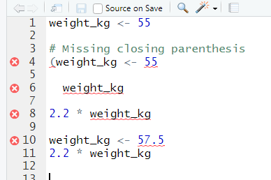

***
:::::::::::::::::::::::::::::::::::::: questions 

- What is R and RStudio? 
- What is a working directory? 
- How should files be set up to import into R? 
- How can I look for help with R functions? 

::::::::::::::::::::::::::::::::::::::::::::::::

::::::::::::::::::::::::::::::::::::: objectives

- Explain what R and RStudio are, what they are used for, and how
  they relate to each other.
- Describe the purpose of the RStudio Script, Console, Environment, and
  Plots panes.
- Organize files and directories for a set of analyses as an R Project, and
  understand the purpose of the working directory.
- Use the built-in RStudio help interface to search for more information on
  R functions.
- Demonstrate how to provide sufficient information for troubleshooting with
  the R user community.

::::::::::::::::::::::::::::::::::::::::::::::::

***

## What is R? What is RStudio?

The term "`R`" is used to refer to both the programming language and the
software that interprets the scripts written using it.

[RStudio](https://rstudio.com) is a popular way to write R scripts and interact with the R software.
To function correctly, RStudio needs R and therefore both need to be installed on your computer.

## Why learn R?

### R does not involve lots of pointing and clicking, and that's a good thing

In R, the results of your analysis rely on a series of written commands, and not
on remembering a succession of pointing and clicking. That is a good thing!
So, if you want to redo your analysis because you collected more data, you don't
have to remember which button you clicked in which order to obtain your results.
With a stored series of commands in an R script, you can repeat running them and
R will process the new dataset exactly the same way as before.

Working with scripts makes the steps you used in your analysis clear, and the
code you write can be inspected by someone else who can give you feedback and
spot mistakes.

Working with scripts forces you to have a deeper understanding of what you are
doing, and facilitates your learning and comprehension of the methods you use.

### R code is great for reproducibility

Reproducibility is when someone else, including your future self, can obtain the
same results from the same dataset when using the same analysis.

R integrates with other tools to generate manuscripts from your code. If you
collect more data, or fix a mistake in your dataset, the figures and the
statistical tests in your manuscript are updated automatically.

R is widely used in academia and in industries such as pharma and biotech.
These organisations expect analyses to be reproducible, so knowing R will give you an
edge with these requirements.

### R is interdisciplinary and extensible

With 10,000+ packages that can be installed to extend its capabilities, R
provides a framework that allows you to combine statistical approaches from many
scientific disciplines to best suit the analytical framework you need to analyze
your data. For instance, R has packages for image analysis, GIS, time series,
population genetics, and a lot more.

### R works on data of all shapes and sizes

The skills you learn with R scale easily with the size of your dataset. Whether
your dataset has hundreds or millions of lines, it won't make much difference to
you.

R is designed for data analysis. It comes with special data structures and data
types that make handling of missing data and statistical factors convenient.

R can connect to spreadsheets, databases, and many other data formats, on your
computer or on the web.

### R produces high-quality graphics

The plotting functionalities in R are endless, and allow you to adjust any
aspect of your graph to visualize your data more effectively.

### R has a large and welcoming community

Thousands of people use R daily. Many of them are willing to help you through
mailing lists and websites such as [Stack Overflow](https://stackoverflow.com/),
[RStudio community](https://community.rstudio.com/), and Slack channels such as
the R for Data Science online community ([https://www.rfordatasci.com/](https://www.rfordatasci.com/)). In addition,
there are numerous online and in person meetups organised globally through organisations
such as R Ladies Global ([https://rladies.org/](https://rladies.org/)).

### Not only is R free, but it is also open-source and cross-platform

Anyone can inspect the source code to see how R works. Because of this
transparency, there is less chance for mistakes, and if you (or someone else)
find some, you can report and fix bugs.

## Knowing your way around RStudio

Let's start by learning about [RStudio](https://www.rstudio.com/), which is an
Integrated Development Environment (IDE) for working with R.

The RStudio IDE open-source product is free under the [Affero General Public
License (AGPL) v3](https://www.gnu.org/licenses/agpl-3.0.en.html). The RStudio
IDE is also available with a commercial license and priority email support from
RStudio, PBC.

We will use RStudio IDE to write code, navigate the files on our computer,
inspect the variables we are going to create, and visualize the plots we will
generate. RStudio can also be used for other things (e.g., version control,
developing packages, writing Shiny apps) that we will not cover during the
workshop.

{alt="RStudio interface screenshot. Clockwise from top left: Source,Environment/History, Files/Plots/Packages/Help/Viewer,Console."}

RStudio is divided into 4 "panes":

- The **Source** for your scripts and documents (top-left, in the default
  layout)
- Your **Environment/History** (top-right) which shows all the objects in
  your working space (Environment) and your command history (History)
- Your **Files/Plots/Packages/Help/Viewer** (bottom-right)
- The R **Console** (bottom-left)

The placement of these panes and their content can be customized (see menu,
Tools -> Global Options -> Pane Layout). For ease of use, settings such as
background color, font color, font size, and zoom level can also be adjusted in
this menu (Global Options -> Appearance).

One of the advantages of using RStudio is that all the information you need to
write code is available in a single window. Additionally, with many shortcuts,
autocompletion, and highlighting for the major file types you use while
developing in R, RStudio will make typing easier and less error-prone.

## Getting set up

It is good practice to keep a set of related data, analyses, and text
self-contained in a single folder, called the **working directory**. All of the
scripts within this folder can then use *relative paths* to files that indicate
where inside the project a file is located (as opposed to absolute paths, which
point to where a file is on a specific computer). Working this way allows you to
move your project around on your computer and share it with others
without worrying about whether or not the underlying scripts will still work.

RStudio provides a helpful set of tools to do this through its "Projects"
interface, which not only creates a working directory for you, but also
remembers its location (allowing you to quickly navigate to it) and optionally
preserves custom settings and (re-)open files to assist resume work after
a break. Go through the steps for creating an "R Project" for this tutorial
below.

1. Start RStudio.
2. Under the `File` menu, click on `New Project`. Choose `New Directory`, then
  `New Project`.
3. Enter a name for this new folder (or "directory"), and choose a convenient
  location for it. This will be your **working directory** for the rest of the
  day (e.g., `~/data-carpentry`).
4. Click on `Create Project`.
5. Download the [code
  handout](files/code-handout.R), place
  it in your working directory and rename it (e.g.,
  `data-carpentry-script.R`).
6. (Optional) Set Preferences to 'Never' save workspace in RStudio.

A workspace is your current working environment in R which includes any
user-defined object. By default, all of these objects will be saved, and
automatically loaded, when you reopen your project. Saving a workspace to
`.RData` can be cumbersome, especially if you are working with larger datasets,
and it can lead to hard to debug errors by having objects in memory you forgot
you had. Therefore, it is often a good idea to turn this off. To do so, go to
Tools --> 'Global Options' and select the 'Never' option for
'Save workspace to .RData' on exit.'

{alt="Set 'Save workspace to .RData on exit' to'Never'"}

### Organizing your working directory

Using a consistent folder structure across your projects will help keep things
organized, and will help you to find/file things in the future. This
can be especially helpful when you have multiple projects. In general, you may
create directories (folders) for **scripts**, **data**, and **documents**.

- **`data_raw/` \& `data/`** Use these folders to store raw data and
  intermediate datasets you may create for the need of a particular analysis.
  For the sake of transparency and
  [provenance](https://en.wikipedia.org/wiki/Provenance), you should *always*
  keep a copy of your raw data accessible and do as much of your data cleanup
  and preprocessing programmatically (i.e., with scripts, rather than
  manually) as possible. Separating raw data from processed data is also a
  good idea. For example, you could have files
  `data_raw/tree_survey.plot1.txt` and `...plot2.txt` kept separate from a
  `data/tree.survey.csv` file generated by the
  `scripts/01.preprocess.tree_survey.R` script.
- **`documents/`** This would be a place to keep outlines, drafts, and other
  text.
- **`scripts/`** This would be the location to keep your R scripts for
  different analyses or plotting, and potentially a separate folder for your
  functions (more on that later).
- **Additional (sub)directories** depending on your project needs.

For this workshop, we will need a `data_raw/` folder to store our raw data, and
we will use `data/` for when we learn how to export data as CSV files, and a
`fig/` folder for the figures that we will save.

- Under the `Files` tab on the right of the screen, click on `New Folder` and
  create a folder named `data_raw` within your newly created working directory
  (e.g., `~/data-carpentry/`). (Alternatively, type `dir.create("data_raw")`
  at your R console.) Repeat these operations to create a `data` and a `fig`
  folder.

We are going to keep the script in the root of our working directory because we
are only going to use one file. Later, when you start create more
complex projects, it might make sense to organize scripts in sub-directories.

Your working directory should now look like this:

<div class="figure" style="text-align: center">

<p class="caption">How it should look like at the beginning of this lesson</p>
</div>

### The working directory

The working directory is an important concept to understand. It is the place
from where R will be looking for and saving the files. When you write code for
your project, it should refer to files in relation to the root of your working
directory and only need files within this structure.

RStudio assists you in this regard and sets the working directory automatically
to the directory where you have placed your project in.
If you need to check it, you can use `getwd()`. If for some
reason your working directory is not what it should be, you can change it in the
RStudio interface by navigating in the file browser where your working directory
should be, and clicking on the blue gear icon "More", and select "Set As Working
Directory". Alternatively you can use `setwd("/path/to/working/directory")` to
reset your working directory. However, your scripts should not include this line
because it will fail on someone else's computer.

## Interacting with R

The basis of programming is that we write down instructions for the computer to
follow, and then we tell the computer to follow those instructions. We write, or
*code*, instructions in R because it is a common language that both the computer
and we can understand. We call the instructions *commands* and we tell the
computer to follow the instructions by *executing* (also called *running*) those
commands.

There are two main ways of interacting with R: by using the console or by using
script files (plain text files that contain your code). The console pane (in
RStudio, the bottom left panel) is the place where commands written in the R
language can be typed and executed immediately by the computer. It is also where
the results will be shown for commands that have been executed. You can type
commands directly into the console and press `Enter` to execute those commands,
but they will be forgotten when you close the session.

Because we want our code and workflow to be reproducible, it is better to type
the commands we want in the script editor, and save the script. This way, there
is a complete record of what we did, and anyone (including our future selves!)
can easily replicate the results on their computer.

RStudio allows you to execute commands directly from the script editor by using
the <kbd>`Ctrl`</kbd> + <kbd>`Enter`</kbd> shortcut (on Macs, <kbd>`Cmd`</kbd> +
<kbd>`Return`</kbd> will work, too). The command on the current line in the
script (indicated by the cursor) or all of the commands in the currently
selected text will be sent to the console and executed when you press
<kbd>`Ctrl`</kbd> + <kbd>`Enter`</kbd>. You can find other keyboard shortcuts in
this [RStudio cheatsheet about the RStudio
IDE](https://raw.githubusercontent.com/rstudio/cheatsheets/main/rstudio-ide.pdf).

At some point in your analysis you may want to check the content of a variable
or the structure of an object, without necessarily keeping a record of it in
your script. You can type these commands and execute them directly in the
console. RStudio provides the <kbd>`Ctrl`</kbd> + <kbd>`1`</kbd> and
<kbd>`Ctrl`</kbd> + <kbd>`2`</kbd> shortcuts allow you to jump between the
script and the console panes.

If R is ready to accept commands, the R console shows a `>` prompt. If it
receives a command (by typing, copy-pasting or sent from the script editor using
<kbd>`Ctrl`</kbd> + <kbd>`Enter`</kbd>), R will try to execute it, and when
ready, will show the results and come back with a new `>` prompt to wait for new
commands.

If R is still waiting for you to enter more data because it isn't complete yet,
the console will show a `+` prompt. It means that you haven't finished entering
a complete command. This is because you have not 'closed' a parenthesis or
quotation, i.e. you don't have the same number of left-parentheses as
right-parentheses, or the same number of opening and closing quotation marks.
When this happens, and you thought you finished typing your command, click
inside the console window and press <kbd>`Esc`</kbd>; this will cancel the
incomplete command and return you to the `>` prompt.

## Seeking help

### Searching function documentation with `?` and `??`

If you need help with a specific function, let's say `mean()`, you can type
`?mean` or press <kbd>F1</kbd> while your cursor is on the function name. If you
are looking for a function to do a particular task, but don't know the function
name, you can use the double question mark `??`, for example `??kruskall`. Both
commands will open matching help files in RStudio's help panel in the lower
right corner. You can also use the help panel to search help directly, as seen
in the screenshot.

{alt="RStudio help panel. When typing a word in the search field, it will showrelated suggestions."}

### Automatic code completion

When you write code in RStudio, you can use its automatic code completion to
remind yourself of a function's name or arguments. Start typing the function
name and pay attention to the suggestions that pop up. Use the up and down arrow
to select a suggested code completion and <kbd>Tab</kbd> to apply it. You can
also use code completion to complete function's argument names, object, names
and file names. It even works if you don't get the spelling 100% correct.

### Package vignettes and cheat sheets

In addition to the documentation for individual functions, many packages have
*vignettes* -- instructions for how to use the package to do certain tasks.
Vignettes are great for learning by example. Vignettes are accessible via the
package help and by using the function `browseVignettes()`.

There is also a Help menu at the top of the RStudio window, that has cheat
sheets for popular packages, RStudio keyboard shortcuts, and more.

### Finding more functions and packages

RStudio's help only searches the packages that you have installed on your
machine, but there are many more available on
[CRAN](https://cran.r-project.org/) and [GitHub](https://github.com/). To search
across all available R packages, you can use the website
[rdocumentation.org](https://www.rdocumentation.org). Often, a generic Google or
internet search "R \<task>" will send you to the appropriate package
documentation or a forum where someone else has already asked your question.
Many packages also have websites with additional help, tutorials, news and more
(for example [tidyverse.org](https://www.tidyverse.org/)).

### Dealing with error messages

Don't get discouraged if your code doesn't run immediately! Error messages are
common when programming, and fixing errors is part of any programmer's daily
work. Often, the problem is a small typo in a variable name or a missing
parenthesis. Watch for the red x's next to your code in RStudio. These may
provide helpful hints about the source of the problem.

{alt="RStudio shows a red x next to a line of code that R doesn't understand."}

If you can't fix an error yourself, start by googling it. Some error messages
are too generic to diagnose a problem (e.g. "subscript out of bounds"). In that
case it might help to include the name of the function or package you're using
in your query.

### Asking for help

If your Google search is unsuccessful, you may want to ask other R users for
help. There are different places where you can ask for help. During this
workshop, don't hesitate to talk to your neighbor, compare your answers, and ask
for help. You might also be interested in organizing regular meetings following
the workshop to keep learning from each other. If you have a friend or colleague
with more experience than you, they might also be able and willing to help you.

Besides that, there are a few places on the internet that provide help:

- [Stack Overflow](https://stackoverflow.com/questions/tagged/r?tab=Votes):
  Many questions have already been answered, but the challenge is to use the
  right words in your search to find them. If your question hasn't been
  answered before and is well crafted, chances are you will get an answer in
  less than 5 min. Remember to follow their guidelines on [how to ask a good
  question](https://stackoverflow.com/help/how-to-ask).
- The [R-help mailing list](https://stat.ethz.ch/mailman/listinfo/r-help): it
  is used by a lot of people (including most of the R core team). If your
  question is valid (read its [Posting
  Guide](https://www.r-project.org/posting-guide.html)), you are likely to get
  an answer very fast, but the tone can be pretty dry and it is not always
  very welcoming to new users.
- If your question is about a specific package rather than a base R function,
  see if there is a mailing list for the package. Usually it's included in the
  DESCRIPTION file of the package that can be accessed using
  `packageDescription("<package-name>")`.
- You can also try to contact the package author directly, by emailing them or
  opening an issue on the code repository (e.g., on GitHub).
- There are also some topic-specific mailing lists (GIS, phylogenetics,
  etc...).  The complete list is [on the R mailing lists website](https://www.r-project.org/mail.html).

The key to receiving help from someone is for them to rapidly grasp your
problem. Thus, you should be as precise as possible when describing your problem
and help others to pinpoint where the issue might be. Try to...

- Use the correct words to describe your problem. Otherwise you might get an
  answer pointing to the misuse of your words rather than answering your
  question.

- Generalize what you are trying to do, so people outside your field can
  understand the question.

- Reduce what does not work to a simple *reproducible example*. For instance,
  instead of using your real data set, create a small generic one. For more
  information on how to write a reproducible example see [this article from
  the reprex
  package](https://reprex.tidyverse.org/articles/reprex-dos-and-donts.html).
  Learning how to use the [reprex](https://cran.r-project.org/package=reprex)
  package is also very helpful for this.

- Include the output of `sessionInfo()` in your question. It provides
  information about your platform, the versions of R and the packages that you
  are using. As an example, here you can see the versions of R and all the
  packages that we are using to run the code in this lesson:


```r
sessionInfo()
```

```{.output}
#> R version 4.3.2 (2023-10-31)
#> Platform: x86_64-pc-linux-gnu (64-bit)
#> Running under: Ubuntu 22.04.3 LTS
#> 
#> Matrix products: default
#> BLAS:   /usr/lib/x86_64-linux-gnu/blas/libblas.so.3.10.0 
#> LAPACK: /usr/lib/x86_64-linux-gnu/lapack/liblapack.so.3.10.0
#> 
#> locale:
#>  [1] LC_CTYPE=C.UTF-8       LC_NUMERIC=C           LC_TIME=C.UTF-8       
#>  [4] LC_COLLATE=C.UTF-8     LC_MONETARY=C.UTF-8    LC_MESSAGES=C.UTF-8   
#>  [7] LC_PAPER=C.UTF-8       LC_NAME=C              LC_ADDRESS=C          
#> [10] LC_TELEPHONE=C         LC_MEASUREMENT=C.UTF-8 LC_IDENTIFICATION=C   
#> 
#> time zone: UTC
#> tzcode source: system (glibc)
#> 
#> attached base packages:
#> [1] stats     graphics  grDevices utils     datasets  methods   base     
#> 
#> other attached packages:
#>  [1] RSQLite_2.3.1   lubridate_1.9.2 forcats_1.0.0   stringr_1.5.0  
#>  [5] dplyr_1.1.3     purrr_1.0.2     readr_2.1.4     tidyr_1.3.0    
#>  [9] tibble_3.2.1    ggplot2_3.4.3   tidyverse_2.0.0 knitr_1.43     
#> 
#> loaded via a namespace (and not attached):
#>  [1] bit_4.0.5         gtable_0.3.4      compiler_4.3.2    renv_1.0.3       
#>  [5] highr_0.10        tidyselect_1.2.0  blob_1.2.4        scales_1.2.1     
#>  [9] fastmap_1.1.1     yaml_2.3.7        R6_2.5.1          generics_0.1.3   
#> [13] munsell_0.5.0     DBI_1.1.3         pillar_1.9.0      tzdb_0.4.0       
#> [17] rlang_1.1.1       utf8_1.2.3        cachem_1.0.8      stringi_1.7.12   
#> [21] xfun_0.40         bit64_4.0.5       memoise_2.0.1     timechange_0.2.0 
#> [25] cli_3.6.1         withr_2.5.0       magrittr_2.0.3    grid_4.3.2       
#> [29] rstudioapi_0.15.0 hms_1.1.3         lifecycle_1.0.3   vctrs_0.6.3      
#> [33] evaluate_0.21     glue_1.6.2        fansi_1.0.4       colorspace_2.1-0 
#> [37] tools_4.3.2       pkgconfig_2.0.3
```


## How to learn more after the workshop?

The material we cover during this workshop will give you a taste of how you can
use R to analyze data for your own research. However, to do advanced operations
such as cleaning your dataset, using statistical methods, or creating beautiful
graphics you will need to learn more.

The best way to become proficient and efficient at R, as with any other tool, is
to use it to address your actual research questions. As a beginner, it can feel
daunting to have to write a script from scratch, and given that many people make
their code available online, modifying existing code to suit your purpose might
get first hands-on experience using R for your own work and help you become
comfortable eventually creating your own scripts.


## More resources

#### More about R

- The [Introduction to R](https://cran.r-project.org/doc/manuals/R-intro.pdf)
  can also be dense for people with little programming experience but it is a
  good place to understand the underpinnings of the R language.
- The [R FAQ](https://cran.r-project.org/doc/FAQ/R-FAQ.html) is dense and
  technical but it is full of useful information.
- To stay up to date, follow `#rstats` on twitter. Twitter can also be a way
  to get questions answered and learn about useful R packages and tipps (e.g.,
  [@RLangTips])

#### How to ask good programming questions?

- The rOpenSci community call "How to ask questions so they get answered",
  ([rOpenSci site](https://ropensci.org/commcalls/2017-03-07/) and [video
  recording](https://vimeo.com/208749032)) includes a presentation of the
  reprex package and of its philosophy.
- [blog.Revolutionanalytics.com](https://blog.revolutionanalytics.com/2014/01/how-to-ask-for-r-help.html)
  and [this blog post by Jon Skeet](https://codeblog.jonskeet.uk/2010/08/29/writing-the-perfect-question/)
  have comprehensive advice on how to ask programming questions.

::::::::::::::::::::::::::::::::::::: keypoints

- R is a programming language and RStudio is the IDE that assists in using R. 
- There are many benefits to learning R, including writing reproducibile code, ability to use a variety of datasets, and a broad, open-source community of practioners. 
- Files related to analysis should be organized within a single working directory. 
- R uses commands containing functions to tell the computer what to do. 
- Documentation for each function is available within RStudio, or users can ask for help from one of many online forums, cheatsheets, or email lists.  

::::::::::::::::::::::::::::::::::::::::::::::::
