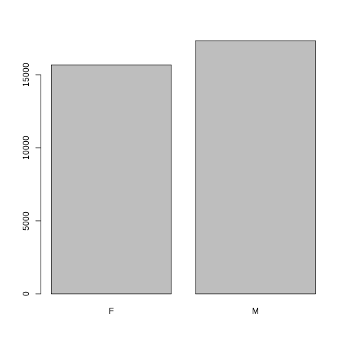
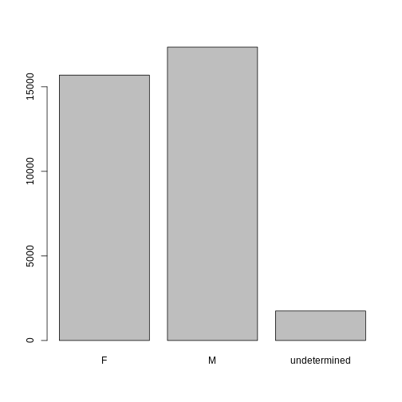
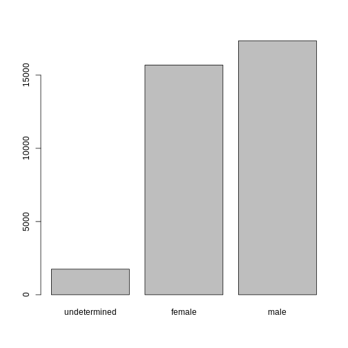

::::::::::::::::::::::::::::::::::::::: objectives
-   Load external data from a .csv file into a data frame.
-   Install and load packages.
-   Describe what a data frame is.
-   Summarize the contents of a data frame.
-   Use indexing to subset specific portions of data frames.
-   Describe what a factor is.
-   Convert between strings and factors.
-   Reorder and rename factors.
-   Change how character strings are handled in a data frame.
-   Format dates.
:::::::::::::::::::::::::::::::::::::::::::::::::::

::::::::::::::::::::::::::::::::::::::: questions
-   What is a data.frame?
-   How can I read a complete csv file into R?
-   How can I get basic summary information about my dataset?
-   How can extract specific information from a dataframe?
-   What are factors, and how are they different from other datatypes?
-   How can I rename factors?
-   How are dates represented in R and how can I change the format?
:::::::::::::::::::::::::::::::::::::::::::::::::::

## Loading the survey data


We are investigating the animal species diversity and weights found
within plots at our study site. The dataset is stored as a comma
separated value (CSV) file. Each row holds information for a single
animal, and the columns represent:

| Column          | Description                                  |
|-----------------|----------------------------------------------|
| record_id       | Unique id for the observation                |
| month           | month of observation                         |
| day             | day of observation                           |
| year            | year of observation                          |
| plot_id         | ID of a particular experimental plot of land |
| species_id      | 2-letter code                                |
| sex             | sex of animal ("M", "F")                     |
| hindfoot_length | length of the hindfoot in mm                 |
| weight          | weight of the animal in grams                |
| genus           | genus of animal                              |
| species         | species of animal                            |
| taxon           | e.g. Rodent, Reptile, Bird, Rabbit           |
| plot_type       | type of plot                                 |

### Downloading the data

We created the folder that will store the downloaded data (`data_raw`)
in the chapter ["Before we
start"](https://datacarpentry.org/R-ecology-lesson/00-before-we-start.html#Organizing_your_working_directory).
If you skipped that part, it may be a good idea to have a look now, to
make sure your working directory is set up properly.

We are going to use the R function `download.file()` to download the CSV
file that contains the survey data from Figshare, and we will use
`read_csv()` to load the content of the CSV file into R.

Inside the `download.file` command, the first entry is a character
string with the source URL
("<https://ndownloader.figshare.com/files/2292169>"). This source URL
downloads a CSV file from figshare. The text after the comma
("data_raw/portal_data_joined.csv") is the destination of the file on
your local machine. You'll need to have a folder on your machine called
"data_raw" where you'll download the file. So this command downloads a
file from Figshare, names it "portal_data_joined.csv" and adds it to a
preexisting folder named "data_raw".


```r
download.file(url = "https://ndownloader.figshare.com/files/2292169",
              destfile = "data_raw/portal_data_joined.csv")
```

### Reading the data into R

The file has now been downloaded to the destination you specified, but R
has not yet loaded the data from the file into memory. To do this, we
can use the `read_csv()` function from the **`tidyverse`** package.

Packages in R are basically sets of additional functions that let you do
more stuff. The functions we've been using so far, like `round()`,
`sqrt()`, or `c()` come built into R. Packages give you access to
additional functions beyond base R. A similar function to `read_csv()`
from the tidyverse package is `read.csv()` from base R. We don't have
time to cover their differences but notice that the exact spelling
determines which function is used. Before you use a package for the
first time you need to install it on your machine, and then you should
import it in every subsequent R session when you need it.

To install the **`tidyverse`** package, we can type
`install.packages("tidyverse")` straight into the console. In fact, it's
better to write this in the console than in our script for any package,
as there's no need to re-install packages every time we run the script.
Then, to load the package type:


```r
## load the tidyverse packages, incl. dplyr
library(tidyverse)
```

Now we can use the functions from the **`tidyverse`** package. Let's use
`read_csv()` to read the data into a data frame (we will learn more
about data frames later):


```r
surveys <- read_csv("data_raw/portal_data_joined.csv")
```

```{.output}
#> Rows: 34786 Columns: 13
#> ── Column specification ────────────────────────────────────────────────────────
#> Delimiter: ","
#> chr (6): species_id, sex, genus, species, taxa, plot_type
#> dbl (7): record_id, month, day, year, plot_id, hindfoot_length, weight
#> 
#> ℹ Use `spec()` to retrieve the full column specification for this data.
#> ℹ Specify the column types or set `show_col_types = FALSE` to quiet this message.
```

When you execute `read_csv` on a data file, it looks through the first
1000 rows of each column and guesses its data type. For example, in this
dataset, `read_csv()` reads `weight` as `col_double` (a numeric data
type), and `species` as `col_character`. You have the option to specify
the data type for a column manually by using the `col_types` argument in
`read_csv`.

::: callout
### Note

`read_csv()` assumes that fields are delineated by commas. However, in
several countries, the comma is used as a decimal separator and the
semicolon (;) is used as a field delineator. If you want to read in this
type of files in R, you can use the `read_csv2()` function. It behaves
like `read_csv()` but uses different parameters for the decimal and the
field separators. There is also the `read_tsv()` for tab separated data
files and `read_delim()` for less common formats. Check out the help for
`read_csv()` by typing `?read_csv` to learn more.

In addition to the above versions of the csv format, you should develop
the habits of looking at and recording some parameters of your csv
files. For instance, the character encoding, control characters used for
line ending, date format (if the date is not split into three
variables), and the presence of unexpected
[newlines](https://en.wikipedia.org/wiki/Newline) are important
characteristics of your data files. Those parameters will ease up the
import step of your data in R.
:::

We can see the contents of the first few lines of the data by typing its
name: `surveys`. By default, this will show you as many rows and columns
of the data as fit on your screen. If you wanted the first 50 rows, you
could type `print(surveys, n = 50)`

We can also extract the first few lines of this data using the function
`head()`:


```r
head(surveys)
```

```{.output}
#> # A tibble: 6 × 13
#>   record_id month   day  year plot_id species_id sex   hindfoot_length weight
#>       <dbl> <dbl> <dbl> <dbl>   <dbl> <chr>      <chr>           <dbl>  <dbl>
#> 1         1     7    16  1977       2 NL         M                  32     NA
#> 2        72     8    19  1977       2 NL         M                  31     NA
#> 3       224     9    13  1977       2 NL         <NA>               NA     NA
#> 4       266    10    16  1977       2 NL         <NA>               NA     NA
#> 5       349    11    12  1977       2 NL         <NA>               NA     NA
#> 6       363    11    12  1977       2 NL         <NA>               NA     NA
#> # ℹ 4 more variables: genus <chr>, species <chr>, taxa <chr>, plot_type <chr>
```

Unlike the `print()` function, `head()` returns the extracted data. You
could use it to assign the first 100 rows of `surveys` to an object
using `surveys_sample <- head(surveys, 100)`. This can be useful if you
want to try out complex computations on a subset of your data before you
apply them to the whole data set. There is a similar function that lets
you extract the last few lines of the data set. It is called (you might
have guessed it) `tail()`.

To open the dataset in RStudio's Data Viewer, use the `view()` function:


```r
view(surveys)
```

::: callout
### Note

There are two functions for viewing which are case-sensitive. Using
`view()` with a lowercase 'v' is part of tidyverse, whereas using
`View()` with an uppercase 'V' is loaded through base R in the `utils`
package.
:::

## What are data frames?

When we loaded the data into R, it got stored as an object of class
`tibble`, which is a special kind of data frame (the difference is not
important for our purposes, but you can learn more about tibbles
[here](https://tibble.tidyverse.org/)). Data frames are the *de facto*
data structure for most tabular data, and what we use for statistics and
plotting. Data frames can be created by hand, but most commonly they are
generated by functions like `read_csv()`; in other words, when importing
spreadsheets from your hard drive or the web.

A data frame is the representation of data in the format of a table
where the columns are vectors that all have the same length. Because
columns are vectors, each column must contain a single type of data
(e.g., characters, integers, factors). For example, here is a figure
depicting a data frame comprising a numeric, a character, and a logical
vector.


We can see this also when inspecting the <b>str</b>ucture of a data
frame with the function `str()`:


```r
str(surveys)
```

## Inspecting data frames

We already saw how the functions `head()` and `str()` can be useful to
check the content and the structure of a data frame. Here is a
non-exhaustive list of functions to get a sense of the content/structure
of the data. Let's try them out!

-   Size:

    -   `dim(surveys)` - returns a vector with the number of rows in the
        first element, and the number of columns as the second element
        (the **dim**ensions of the object)
    -   `nrow(surveys)` - returns the number of rows
    -   `ncol(surveys)` - returns the number of columns

-   Content:

    -   `head(surveys)` - shows the first 6 rows
    -   `tail(surveys)` - shows the last 6 rows

-   Names:

    -   `names(surveys)` - returns the column names (synonym of
        `colnames()` for `data.frame` objects)
    -   `rownames(surveys)` - returns the row names

-   Summary:

    -   `str(surveys)` - structure of the object and information about
        the class, length and content of each column
    -   `summary(surveys)` - summary statistics for each column

Note: most of these functions are "generic", they can be used on other
types of objects besides `data.frame`.

::: challenge
### Challenge

Based on the output of `str(surveys)`, can you answer the following
questions?

-   What is the class of the object `surveys`?
-   How many rows and how many columns are in this object?

::: solution

```r
str(surveys)
```

```{.output}
#> spc_tbl_ [34,786 × 13] (S3: spec_tbl_df/tbl_df/tbl/data.frame)
#>  $ record_id      : num [1:34786] 1 72 224 266 349 363 435 506 588 661 ...
#>  $ month          : num [1:34786] 7 8 9 10 11 11 12 1 2 3 ...
#>  $ day            : num [1:34786] 16 19 13 16 12 12 10 8 18 11 ...
#>  $ year           : num [1:34786] 1977 1977 1977 1977 1977 ...
#>  $ plot_id        : num [1:34786] 2 2 2 2 2 2 2 2 2 2 ...
#>  $ species_id     : chr [1:34786] "NL" "NL" "NL" "NL" ...
#>  $ sex            : chr [1:34786] "M" "M" NA NA ...
#>  $ hindfoot_length: num [1:34786] 32 31 NA NA NA NA NA NA NA NA ...
#>  $ weight         : num [1:34786] NA NA NA NA NA NA NA NA 218 NA ...
#>  $ genus          : chr [1:34786] "Neotoma" "Neotoma" "Neotoma" "Neotoma" ...
#>  $ species        : chr [1:34786] "albigula" "albigula" "albigula" "albigula" ...
#>  $ taxa           : chr [1:34786] "Rodent" "Rodent" "Rodent" "Rodent" ...
#>  $ plot_type      : chr [1:34786] "Control" "Control" "Control" "Control" ...
#>  - attr(*, "spec")=
#>   .. cols(
#>   ..   record_id = col_double(),
#>   ..   month = col_double(),
#>   ..   day = col_double(),
#>   ..   year = col_double(),
#>   ..   plot_id = col_double(),
#>   ..   species_id = col_character(),
#>   ..   sex = col_character(),
#>   ..   hindfoot_length = col_double(),
#>   ..   weight = col_double(),
#>   ..   genus = col_character(),
#>   ..   species = col_character(),
#>   ..   taxa = col_character(),
#>   ..   plot_type = col_character()
#>   .. )
#>  - attr(*, "problems")=<externalptr>
```

```r
## * class: data frame
## * how many rows: 34786,  how many columns: 13
```
:::
:::


## Indexing and subsetting data frames


Our survey data frame has rows and columns (it has 2 dimensions), if we
want to extract some specific data from it, we need to specify the
"coordinates" we want from it. Row numbers come first, followed by
column numbers. However, note that different ways of specifying these
coordinates lead to results with different classes.


```r
# We can extract specific values by specifying row and column indices
# in the format: 
# data_frame[row_index, column_index]
# For instance, to extract the first row and column from surveys:
surveys[1, 1]

# First row, sixth column:
surveys[1, 6]   

# We can also use shortcuts to select a number of rows or columns at once
# To select all columns, leave the column index blank
# For instance, to select all columns for the first row:
surveys[1, ]

# The same shortcut works for rows --
# To select the first column across all rows:
surveys[, 1]

# An even shorter way to select first column across all rows:
surveys[1] # No comma! 

# To select multiple rows or columns, use vectors!
# To select the first three rows of the 5th and 6th column
surveys[c(1, 2, 3), c(5, 6)] 

# We can use the : operator to create those vectors for us:
surveys[1:3, 5:6] 

# This is equivalent to head_surveys <- head(surveys)
head_surveys <- surveys[1:6, ]

# As we've seen, when working with tibbles 
# subsetting with single square brackets ("[]") always returns a data frame.
# If you want a vector, use double square brackets ("[[]]")

# For instance, to get the first column as a vector:
surveys[[1]]

# To get the first value in our data frame:
surveys[[1, 1]]
```

`:` is a special function that creates numeric vectors of integers in
increasing or decreasing order, test `1:10` and `10:1` for instance.

You can also exclude certain indices of a data frame using the "`-`"
sign:


```r
surveys[, -1]                 # The whole data frame, except the first column
surveys[-(7:nrow(surveys)), ] # Equivalent to head(surveys)
```

Data frames can be subset by calling indices (as shown previously), but
also by calling their column names directly:


```r
# As before, using single brackets returns a data frame:
surveys["species_id"]
surveys[, "species_id"]

# Double brackets returns a vector:
surveys[["species_id"]]

# We can also use the $ operator with column names instead of double brackets
# This returns a vector:
surveys$species_id
```

In RStudio, you can use the autocompletion feature to get the full and
correct names of the columns.

::: challenge
### Challenge

1.  Create a `data.frame` (`surveys_200`) containing only the data in
    row 200 of the `surveys` dataset.

2.  Notice how `nrow()` gave you the number of rows in a `data.frame`?

-   Use that number to pull out just that last row from the `surveys`
    dataset.
-   Compare that with what you see as the last row using `tail()` to
    make sure it's meeting expectations.
-   Pull out that last row using `nrow()` instead of the row number.
-   Create a new data frame (`surveys_last`) from that last row.

3.  Use `nrow()` to extract the row that is in the middle of the data
    frame. Store the content of this row in an object named
    `surveys_middle`.

4.  Combine `nrow()` with the `-` notation above to reproduce the
    behavior of `head(surveys)`, keeping just the first through 6th rows
    of the surveys dataset.

::: solution

```r
## 1.
surveys_200 <- surveys[200, ]
## 2.
# Saving `n_rows` to improve readability and reduce duplication
n_rows <- nrow(surveys)
surveys_last <- surveys[n_rows, ]
## 3.
surveys_middle <- surveys[n_rows / 2, ]
## 4.
surveys_head <- surveys[-(7:n_rows), ]
```
:::
:::


## Factors


When we did `str(surveys)` we saw that several of the columns consist of
integers. The columns `genus`, `species`, `sex`, `plot_type`, ...
however, are of the class `character`. Arguably, these columns contain
categorical data, that is, they can only take on a limited number of
values.

R has a special class for working with categorical data, called
`factor`. Factors are very useful and actually contribute to making R
particularly well suited to working with data. So we are going to spend
a little time introducing them.

Once created, factors can only contain a pre-defined set of values,
known as *levels*. Factors are stored as integers associated with labels
and they can be ordered or unordered. While factors look (and often
behave) like character vectors, they are actually treated as integer
vectors by R. So you need to be very careful when treating them as
strings.

When importing a data frame with `read_csv()`, the columns that contain
text are not automatically coerced (=converted) into the `factor` data
type, but once we have loaded the data we can do the conversion using
the `factor()` function:


```r
surveys$sex <- factor(surveys$sex)
```

We can see that the conversion has worked by using the `summary()`
function again. This produces a table with the counts for each factor
level:


```r
summary(surveys$sex)
```

By default, R always sorts levels in alphabetical order. For instance,
if you have a factor with 2 levels:


```r
sex <- factor(c("male", "female", "female", "male"))
```

R will assign `1` to the level `"female"` and `2` to the level `"male"`
(because `f` comes before `m`, even though the first element in this
vector is `"male"`). You can see this by using the function `levels()`
and you can find the number of levels using `nlevels()`:


```r
levels(sex)
nlevels(sex)
```

Sometimes, the order of the factors does not matter, other times you
might want to specify the order because it is meaningful (e.g., "low",
"medium", "high"), it improves your visualization, or it is required by
a particular type of analysis. Here, one way to reorder our levels in
the `sex` vector would be:


```r
sex # current order
```

```{.output}
#> [1] male   female female male  
#> Levels: female male
```

```r
sex <- factor(sex, levels = c("male", "female"))
sex # after re-ordering
```

```{.output}
#> [1] male   female female male  
#> Levels: male female
```

In R's memory, these factors are represented by integers (1, 2, 3), but
are more informative than integers because factors are self describing:
`"female"`, `"male"` is more descriptive than `1`, `2`. Which one is
"male"? You wouldn't be able to tell just from the integer data.
Factors, on the other hand, have this information built in. It is
particularly helpful when there are many levels (like the species names
in our example dataset).

::: challenge
### Challenge

1.  Change the columns `taxa` and `genus` in the `surveys` data frame
    into a factor.

2.  Using the functions you learned before, can you find out...

-   How many rabbits were observed?
-   How many different genera are in the `genus` column?

::: solution

```r
surveys$taxa <- factor(surveys$taxa)
surveys$genus <- factor(surveys$genus)
summary(surveys)
nlevels(surveys$genus)

## * how many genera: There are 26 unique genera in the `genus` column.
## * how many rabbts: There are 75 rabbits in the `taxa` column.
```
:::
:::


### Converting factors

If you need to convert a factor to a character vector, you use
`as.character(x)`.


```r
as.character(sex)
```

In some cases, you may have to convert factors where the levels appear
as numbers (such as concentration levels or years) to a numeric vector.
For instance, in one part of your analysis the years might need to be
encoded as factors (e.g., comparing average weights across years) but in
another part of your analysis they may need to be stored as numeric
values (e.g., doing math operations on the years). This conversion from
factor to numeric is a little trickier. The `as.numeric()` function
returns the index values of the factor, not its levels, so it will
result in an entirely new (and unwanted in this case) set of numbers.
One method to avoid this is to convert factors to characters, and then
to numbers.

Another method is to use the `levels()` function. Compare:


```r
year_fct <- factor(c(1990, 1983, 1977, 1998, 1990))
as.numeric(year_fct)               # Wrong! And there is no warning...
as.numeric(as.character(year_fct)) # Works...
as.numeric(levels(year_fct))[year_fct]    # The recommended way.
```

Notice that in the `levels()` approach, three important steps occur:

-   We obtain all the factor levels using `levels(year_fct)`
-   We convert these levels to numeric values using
    `as.numeric(levels(year_fct))`
-   We then access these numeric values using the underlying integers of
    the vector `year_fct` inside the square brackets

### Renaming factors

When your data is stored as a factor, you can use the `plot()` function
to get a quick glance at the number of observations represented by each
factor level. Let's look at the number of males and females captured
over the course of the experiment:


```r
## bar plot of the number of females and males captured during the experiment:
plot(surveys$sex)
```



However, as we saw when we used `summary(surveys$sex)`, there are about
1700 individuals for which the sex information hasn't been recorded. To
show them in the plot, we can turn the missing values into a factor
level with the `addNA()` function. We will also have to give the new
factor level a label. We are going to work with a copy of the `sex`
column, so we're not modifying the working copy of the data frame:


```r
sex <- surveys$sex
levels(sex)
```

```{.output}
#> [1] "F" "M"
```

```r
sex <- addNA(sex)
levels(sex)
```

```{.output}
#> [1] "F" "M" NA
```

```r
head(sex)
```

```{.output}
#> [1] M    M    <NA> <NA> <NA> <NA>
#> Levels: F M <NA>
```

```r
levels(sex)[3] <- "undetermined"
levels(sex)
```

```{.output}
#> [1] "F"            "M"            "undetermined"
```

```r
head(sex)
```

```{.output}
#> [1] M            M            undetermined undetermined undetermined
#> [6] undetermined
#> Levels: F M undetermined
```

Now we can plot the data again, using `plot(sex)`.



::: challenge
### Challenge

-   Rename "F" and "M" to "female" and "male" respectively.
-   Now that we have renamed the factor level to "undetermined", can you
    recreate the barplot such that "undetermined" is first (before
    "female")?

::: solution

```r
levels(sex)[1:2] <- c("female", "male")
sex <- factor(sex, levels = c("undetermined", "female", "male"))
plot(sex)
```


:::
:::


::: challenge
### Challenge

1.  We have seen how data frames are created when using `read_csv()`,
    but they can also be created by hand with the `data.frame()`
    function. There are a few mistakes in this hand-crafted
    `data.frame`. Can you spot and fix them? Don't hesitate to
    experiment!


```r
animal_data <- data.frame(
          animal = c(dog, cat, sea cucumber, sea urchin),
          feel = c("furry", "squishy", "spiny"),
          weight = c(45, 8 1.1, 0.8)
          )
```


2.  Can you predict the class for each of the columns in the following
    example? Check your guesses using `str(country_climate)`:

-   Are they what you expected? Why? Why not?
-   What would you need to change to ensure that each column had the
    accurate data type?


```r
country_climate <- data.frame(
       country = c("Canada", "Panama", "South Africa", "Australia"),
       climate = c("cold", "hot", "temperate", "hot/temperate"),
       temperature = c(10, 30, 18, "15"),
       northern_hemisphere = c(TRUE, TRUE, FALSE, "FALSE"),
       has_kangaroo = c(FALSE, FALSE, FALSE, 1)
       )
```


:::

The automatic conversion of data type is sometimes a blessing, sometimes
an annoyance. Be aware that it exists, learn the rules, and double check
that data you import in R are of the correct type within your data
frame. If not, use it to your advantage to detect mistakes that might
have been introduced during data entry (for instance, a letter in a
column that should only contain numbers).

Learn more in this [RStudio
tutorial](https://support.rstudio.com/hc/en-us/articles/218611977-Importing-Data-with-RStudio)

## Formatting dates

A common issue that new (and experienced!) R users have is converting
date and time information into a variable that is suitable for analyses.
One way to store date information is to store each component of the date
in a separate column. Using `str()`, we can confirm that our data frame
does indeed have a separate column for day, month, and year, and that
each of these columns contains integer values.


```r
str(surveys)
```

We are going to use the `ymd()` function from the package
**`lubridate`** (which belongs to the **`tidyverse`**; learn more
[here](https://www.tidyverse.org/)). **`lubridate`** gets installed as
part as the **`tidyverse`** installation. When you load the
**`tidyverse`** (`library(tidyverse)`), the core packages (the packages
used in most data analyses) get loaded. **`lubridate`** however does not
belong to the core tidyverse, so you have to load it explicitly with
`library(lubridate)`

Start by loading the required package:


```r
library(lubridate)
```

The **`lubridate`** package has many useful functions for working with
dates. These can help you extract dates from different string
representations, convert between timezones, calculate time differences
and more. You can find an overview of them in the [lubridate cheat
sheet](https://raw.githubusercontent.com/rstudio/cheatsheets/main/lubridate.pdf).

Here we will use the function `ymd()`, which takes a vector representing
year, month, and day, and converts it to a `Date` vector. `Date` is a
class of data recognized by R as being a date and can be manipulated as
such. The argument that the function requires is flexible, but, as a
best practice, is a character vector formatted as "YYYY-MM-DD".

Let's create a date object and inspect the structure:


```r
my_date <- ymd("2015-01-01")
str(my_date)
```

Now let's paste the year, month, and day separately - we get the same
result:


```r
# sep indicates the character to use to separate each component
my_date <- ymd(paste("2015", "1", "1", sep = "-")) 
str(my_date)
```

Now we apply this function to the surveys dataset. Create a character
vector from the `year`, `month`, and `day` columns of `surveys` using
`paste()`:


```r
paste(surveys$year, surveys$month, surveys$day, sep = "-")
```

This character vector can be used as the argument for `ymd()`:


```r
ymd(paste(surveys$year, surveys$month, surveys$day, sep = "-"))
```

```{.warning}
#> Warning: 129 failed to parse.
```

There is a warning telling us that some dates could not be parsed
(understood) by the `ymd()` function. For these dates, the function has
returned `NA`, which means they are treated as missing values. We will
deal with this problem later, but first we add the resulting `Date`
vector to the `surveys` data frame as a new column called `date`:


```r
surveys$date <- ymd(paste(surveys$year, surveys$month, surveys$day, sep = "-"))
```

```{.warning}
#> Warning: 129 failed to parse.
```

```r
str(surveys) # notice the new column, with 'date' as the class
```

Let's make sure everything worked correctly. One way to inspect the new
column is to use `summary()`:


```r
summary(surveys$date)
```

```{.output}
#>         Min.      1st Qu.       Median         Mean      3rd Qu.         Max. 
#> "1977-07-16" "1984-03-12" "1990-07-22" "1990-12-15" "1997-07-29" "2002-12-31" 
#>         NA's 
#>        "129"
```

Let's investigate why some dates could not be parsed.

We can use the functions we saw previously to deal with missing data to
identify the rows in our data frame that are failing. If we combine them
with what we learned about subsetting data frames earlier, we can
extract the columns "year,"month", "day" from the records that have `NA`
in our new column `date`. We will also use `head()` so we don't clutter
the output:


```r
missing_dates <- surveys[is.na(surveys$date), c("year", "month", "day")]

head(missing_dates)
```

```{.output}
#> # A tibble: 6 × 3
#>    year month   day
#>   <dbl> <dbl> <dbl>
#> 1  2000     9    31
#> 2  2000     4    31
#> 3  2000     4    31
#> 4  2000     4    31
#> 5  2000     4    31
#> 6  2000     9    31
```

Why did these dates fail to parse? If you had to use these data for your
analyses, how would you deal with this situation?

The answer is because the dates provided as input for the `ymd()`
function do not actually exist. If we refer to the output we got above,
September and April only have 30 days, not 31 days as it is specified in
our dataset.

There are several ways you could deal with situation:

-   If you have access to the raw data (e.g., field sheets) or
    supporting information (e.g., field trip reports/logs), check them
    and ensure the electronic database matches the information in the
    original data source.
-   If you are able to contact the person responsible for collecting the
    data, you could refer to them and ask for clarification.
-   You could also check the rest of the dataset for clues about the
    correct value for the erroneous dates.
-   If your project has guidelines on how to correct this sort of
    errors, refer to them and apply any recommendations.
-   If it is not possible to ascertain the correct value for these
    observations, you may want to leave them as missing data.

Regardless of the option you choose, it is important that you document
the error and the corrections (if any) that you apply to your data.

::: keypoints
-   Use `read.csv` to read tabular data in R.
-   A data frame is the representation of data in the format of a table
    where the columns are vectors that all have the same length.
-   `dplyr` provides many methods for inspecting and summarizing data in
    data frames.
-   Use factors to represent categorical data in R.
-   The **`lubridate`** package has many useful functions for working
    with dates.
:::
