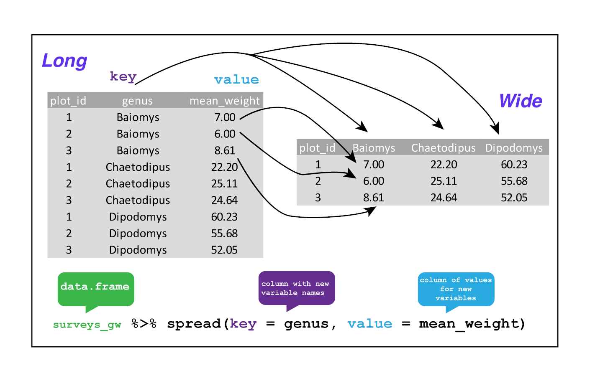
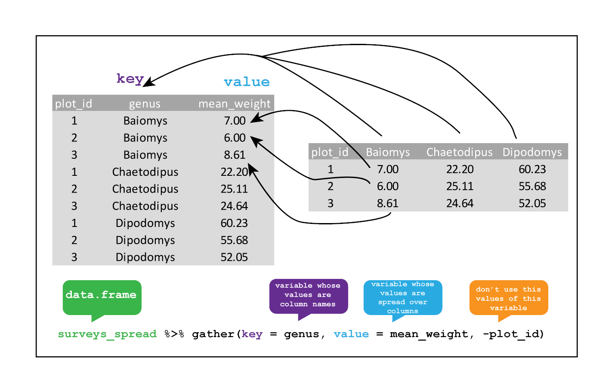

```{r, echo=FALSE, purl=FALSE, message = FALSE}
source("setup.R")
surveys <- read.csv("data/portal_data_joined.csv")
suppressWarnings(surveys$date <- lubridate::ymd(paste(surveys$year,
                                                      surveys$month,
                                                      surveys$day,
                                                      sep = "-")))
```

### Manipulating and analyzing data with dplyr

------------

> ### Learning Objectives
>
> * Describe the purpose of the **`dplyr`** and **`tidyr`** packages.
> * Select certain columns in a data frame with the **`dplyr`** function `select`.
> * Select certain rows in a data frame according to filtering conditions with the **`dplyr`** function `filter` .
> * Link the output of one **`dplyr`** function to the input of another function with the 'pipe' operator `%>%`.
> * Add new columns to a data frame that are functions of existing columns with `mutate`.
> * Use the split-apply-combine concept for data analysis.
> * Use `summarize`, `group_by`, and `count` to split a data frame into groups of observations, apply summary statistics for each group, and then combine the results.
> * Describe the concept of a wide and a long table format and for which purpose those formats are useful.
> * Describe what key-value pairs are.
> * Reshape a data frame from long to wide format and back with the `spread` and `gather` commands from the **`tidyr`** package.
> * Export a data frame to a .csv file.

------------

# Data Manipulation using **`dplyr`** and **`tidyr`**

Bracket subsetting is handy, but it can be cumbersome and difficult to read,
especially for complicated operations. Enter **`dplyr`**. **`dplyr`** is a package for
making tabular data manipulation easier. It pairs nicely with **`tidyr`** which enables you to swiftly convert between different data formats for plotting and analysis.

Packages in R are basically sets of additional functions that let you do more
stuff. The functions we've been using so far, like `str()` or `data.frame()`,
come built into R; packages give you access to more of them. Before you use a
package for the first time you need to install it on your machine, and then you
should import it in every subsequent R session when you need it. You should
already have installed the **`tidyverse`** package. This is an
"umbrella-package" that installs several packages useful for data analysis which
work together well such as **`tidyr`**, **`dplyr`**, **`ggplot2`**, **`tibble`**, etc.


The **`tidyverse`** package tries to address 3 common issues that arise when
doing data analysis with some of the functions that come with R:

1. The results from a base R function sometimes depend on the type of data.
2. Using R expressions in a non standard way, which can be confusing for new
   learners.
3. Hidden arguments, having default operations that new learners are not aware
   of.

We have seen in our previous lesson that when building or importing a data frame, the columns that contain characters (i.e., text) are coerced (=converted) into the `factor` data type. We had to set **`stringsAsFactors`** to **`FALSE`** to avoid this hidden argument to convert our data type. 

This time we will use the **`tidyverse`** package to read the data and avoid having to set **`stringsAsFactors`** to **`FALSE`**

To load the package type:


```{r, message = FALSE, purl = FALSE}
## load the tidyverse packages, incl. dplyr
library("tidyverse")
```

## What are **`dplyr`** and **`tidyr`**?

The package **`dplyr`** provides easy tools for the most common data manipulation
tasks. It is built to work directly with data frames, with many common tasks
optimized by being written in a compiled language (C++). An additional feature is the
ability to work directly with data stored in an external database. The benefits of
doing this are that the data can be managed natively in a relational database,
queries can be conducted on that database, and only the results of the query are
returned.

This addresses a common problem with R in that all operations are conducted
in-memory and thus the amount of data you can work with is limited by available
memory. The database connections essentially remove that limitation in that you
can connect to a database of many hundreds of GB, conduct queries on it directly, and pull
back into R only what you need for analysis.

The package **`tidyr`** addresses the common problem of wanting to reshape your data for plotting and use by different R functions. Sometimes we want data sets where we have one row per measurement. Sometimes we want a data frame where each measurement type has its own column, and rows are instead more aggregated groups - like plots or aquaria. Moving back and forth between these formats is nontrivial, and **`tidyr`** gives you tools for this and more sophisticated  data manipulation.

To learn more about **`dplyr`** and **`tidyr`** after the workshop, you may want to check out this
[handy data transformation with **`dplyr`** cheatsheet](https://github.com/rstudio/cheatsheets/raw/master/data-transformation.pdf) and this [one about **`tidyr`**](https://github.com/rstudio/cheatsheets/raw/master/data-import.pdf).

We'll read in our data using the `read_csv()` function, from the tidyverse package **`readr`**, instead of `read.csv()`.


```{r, results = 'hide', purl = FALSE}
surveys <- read_csv("data/portal_data_joined.csv")

## inspect the data
str(surveys)
```

```{r, eval=FALSE, purl=FALSE}
## preview the data
View(surveys)
```

Notice that the class of the data is now `tbl_df`

This is referred to as a "tibble". Tibbles tweak some of the behaviors of the data frame objects we introduced in the previous episode. The data structure is very similar to a data frame. For our purposes the only differences are that:

1. In addition to displaying the data type of each column under its name, it
   only prints the first few rows of data and only as many columns as fit on one
   screen.
2. Columns of class `character` are never converted into factors.


We're going to learn some of the most common **`dplyr`** functions:

- `select()`: subset columns
- `filter()`: subset rows on conditions
- `mutate()`: create new columns by using information from other columns
- `group_by()` and `summarize()`: create summary statisitcs on grouped data
- `arrange()`: sort results
- `count()`: count discrete values

## Selecting columns and filtering rows

To select columns of a data frame, use `select()`. The first argument
to this function is the data frame (`surveys`), and the subsequent
arguments are the columns to keep.

```{r, results = 'hide', purl = FALSE}
select(surveys, plot_id, species_id, weight)
```

To select all columns *except* certain ones, put a "-" in front of
the variable to exclude it.

```{r, results = 'hide', purl = FALSE}
select(surveys, -record_id, -species_id)
```

This will select all the variables in `surveys` except `record_id`
and `species_id`.

To choose rows based on a specific criteria, use `filter()`:

```{r, purl = FALSE}
filter(surveys, year == 1995)
```

## Pipes

What if you want to select and filter at the same time? There are three
ways to do this: use intermediate steps, nested functions, or pipes.

With intermediate steps, you create a temporary data frame and use
that as input to the next function, like this:

```{r, purl = FALSE}
surveys2 <- filter(surveys, weight < 5)
surveys_sml <- select(surveys2, species_id, sex, weight)
```

This is readable, but can clutter up your workspace with lots of objects that you have to name individually. With multiple steps, that can be hard to keep track of.

You can also nest functions (i.e. one function inside of another), like this:

```{r, purl = FALSE}
surveys_sml <- select(filter(surveys, weight < 5), species_id, sex, weight)
```

This is handy, but can be difficult to read if too many functions are nested, as
R evaluates the expression from the inside out (in this case, filtering, then selecting).

The last option, *pipes*, are a recent addition to R. Pipes let you take
the output of one function and send it directly to the next, which is useful
when you need to do many things to the same dataset.  Pipes in R look like
`%>%` and are made available via the **`magrittr`** package, installed automatically
with **`dplyr`**. If you use RStudio, you can type the pipe with <kbd>Ctrl</kbd>
+ <kbd>Shift</kbd> + <kbd>M</kbd> if you have a PC or <kbd>Cmd</kbd> + 
<kbd>Shift</kbd> + <kbd>M</kbd> if you have a Mac.

```{r, purl = FALSE}
surveys %>%
  filter(weight < 5) %>%
  select(species_id, sex, weight)
```

In the above code, we use the pipe to send the `surveys` dataset first through
`filter()` to keep rows where `weight` is less than 5, then through `select()`
to keep only the `species_id`, `sex`, and `weight` columns. Since `%>%` takes
the object on its left and passes it as the first argument to the function on
its right, we don't need to explicitly include the data frame as an argument
to the `filter()` and `select()` functions any more.

Some may find it helpful to read the pipe like the word "then". For instance,
in the above example, we took the data frame `surveys`, *then* we `filter`ed
for rows with `weight < 5`, *then* we `select`ed columns `species_id`, `sex`,
and `weight`. The **`dplyr`** functions by themselves are somewhat simple,
but by combining them into linear workflows with the pipe, we can accomplish
more complex manipulations of data frames.

If we want to create a new object with this smaller version of the data, we
can assign it a new name:

```{r, purl = FALSE}
surveys_sml <- surveys %>%
  filter(weight < 5) %>%
  select(species_id, sex, weight)

surveys_sml
```

Note that the final data frame is the leftmost part of this expression.

> ### Challenge {.challenge}
>
>  Using pipes, subset the `surveys` data to include animals collected before
>  1995 and retain only the columns `year`, `sex`, and `weight`.
> 
> 
> ```{r, answer=TRUE, eval=FALSE, purl=FALSE}
> surveys %>%
>     filter(year < 1995) %>%
>     select(year, sex, weight)
> ```

```{r, eval=FALSE, purl=TRUE, echo=FALSE}
## Pipes Challenge:
##  Using pipes, subset the data to include animals collected
##  before 1995, and retain the columns `year`, `sex`, and `weight.`
```

### Mutate

Frequently you'll want to create new columns based on the values in existing
columns, for example to do unit conversions, or to find the ratio of values in two
columns. For this we'll use `mutate()`.

To create a new column of weight in kg:

```{r, purl = FALSE}
surveys %>%
  mutate(weight_kg = weight / 1000)
```

You can also create a second new column based on the first new column within the same call of `mutate()`:

```{r, purl = FALSE}
surveys %>%
  mutate(weight_kg = weight / 1000,
         weight_kg2 = weight_kg * 2)
```

If this runs off your screen and you just want to see the first few rows, you
can use a pipe to view the `head()` of the data. (Pipes work with non-**`dplyr`**
functions, too, as long as the **`dplyr`** or `magrittr` package is loaded).

```{r, purl = FALSE}
surveys %>%
  mutate(weight_kg = weight / 1000) %>%
  head()
```

The first few rows of the output are full of `NA`s, so if we wanted to remove
those we could insert a `filter()` in the chain:

```{r, purl = FALSE}
surveys %>%
  filter(!is.na(weight)) %>%
  mutate(weight_kg = weight / 1000) %>%
  head()
```

`is.na()` is a function that determines whether something is an `NA`. The `!`
symbol negates the result, so we're asking for every row where weight *is not* an `NA`.

> ### Challenge {.challenge}
>
>  Create a new data frame from the `surveys` data that meets the following
>  criteria: contains only the `species_id` column and a new column called
>  `hindfoot_half` containing values that are half the `hindfoot_length` values.
>  In this `hindfoot_half` column, there are no `NA`s and all values are less
>  than 30.
>
>  **Hint**: think about how the commands should be ordered to produce this data frame!
> 
> ```{r, answer=TRUE, eval=FALSE, purl=FALSE}
> surveys_hindfoot_half <- surveys %>%
>     filter(!is.na(hindfoot_length)) %>%
>     mutate(hindfoot_half = hindfoot_length / 2) %>%
>     filter(hindfoot_half < 30) %>%
>     select(species_id, hindfoot_half)
> ```
 

```{r, eval=FALSE, purl=TRUE, echo=FALSE}
## Mutate Challenge:
##  Create a new data frame from the `surveys` data that meets the following
##  criteria: contains only the `species_id` column and a column that
##  contains values that are half the `hindfoot_length` values (e.g. a
##  new column `hindfoot_half`). In this `hindfoot_half` column, there are
##  no NA values and all values are < 30.

##  Hint: think about how the commands should be ordered to produce this data frame!
```

### Split-apply-combine data analysis and the summarize() function

Many data analysis tasks can be approached using the *split-apply-combine*
paradigm: split the data into groups, apply some analysis to each group, and
then combine the results. **`dplyr`** makes this very easy through the use of the
`group_by()` function.


#### The `summarize()` function

`group_by()` is often used together with `summarize()`, which collapses each
group into a single-row summary of that group.  `group_by()` takes as arguments
the column names that contain the **categorical** variables for which you want
to calculate the summary statistics. So to compute the mean `weight` by sex:

```{r, purl = FALSE}
surveys %>%
  group_by(sex) %>%
  summarize(mean_weight = mean(weight, na.rm = TRUE))
```

You may also have noticed that the output from these calls doesn't run off the
screen anymore. It's one of the advantages of `tbl_df` over data frame.

You can also group by multiple columns:

```{r, purl = FALSE}
surveys %>%
  group_by(sex, species_id) %>%
  summarize(mean_weight = mean(weight, na.rm = TRUE))
```

When grouping both by `sex` and `species_id`, the last few rows are for animals
that escaped before their sex and body weights could be determined. You may notice
that the last column does not contain `NA` but `NaN` (which refers to "Not a
Number"). To avoid this, we can remove the missing values for weight before we
attempt to calculate the summary statistics on weight. Because the missing
values are removed first, we can omit `na.rm = TRUE` when computing the mean:

```{r, purl = FALSE}
surveys %>%
  filter(!is.na(weight)) %>%
  group_by(sex, species_id) %>%
  summarize(mean_weight = mean(weight))
```

Here, again, the output from these calls doesn't run off the screen
anymore. If you want to display more data, you can use the `print()` function
at the end of your chain with the argument `n` specifying the number of rows to
display:

```{r, purl = FALSE}
surveys %>%
  filter(!is.na(weight)) %>%
  group_by(sex, species_id) %>%
  summarize(mean_weight = mean(weight)) %>%
  print(n = 15)
```

Once the data are grouped, you can also summarize multiple variables at the same
time (and not necessarily on the same variable). For instance, we could add a
column indicating the minimum weight for each species for each sex:

```{r, purl = FALSE}
surveys %>%
  filter(!is.na(weight)) %>%
  group_by(sex, species_id) %>%
  summarize(mean_weight = mean(weight),
            min_weight = min(weight))
```

It is sometimes useful to rearrange the result of a query to inspect the values. For instance, we can sort on `min_weight` to put the lighter species first:


```{r, purl = FALSE}
surveys %>%
  filter(!is.na(weight)) %>%
  group_by(sex, species_id) %>%
  summarize(mean_weight = mean(weight),
            min_weight = min(weight)) %>%
  arrange(min_weight)
```

To sort in descending order, we need to add the `desc()` function. If we want to sort the results by decreasing order of mean weight:

```{r, purl = FALSE}
surveys %>%
  filter(!is.na(weight)) %>%
  group_by(sex, species_id) %>%
  summarize(mean_weight = mean(weight),
            min_weight = min(weight)) %>%
  arrange(desc(mean_weight))
```


#### Counting

When working with data, we often want to know the number of observations found
for each factor or combination of factors. For this task, **`dplyr`** provides
`count()`. For example, if we wanted to count the number of rows of data for
each sex, we would do:

```{r, purl = FALSE}
surveys %>%
    count(sex) 
```

The `count()` function is shorthand for something we've already seen: grouping by a variable, and summarizing it by counting the number of observations in that group. In other words, `surveys %>% count()` is equivalent to:  

```{r, purl = FALSE}
surveys %>%
    group_by(sex) %>%
    summarise(count = n())
```

For convenience, `count()` provides the `sort` argument:  

```{r, purl = FALSE}
surveys %>%
    count(sex, sort = TRUE) 
```

Previous example shows the use of `count()` to count the number of rows/observations 
for *one* factor (i.e., `sex`). 
If we wanted to count *combination of factors*, such as `sex` and `species`, 
we would specify the first and the second factor as the arguments of `count()`:

```{r purl = FALSE}
surveys %>%
  count(sex, species) 
```

With the above code, we can proceed with `arrange()` to sort the table 
according to a number of criteria so that we have a better comparison. 
For instance, we might want to arrange the table above in (i) an alphabetical order of 
the levels of the species and (ii) in descending order of the count:

```{r purl = FALSE}
surveys %>%
  count(sex, species) %>%
  arrange(species, desc(n))
```

From the table above, we may learn that, for instance, there are 75 observations of 
the *albigula* species that are not specified for its sex (i.e. `NA`).

> ### Challenge {.challenge}
>
> 1. How many animals were caught in each `plot_type` surveyed?
>
> ```{r, answer=TRUE, purl=FALSE}
> surveys %>%
>     count(plot_type) 
> ```
>
> 2. Use `group_by()` and `summarize()` to find the mean, min, and max hindfoot
> length for each species (using `species_id`). Also add the number of
> observations (hint: see `?n`).
>
> ```{r, answer=TRUE, purl=FALSE}
> surveys %>%
>     filter(!is.na(hindfoot_length)) %>%
>     group_by(species_id) %>%
>     summarize(
>         mean_hindfoot_length = mean(hindfoot_length),
>         min_hindfoot_length = min(hindfoot_length),
>         max_hindfoot_length = max(hindfoot_length),
>         n = n()
>     )
> ```
>
> 3. What was the heaviest animal measured in each year? Return the columns `year`,
> `genus`, `species_id`, and `weight`.
>
> ```{r, answer=TRUE, purl=FALSE}
> surveys %>%
>     filter(!is.na(weight)) %>%
>     group_by(year) %>%
>     filter(weight == max(weight)) %>%
>     select(year, genus, species, weight) %>%
>     arrange(year)
> ```


```{r, eval=FALSE, purl=TRUE, echo=FALSE}
## Count Challenges:
##  1. How many animals were caught in each `plot_type` surveyed?

##  2. Use `group_by()` and `summarize()` to find the mean, min, and max
## hindfoot length for each species (using `species_id`). Also add the number of
## observations (hint: see `?n`).

##  3. What was the heaviest animal measured in each year? Return the
##  columns `year`, `genus`, `species_id`, and `weight`.
```

### Reshaping with gather and spread

In the [spreadsheet
lesson](http://www.datacarpentry.org/spreadsheet-ecology-lesson/01-format-data/),
we discussed how to structure our data leading to the four rules defining a tidy
dataset:

1. Each variable has its own column
2. Each observation has its own row
3. Each value must have its own cell
4. Each type of observational unit forms a table

Here we examine the fourth rule: Each type of observational unit forms a table.

In `surveys` , the rows of `surveys` contain the values of variables associated
with each record (the unit), values such the weight or sex of each animal 
associated with each record. What if instead of comparing records, we 
wanted to compare the different mean weight of each species between plots? (Ignoring `plot_type` for simplicity).

We'd need to create a new table where each row (the unit) is comprised of values of variables associated with each plot. In practical terms this means the values
of the species in `genus` would become the names of column variables and the cells would contain the values of the mean weight observed on each plot.

Having created a new table, it is therefore straightforward to explore the 
relationship between the weight of different species within, and between, the
plots. The key point here is that we are still following a tidy data structure,
but we have **reshaped** the data according to the observations of interest:
average species weight per plot instead of recordings per date.

The opposite transformation would be to transform column names into values of
a variable.

We can do both these of transformations with two `tidyr` functions, `spread()`
and `gather()`.

#### Spreading

`spread()` takes three principal arguments:

1. the data 
2. the *key* column variable whose values will become new column names.  
3. the *value* column variable whose values will fill the new column variables.

Further arguments include `fill` which, if set, fills in missing values with 
the value provided.

Let's use `spread()` to transform surveys to find the mean weight of each 
species in each plot over the entire survey period. We use `filter()`,
`group_by()` and `summarise()` to filter our observations and variables of 
interest, and create a new variable for the `mean_weight`. We use the pipe as 
before too.

```{r, purl=FALSE}
surveys_gw <- surveys %>%
  filter(!is.na(weight)) %>%
  group_by(genus, plot_id) %>%
  summarize(mean_weight = mean(weight))

str(surveys_gw)
```

This yields `surveys_gw` where the observations for each plot are spread across
multiple rows, 196 observations of 3 variables. 
Using `spread()` to key on `genus` with values from `mean_weight` this becomes
24 observations of 11 variables, one row for each plot. We again use pipes:

```{r, purl=FALSE}
surveys_spread <- surveys_gw %>%
  spread(key = genus, value = mean_weight)

str(surveys_spread)
```



We could now plot comparisons between the weight of species in different plots, 
although we may wish to fill in the missing values first.

```{r, purl=FALSE}
surveys_gw %>%
  spread(genus, mean_weight, fill = 0) %>%
  head()
```

#### Gathering

The opposing situation could occur if we had been provided with data in the
form of `surveys_spread`, where the genus names are column names, but we 
wish to treat them as values of a genus variable instead.

In this situation we are gathering the column names and turning them into a
pair of new variables. One variable represents the column names as values, and
the other variable contains the values previously associated with the column names.

`gather()` takes four principal arguments:

1. the data
2. the *key* column variable we wish to create from column names.
3. the *values* column variable we wish to create and fill with values 
associated with the key.
4. the names of the columns we use to fill the key variable (or to drop).

To recreate `surveys_gw` from `surveys_spread` we would create a key called
`genus` and value called `mean_weight` and use all columns except `plot_id` for
the key variable. Here we drop `plot_id` column with a minus sign.

```{r, purl=FALSE}
surveys_gather <- surveys_spread %>%
  gather(key = genus, value = mean_weight, -plot_id)

str(surveys_gather)
```



Note that now the `NA` genera are included in the re-gathered format. Spreading
and then gathering can be a useful way to balance out a dataset so every
replicate has the same composition.

We could also have used a specification for what columns to include. This can be
useful if you have a large number of identifying columns, and it's easier to
specify what to gather than what to leave alone. And if the columns are in a
row, we don't even need to list them all out - just use the `:` operator!

```{r, purl=FALSE}
surveys_spread %>%
  gather(key = genus, value = mean_weight, Baiomys:Spermophilus) %>%
  head()
```

> ### Challenge {.challenge}
>
> 1. Spread the `surveys` data frame with `year` as columns, `plot_id` 
>   as rows, and the
>   number of genera per plot as the values. You will need to summarize before
>   reshaping, and use the function `n_distinct()` to get the number of unique
>   genera within a particular chunk of data. It's a powerful function! See
>   `?n_distinct` for more.
> 
> ```{r, answer=TRUE, purl=FALSE}
> rich_time <- surveys %>%
>   group_by(plot_id, year) %>%
>   summarize(n_genera = n_distinct(genus)) %>%
>   spread(year, n_genera)
> 
> head(rich_time)
> ```
>
> 2. Now take that data frame and `gather()` it again, so each row is a unique
>    `plot_id` by `year` combination.
>
> ```{r, answer=TRUE, purl=FALSE}
> rich_time %>%
>   gather(year, n_genera, -plot_id)
> ```
>
> 3. The `surveys` data set has
>    two measurement columns: `hindfoot_length` and `weight`.  This makes it
>    difficult to do things like look at the relationship between mean values of
>    each measurement per year in different plot types. Let's walk through a
>    common solution for this type of problem. First, use `gather()` to create a
>     dataset where we have a key column called `measurement` and a
>    `value` column that takes on the value of either `hindfoot_length` or
>    `weight`. *Hint*: You'll need to specify which columns are being gathered.
>
> ```{r, answer=TRUE, purl=FALSE}
> surveys_long <- surveys %>%
>   gather(measurement, value, hindfoot_length, weight)
> ```
>
> 4. With this new data set, calculate the average of each
>    `measurement` in each `year` for each different `plot_type`. Then
>    `spread()` them into a data set with a column for `hindfoot_length` and
>    `weight`. *Hint*: You only need to specify the key and value
>    columns for `spread()`.
>
> ```{r, answer=TRUE, purl=FALSE}
> surveys_long %>%
>   group_by(year, measurement, plot_type) %>%
>   summarize(mean_value = mean(value, na.rm=TRUE)) %>%
>   spread(measurement, mean_value)
> ```

```{r, eval=FALSE, purl=TRUE, echo=FALSE}
## Reshaping challenges

## 1. Make a wide data frame with `year` as columns, `plot_id`` as rows, and where the values are the number of genera per plot. You will need to summarize before reshaping, and use the function `n_distinct` to get the number of unique genera within a chunk of data. It's a powerful function! See `?n_distinct` for more.

## 2. Now take that data frame, and make it long again, so each row is a unique `plot_id` `year` combination

## 3. The `surveys` data set is not truly wide or long because there are two columns of measurement - `hindfoot_length` and `weight`.  This makes it difficult to do things like look at the relationship between mean values of each measurement per year in different plot types. Let's walk through a common solution for this type of problem. First, use `gather` to create a truly long dataset where we have a key column called `measurement` and a `value` column that takes on the value of either `hindfoot_length` or `weight`. Hint: You'll need to specify which columns are being gathered.

## 4. With this new truly long data set, calculate the average of each `measurement` in each `year` for each different `plot_type`. Then `spread` them into a wide data set with a column for `hindfoot_length` and `weight`. Hint: Remember, you only need to specify the key and value columns for `spread`.

```

# Exporting data

Now that you have learned how to use **`dplyr`** to extract information from
or summarize your raw data, you may want to export these new data sets to share
them with your collaborators or for archival.

Similar to the `read_csv()` function used for reading CSV files into R, there is
a `write_csv()` function that generates CSV files from data frames.

Before using `write_csv()`, we are going to create a new folder, `data_output`,
in our working directory that will store this generated dataset. We don't want
to write generated datasets in the same directory as our raw data. It's good
practice to keep them separate. The `data` folder should only contain the raw,
unaltered data, and should be left alone to make sure we don't delete or modify
it. In contrast, our script will generate the contents of the `data_output`
directory, so even if the files it contains are deleted, we can always
re-generate them.

In preparation for our next lesson on plotting, we are going to prepare a
cleaned up version of the data set that doesn't include any missing data.

Let's start by removing observations of animals for which `weight` and `hindfoot_length` are missing, or the `sex` has not been determined:


```{r, purl=FALSE}
surveys_complete <- surveys %>%
  filter(!is.na(weight),           # remove missing weight
         !is.na(hindfoot_length),  # remove missing hindfoot_length
         !is.na(sex))                # remove missing sex
```

Because we are interested in plotting how species abundances have changed
through time, we are also going to remove observations for rare species (i.e.,
that have been observed less than 50 times). We will do this in two steps: first
we are going to create a data set that counts how often each species has been
observed, and filter out the rare species; then, we will extract only the
observations for these more common species:

```{r, purl=FALSE}
## Extract the most common species_id
species_counts <- surveys_complete %>%
    count(species_id) %>% 
    filter(n >= 50)

## Only keep the most common species
surveys_complete <- surveys_complete %>%
  filter(species_id %in% species_counts$species_id)
```

```{r, eval=FALSE, purl=TRUE, echo=FALSE}
### Create the dataset for exporting:
##  Start by removing observations for which the `species_id`, `weight`,
##  `hindfoot_length`, or `sex` data are missing:
surveys_complete <- surveys %>%
    filter(species_id != "",        # remove missing species_id
           !is.na(weight),                 # remove missing weight
           !is.na(hindfoot_length),        # remove missing hindfoot_length
           sex != "")                      # remove missing sex

##  Now remove rare species in two steps. First, make a list of species which
##  appear at least 50 times in our dataset:
species_counts <- surveys_complete %>%
    count(species_id) %>% 
    filter(n >= 50) %>%
    select(species_id)

##  Second, keep only those species:
surveys_complete <- surveys_complete %>%
    filter(species_id %in% species_counts$species_id)
```

To make sure that everyone has the same data set, check that `surveys_complete`
has `r nrow(surveys_complete)` rows and `r ncol(surveys_complete)` columns by
typing `dim(surveys_complete)`.

Now that our data set is ready, we can save it as a CSV file in our `data_output`
folder.

```{r, purl=FALSE, eval=FALSE}
write_csv(surveys_complete, path = "data_output/surveys_complete.csv")
```

```{r, purl=FALSE, eval=TRUE, echo=FALSE}
if (!dir.exists("data_output")) dir.create("data_output")
write_csv(surveys_complete, path = "data_output/surveys_complete.csv")
```


```{r, child="_page_built_on.Rmd"}
```
