***
::::::::::::::::::::::::::::::::::::::: questions

- How do you make plots using R?
- How do you customize and modify plots?

::::::::::::::::::::::::::::::::::::::::::::::::::

:::::::::::::::::::::::::::::::::::::: objectives

- Produce scatter plots, boxplots, and time series plots using ggplot.
- Set universal plot settings.
- Describe what faceting is and apply faceting in ggplot.
- Modify the aesthetics of an existing ggplot plot (including axis labels and color).
- Build complex and customized plots from data in a data frame.

::::::::::::::::::::::::::::::::::::::::::::::::::

***

We start by loading the required packages. **`ggplot2`** is included in the **`tidyverse`** package.


```r
library(tidyverse)
```

If not still in the workspace, load the data we saved in the previous lesson.


```r
surveys_complete <- read_csv("data/surveys_complete.csv")
```

## Plotting with **`ggplot2`**

**`ggplot2`** is a plotting package that provides helpful commands to create complex plots
from data in a data frame. It provides a more programmatic interface for
specifying what variables to plot, how they are displayed, and general visual
properties. Therefore, we only need minimal changes if the underlying data
change or if we decide to change from a bar plot to a scatterplot. This helps in
creating publication quality plots with minimal amounts of adjustments and
tweaking.

**`ggplot2`** refers to the name of the package itself. When using the package we use the
function **`ggplot()`** to generate the plots, and so references to using the function will
be referred to as **`ggplot()`** and the package as a whole as **`ggplot2`**

**`ggplot2`** plots work best with data in the 'long' format, i.e., a column for every variable,
and a row for every observation. Well-structured data will save you lots of time
when making figures with **`ggplot2`**

ggplot graphics are built layer by layer by adding new elements. Adding layers in
this fashion allows for extensive flexibility and customization of plots.

To build a ggplot, we will use the following basic template that can be used for different types of plots:

```
ggplot(data = <DATA>, mapping = aes(<MAPPINGS>)) +  <GEOM_FUNCTION>()
```

- use the `ggplot()` function and bind the plot to a specific data frame using
  the `data` argument


```r
ggplot(data = surveys_complete)
```

- define an aesthetic mapping (using the aesthetic (`aes`) function), by
  selecting the variables to be plotted and specifying how to present them in the
  graph, e.g., as x/y positions or characteristics such as size, shape, color, etc.


```r
ggplot(data = surveys_complete, mapping = aes(x = weight, y = hindfoot_length))
```

- add 'geoms' – graphical representations of the data in the plot (points,
  lines, bars). **`ggplot2`** offers many different geoms; we will use some
  common ones today, including:
  
  - `geom_point()` for scatter plots, dot plots, etc.
  - `geom_boxplot()` for, well, boxplots!
  - `geom_line()` for trend lines, time series, etc.

To add a geom to the plot use `+` operator. Because we have two continuous
variables, let's use `geom_point()` first:


```r
ggplot(data = surveys_complete, aes(x = weight, y = hindfoot_length)) +
  geom_point()
```

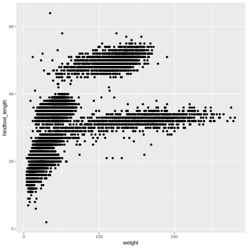

The `+` in the **`ggplot2`** package is particularly useful because it allows
you to modify existing `ggplot` objects. This means you can easily set up plot
"templates" and conveniently explore different types of plots, so the above
plot can also be generated with code like this:


```r
# Assign plot to a variable
surveys_plot <- ggplot(data = surveys_complete,
                       mapping = aes(x = weight, y = hindfoot_length))

# Draw the plot
surveys_plot +
    geom_point()
```


**Notes**

- Anything you put in the `ggplot()` function can be seen by any geom layers
  that you add (i.e., these are universal plot settings). This includes the x-
  and y-axis you set up in `aes()`.
- You can also specify aesthetics for a given geom independently of the
  aesthetics defined globally in the `ggplot()` function.
- The `+` sign used to add layers must be placed at the end of each line
  containing a layer. If, instead, the `+` sign is added in the line before the
  other layer, **`ggplot2`** will not add the new layer and will return an error
  message.
- You may notice that we sometimes reference 'ggplot2' and sometimes 'ggplot'.
  To clarify, 'ggplot2' is the name of the most recent version of the package.
  However, any time we call the function itself, it's just called 'ggplot'.
- The previous version of the **`ggplot2`** package, called **`ggplot`**,
  which also contained the `ggplot()` function is now unsupported and has
  been removed from CRAN in order to reduce accidental installations
  and further confusion.


```r
# This is the correct syntax for adding layers
surveys_plot +
  geom_point()

# This will not add the new layer and will return an error message
surveys_plot
  + geom_point()
```

:::::::::::::::::::::::::::::::::::::::  challenge

### Challenge (optional)

Scatter plots can be useful exploratory tools for small datasets. For data
sets with large numbers of observations, such as the `surveys_complete` data
set, overplotting of points can be a limitation of scatter plots. One strategy
for handling such settings is to use hexagonal binning of observations. The
plot space is tessellated into hexagons. Each hexagon is assigned a color
based on the number of observations that fall within its boundaries.  To use
hexagonal binning with **`ggplot2`**, first install the R package `hexbin`
from CRAN:


```r
install.packages("hexbin")
library(hexbin)
```

Then use the `geom_hex()` function:


```r
surveys_plot +
 geom_hex()
```

- What are the relative strengths and weaknesses of a hexagonal bin plot
  compared to a scatter plot? Examine the above scatter plot and compare it
  with the hexagonal bin plot that you created.

::::::::::::::::::::::::::::::::::::::::::::::::::


## Building your plots iteratively

Building plots with **`ggplot2`** is typically an iterative process. We start by
defining the dataset we'll use, lay out the axes, and choose a geom:


```r
ggplot(data = surveys_complete, aes(x = weight, y = hindfoot_length)) +
    geom_point()
```


Then, we start modifying this plot to extract more information from it. For
instance, we can add transparency (`alpha`) to avoid overplotting:


```r
ggplot(data = surveys_complete, aes(x = weight, y = hindfoot_length)) +
    geom_point(alpha = 0.1)
```

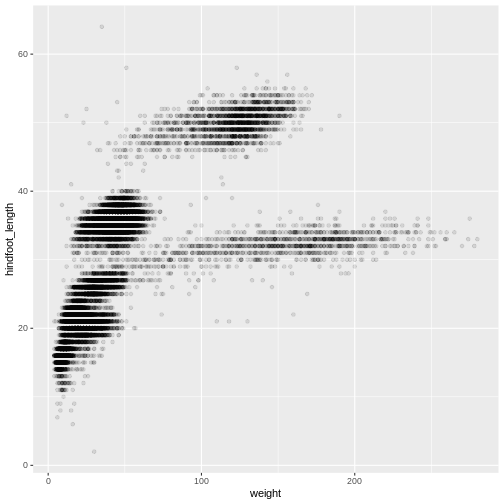

We can also add colors for all the points:


```r
ggplot(data = surveys_complete, mapping = aes(x = weight, y = hindfoot_length)) +
    geom_point(alpha = 0.1, color = "blue")
```

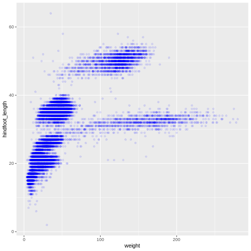

Or to color each species in the plot differently, you could use a vector as an input to the argument **color**. **`ggplot2`** will provide a different color corresponding to different values in the vector. Here is an example where we color with **`species_id`**:


```r
ggplot(data = surveys_complete, mapping = aes(x = weight, y = hindfoot_length)) +
    geom_point(alpha = 0.1, aes(color = species_id))
```

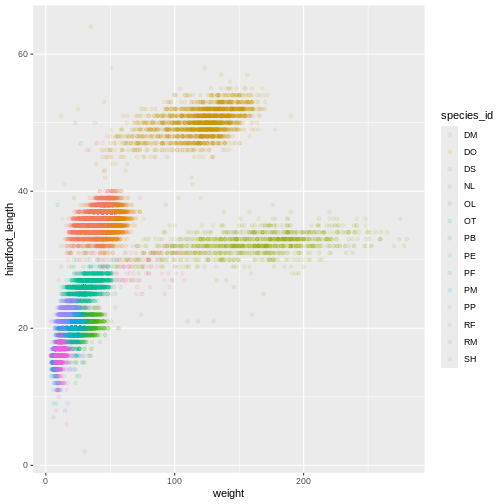

:::::::::::::::::::::::::::::::::::::::  challenge

### Challenge

Use what you just learned to create a scatter plot of `weight` over
`species_id` with the plot types showing in different colors.
Is this a good way to show this type of data?

:::::::: solution


```r
ggplot(data = surveys_complete,
       mapping = aes(x = species_id, y = weight)) +
   geom_point(aes(color = plot_type))
```

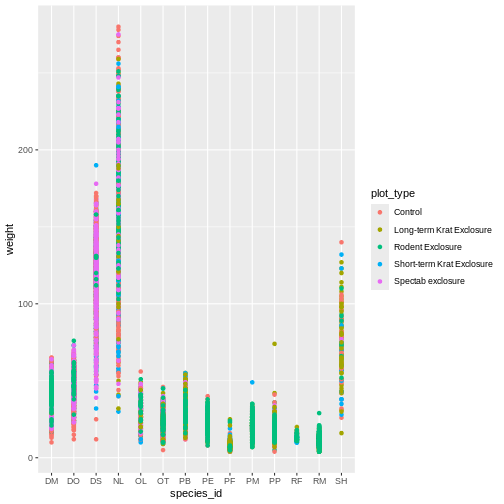

:::::::::::::::::

::::::::::::::::::::::::::::::::::::::::::::::::::


## Boxplot

We can use boxplots to visualize the distribution of weight within each species:


```r
ggplot(data = surveys_complete, mapping = aes(x = species_id, y = weight)) +
    geom_boxplot()
```

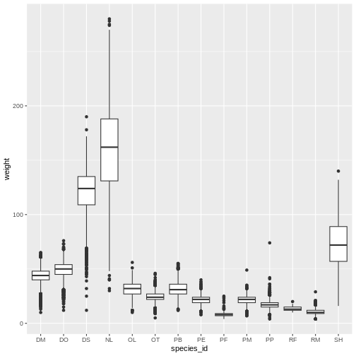

By adding points to the boxplot, we can have a better idea of the number of
measurements and of their distribution. Because the boxplot will show the outliers
by default these points will be plotted twice -- by `geom_boxplot` and
`geom_jitter`. To avoid this we must specify that no outliers should be added
to the boxplot by specifying `outlier.shape = NA`.


```r
ggplot(data = surveys_complete, mapping = aes(x = species_id, y = weight)) +
    geom_boxplot(outlier.shape = NA) +
    geom_jitter(alpha = 0.3, color = "tomato")
```

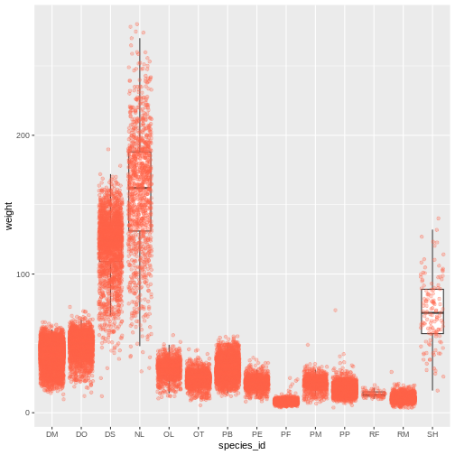

Notice how the boxplot layer is behind the jitter layer? What do you need to
change in the code to put the boxplot in front of the points such that it's not
hidden?

:::::::::::::::::::::::::::::::::::::::  challenge

### Challenges

Boxplots are useful summaries, but hide the *shape* of the distribution. For
example, if there is a bimodal distribution, it would not be observed with a
boxplot. An alternative to the boxplot is the violin plot (sometimes known as
a beanplot), where the shape (of the density of points) is drawn.

- Replace the box plot with a violin plot; see `geom_violin()`.

:::::::: solution


```r
ggplot(data = surveys_complete, mapping = aes(x = species_id, y = weight)) +
geom_jitter(alpha = 0.3, color = "tomato") +
geom_violin() 
```

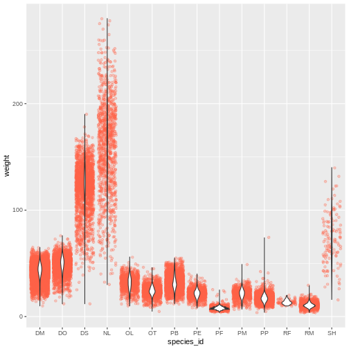

:::::::::::::::::

In many types of data, it is important to consider the *scale* of the
observations.  For example, it may be worth changing the scale of the axis to
better distribute the observations in the space of the plot.  Changing the scale
of the axes is done similarly to adding/modifying other components (i.e., by
incrementally adding commands). Try making these modifications:

- Represent weight on the log~10~ scale; see `scale_y_log10()`.

:::::::: solution


```r
ggplot(data = surveys_complete, mapping = aes(x = species_id, y = weight)) +
scale_y_log10() +
geom_jitter(alpha = 0.3, color = "tomato") +
geom_boxplot(outlier.shape = NA)
```

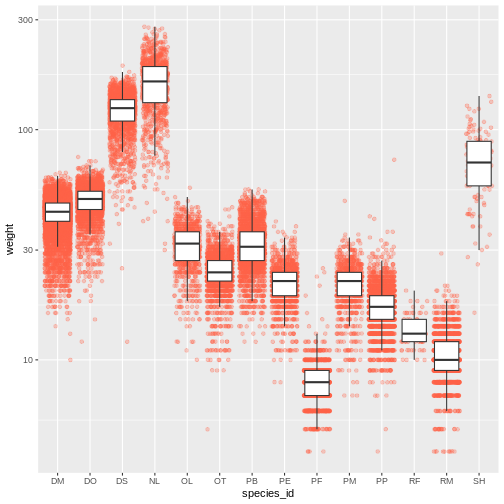

:::::::::::::::::

So far, we've looked at the distribution of weight within species. Try making
a new plot to explore the distribution of another variable within each species.

- Create boxplot for `hindfoot_length`.  Overlay the boxplot layer on a jitter
  layer to show actual measurements.

:::::::: solution


```r
ggplot(data = surveys_complete, mapping = aes(x = species_id, y = hindfoot_length)) +
geom_jitter(alpha = 0.3, color = "tomato") +
geom_boxplot(outlier.shape = NA)
```

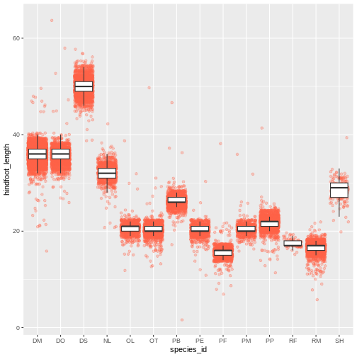

:::::::::::::::::

- Add color to the data points on your boxplot according to the plot from which
  the sample was taken (`plot_id`).

Hint: Check the class for `plot_id`. Consider changing the class of `plot_id`
from integer to factor. Why does this change how R makes the graph?

::::::::::::::::::::::::::::::::::::::::::::::::::


## Plotting time series data

Let's calculate number of counts per year for each genus. First we need
to group the data and count records within each group:


```r
yearly_counts <- surveys_complete %>%
  count(year, genus)
```

Timelapse data can be visualized as a line plot with years on the x-axis and
counts on the y-axis:


```r
ggplot(data = yearly_counts, aes(x = year, y = n)) +
     geom_line()
```

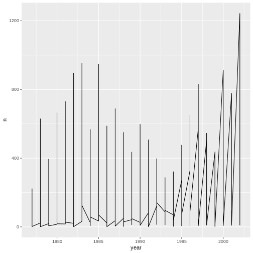

Unfortunately, this does not work because we plotted data for all the genera
together. We need to tell ggplot to draw a line for each genus by modifying
the aesthetic function to include `group = genus`:


```r
ggplot(data = yearly_counts, aes(x = year, y = n, group = genus)) +
    geom_line()
```

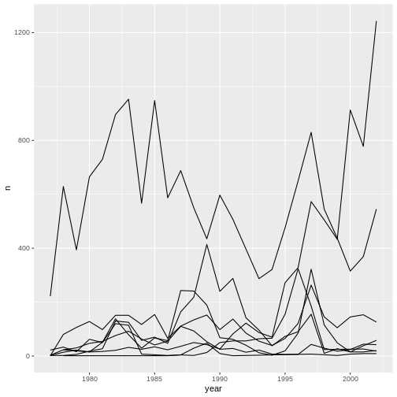

We will be able to distinguish genera in the plot if we add colors (using
`color` also automatically groups the data):


```r
ggplot(data = yearly_counts, aes(x = year, y = n, color = genus)) +
    geom_line()
```

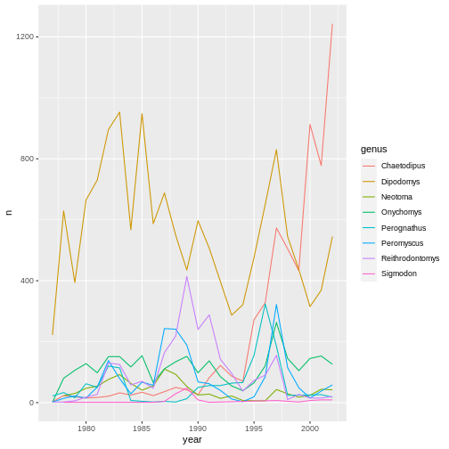

## Integrating the pipe operator with ggplot2

In the previous lesson, we saw how to use the pipe operator `%>%` to use
different functions in a sequence and create a coherent workflow.
We can also use the pipe operator to pass the `data` argument to the
`ggplot()` function. The hard part is to remember that to build your ggplot,
you need to use `+` and not `%>%`.


```r
yearly_counts %>%
    ggplot(mapping = aes(x = year, y = n, color = genus)) +
    geom_line()
```

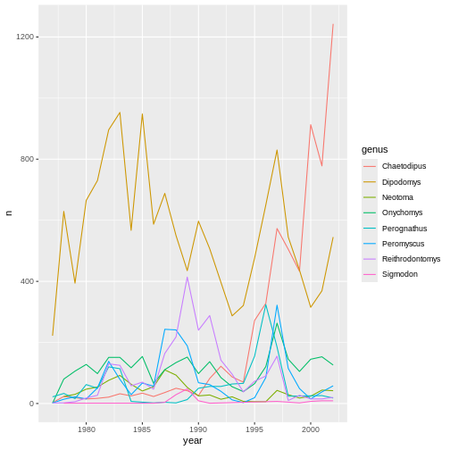

The pipe operator can also be used to link data manipulation with consequent data visualization.


```r
yearly_counts_graph <- surveys_complete %>%
    count(year, genus) %>%
    ggplot(mapping = aes(x = year, y = n, color = genus)) +
    geom_line()

yearly_counts_graph
```


## Faceting

`ggplot` has a special technique called *faceting* that allows the user to split
one plot into multiple plots based on a factor included in the dataset. We will
use it to make a time series plot for each genus:


```r
ggplot(data = yearly_counts, aes(x = year, y = n)) +
    geom_line() +
    facet_wrap(facets = vars(genus))
```

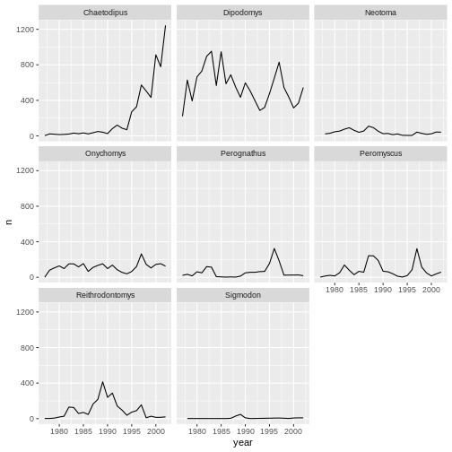

Now we would like to split the line in each plot by the sex of each individual
measured. To do that we need to make counts in the data frame grouped by `year`,
`genus`, and `sex`:


```r
 yearly_sex_counts <- surveys_complete %>%
                      count(year, genus, sex)
```

We can now make the faceted plot by splitting further by sex using `color`
(within a single plot):


```r
ggplot(data = yearly_sex_counts, mapping = aes(x = year, y = n, color = sex)) +
  geom_line() +
  facet_wrap(facets =  vars(genus))
```

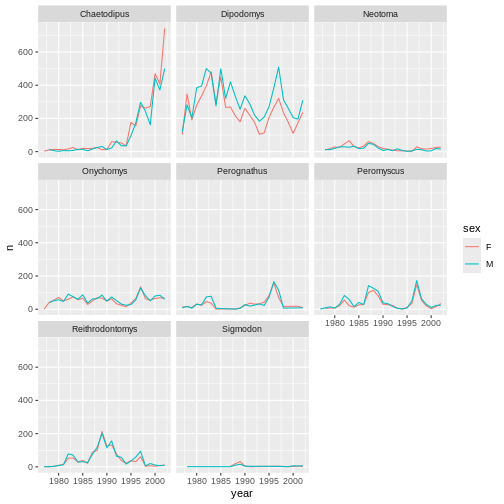

We can also facet both by sex and genus:


```r
ggplot(data = yearly_sex_counts,
       mapping = aes(x = year, y = n, color = sex)) +
  geom_line() +
  facet_grid(rows = vars(sex), cols =  vars(genus))
```

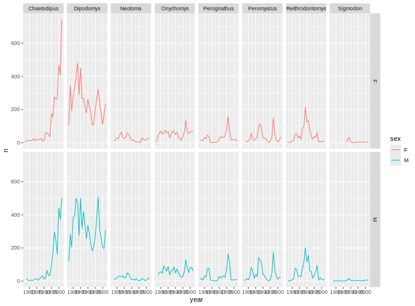

You can also organise the panels only by rows (or only by columns):


```r
# One column, facet by rows
ggplot(data = yearly_sex_counts,
       mapping = aes(x = year, y = n, color = sex)) +
  geom_line() +
  facet_grid(rows = vars(genus))
```

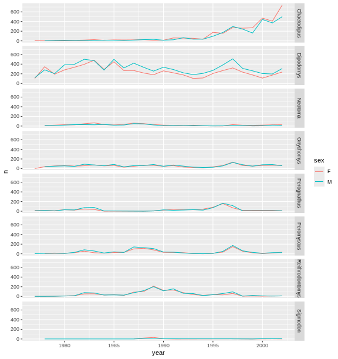


```r
# One row, facet by column
ggplot(data = yearly_sex_counts,
       mapping = aes(x = year, y = n, color = sex)) +
  geom_line() +
  facet_grid(cols = vars(genus))
```

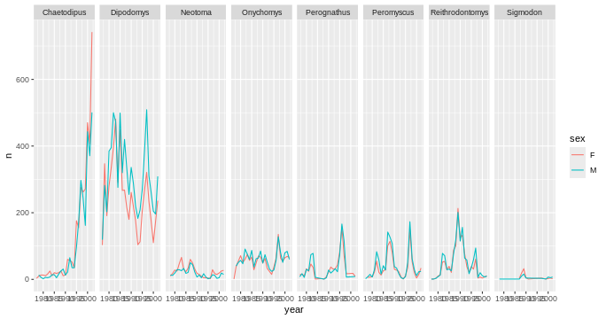

**Note:**
`ggplot2` before version 3.0.0 used formulas to specify how plots are faceted.
If you encounter `facet_grid`/`wrap(...)` code containing `~`, please read
[https://ggplot2.tidyverse.org/news/#tidy-evaluation](https://ggplot2.tidyverse.org/news/#tidy-evaluation).

## **`ggplot2`** themes

Usually plots with white background look more readable when printed.
Every single component of a `ggplot` graph can be customized using the generic
`theme()` function, as we will see below. However, there are pre-loaded themes
available that change the overall appearance of the graph without much effort.

For example, we can change our previous graph to have a simpler white background
using the `theme_bw()` function:


```r
 ggplot(data = yearly_sex_counts,
        mapping = aes(x = year, y = n, color = sex)) +
     geom_line() +
     facet_wrap(vars(genus)) +
     theme_bw()
```

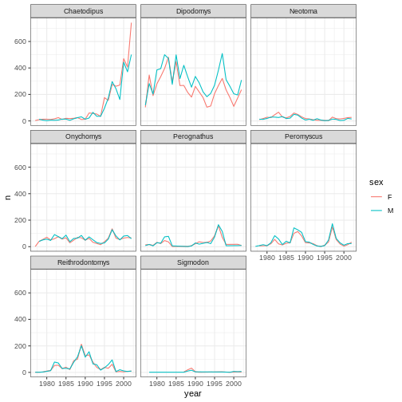

In addition to `theme_bw()`, which changes the plot background to white, **`ggplot2`**
comes with several other themes which can be useful to quickly change the look
of your visualization. The complete list of themes is available
at [https://ggplot2.tidyverse.org/reference/ggtheme.html](https://ggplot2.tidyverse.org/reference/ggtheme.html). `theme_minimal()` and
`theme_light()` are popular, and `theme_void()` can be useful as a starting
point to create a new hand-crafted theme.

The
[ggthemes](https://jrnold.github.io/ggthemes/reference/index.html) package
provides a wide variety of options.

:::::::::::::::::::::::::::::::::::::::  challenge

### Challenge

Use what you just learned to create a plot that depicts how the average weight
of each species changes through the years.

:::::::: solution


```r
yearly_weight <- surveys_complete %>%
                group_by(year, species_id) %>%
                 summarize(avg_weight = mean(weight))
```

```{.output}
#> `summarise()` has grouped output by 'year'. You can override using the
#> `.groups` argument.
```

```r
ggplot(data = yearly_weight, mapping = aes(x=year, y=avg_weight)) +
   geom_line() +
   facet_wrap(vars(species_id)) +
   theme_bw()
```


:::::::::::::::::

::::::::::::::::::::::::::::::::::::::::::::::::::


## Customization

Take a look at the [**`ggplot2`** cheat sheet](https://posit.co/wp-content/uploads/2022/10/data-visualization-1.pdf), and
think of ways you could improve the plot.

Now, let's change names of axes to something more informative than 'year'
and 'n' and add a title to the figure:


```r
ggplot(data = yearly_sex_counts, aes(x = year, y = n, color = sex)) +
    geom_line() +
    facet_wrap(vars(genus)) +
    labs(title = "Observed genera through time",
         x = "Year of observation",
         y = "Number of individuals") +
    theme_bw()
```

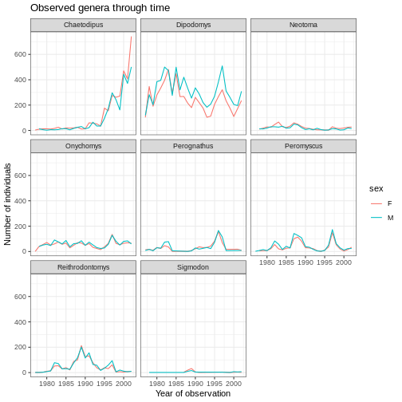

The axes have more informative names, but their readability can be improved by
increasing the font size. This can be done with the generic `theme()` function:


```r
ggplot(data = yearly_sex_counts, mapping = aes(x = year, y = n, color = sex)) +
    geom_line() +
    facet_wrap(vars(genus)) +
    labs(title = "Observed genera through time",
        x = "Year of observation",
        y = "Number of individuals") +
    theme_bw() +
    theme(text=element_text(size = 16))
```

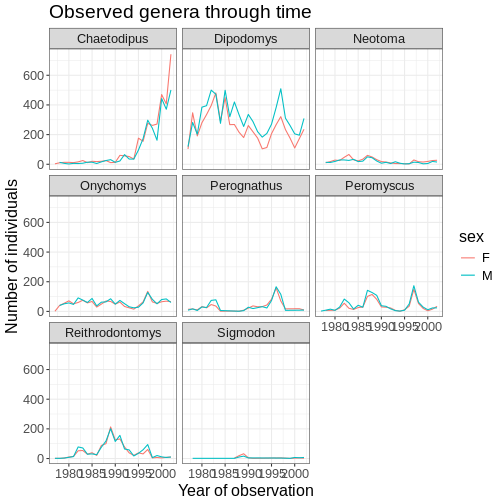

Note that it is also possible to change the fonts of your plots. If you are on
Windows, you may have to install
the [**`extrafont`** package](https://github.com/wch/extrafont), and follow the
instructions included in the README for this package.

After our manipulations, you may notice that the values on the x-axis are still
not properly readable. Let's change the orientation of the labels and adjust
them vertically and horizontally so they don't overlap. You can use a 90 degree
angle, or experiment to find the appropriate angle for diagonally oriented
labels. We can also modify the facet label text (`strip.text`) to italicize the genus
names:


```r
ggplot(data = yearly_sex_counts, mapping = aes(x = year, y = n, color = sex)) +
    geom_line() +
    facet_wrap(vars(genus)) +
    labs(title = "Observed genera through time",
        x = "Year of observation",
        y = "Number of individuals") +
    theme_bw() +
    theme(axis.text.x = element_text(colour = "grey20", size = 12, angle = 90, hjust = 0.5, vjust = 0.5),
                        axis.text.y = element_text(colour = "grey20", size = 12),
                        strip.text = element_text(face = "italic"),
                        text = element_text(size = 16))
```

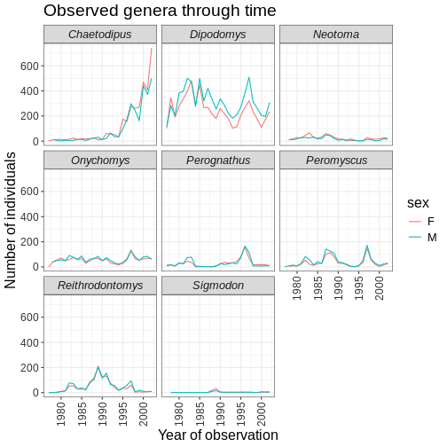

If you like the changes you created better than the default theme, you can save
them as an object to be able to easily apply them to other plots you may create:


```r
grey_theme <- theme(axis.text.x = element_text(colour="grey20", size = 12,
                                               angle = 90, hjust = 0.5,
                                               vjust = 0.5),
                    axis.text.y = element_text(colour = "grey20", size = 12),
                    text=element_text(size = 16))

ggplot(surveys_complete, aes(x = species_id, y = hindfoot_length)) +
    geom_boxplot() +
    grey_theme
```

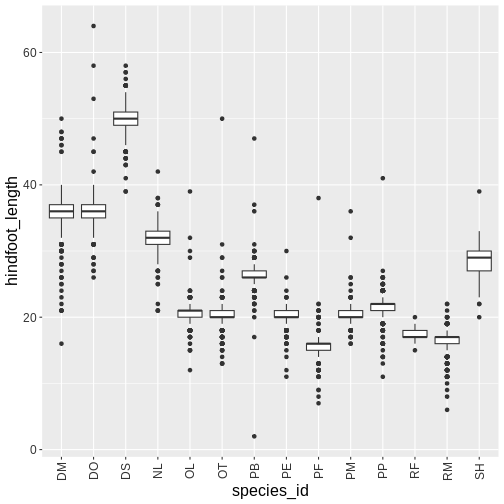

:::::::::::::::::::::::::::::::::::::::  challenge

### Challenge

With all of this information in hand, please take another five minutes to either
improve one of the plots generated in this exercise or create a beautiful graph
of your own. Use the RStudio [**`ggplot2`** cheat sheet](https://posit.co/wp-content/uploads/2022/10/data-visualization-1.pdf)
for inspiration.

Here are some ideas:

- See if you can change the thickness of the lines.
- Can you find a way to change the name of the legend? What about its labels?
- Try using a different color palette (see
  [https://r-graphics.org/chapter-colors](https://r-graphics.org/chapter-colors)).

::::::::::::::::::::::::::::::::::::::::::::::::::

## Arranging plots

Faceting is a great tool for splitting one plot into multiple plots, but
sometimes you may want to produce a single figure that contains multiple plots
using different variables or even different data frames. The **`patchwork`**
package allows us to combine separate ggplots into a single figure while keeping
everything aligned properly. Like most R packages, we can install `patchwork`
from CRAN, the R package repository:


```r
install.packages("patchwork")
```

After you have loaded the `patchwork` package you can use `+` to place plots
next to each other, `/` to arrange them vertically, and `plot_layout()` to
determine how much space each plot uses:


```r
library(patchwork)

plot_weight <- ggplot(data = surveys_complete, aes(x = species_id, y = weight)) +
  geom_boxplot() +
  labs(x = "Species", y = expression(log[10](Weight))) +
  scale_y_log10()

plot_count <- ggplot(data = yearly_counts, aes(x = year, y = n, color = genus)) +
  geom_line() +
  labs(x = "Year", y = "Abundance")

plot_weight / plot_count + plot_layout(heights = c(3, 2))
```

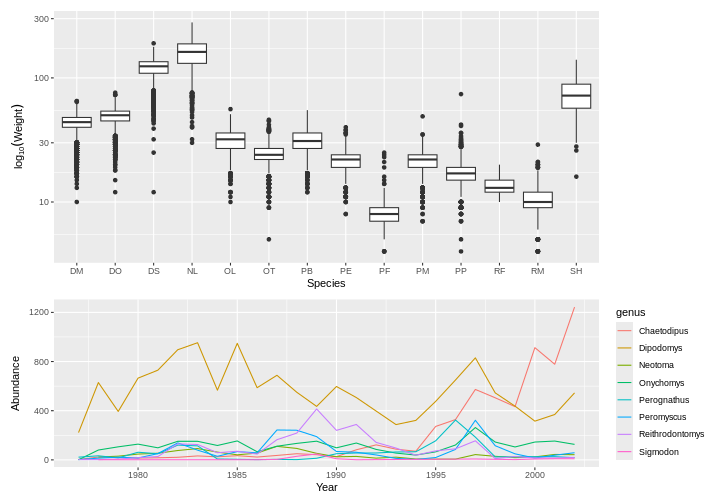

You can also use parentheses `()` to create more complex layouts. There are
many useful examples on the [patchwork website](https://patchwork.data-imaginist.com/)

## Exporting plots

After creating your plot, you can save it to a file in your favorite format. The
Export tab in the **Plot** pane in RStudio will save your plots at low
resolution, which will not be accepted by many journals and will not scale well
for posters. The [**`ggplot2`** extensions website](https://exts.ggplot2.tidyverse.org/) provides a list
of packages that extend the capabilities of **`ggplot2`**, including additional
themes.

Instead, use the `ggsave()` function, which allows you to easily change the
dimension and resolution of your plot by adjusting the appropriate arguments
(`width`, `height` and `dpi`):


```r
my_plot <- ggplot(data = yearly_sex_counts,
                  aes(x = year, y = n, color = sex)) +
    geom_line() +
    facet_wrap(vars(genus)) +
    labs(title = "Observed genera through time",
        x = "Year of observation",
        y = "Number of individuals") +
    theme_bw() +
    theme(axis.text.x = element_text(colour = "grey20", size = 12, angle = 90,
                                     hjust = 0.5, vjust = 0.5),
          axis.text.y = element_text(colour = "grey20", size = 12),
          text = element_text(size = 16))

ggsave("name_of_file.png", my_plot, width = 15, height = 10)

## This also works for plots combined with patchwork
plot_combined <- plot_weight / plot_count + plot_layout(heights = c(3, 2))
ggsave("plot_combined.png", plot_combined, width = 10, dpi = 300)
```

Note: The parameters `width` and `height` also determine the font size in the
saved plot.


::::::::::::::::::::::::::::::::::::: keypoints

- start simple and build your plots iteratively
- the `ggplot()` function initiates a plot, and `geom_` functions add representations of your data
- use `aes()` when mapping a variable from the data to a part of the plot
- use `facet_` to partition a plot into multiple plots based on a factor included in the dataset
- use premade `theme_` functions to broadly change appearance, and the `theme()` function to fine-tune
- the `patchwork` library can combine separate plots into a single figure
- use `ggsave()` to save plots in your favorite format and dimensions

::::::::::::::::::::::::::::::::::::::::::::::::
