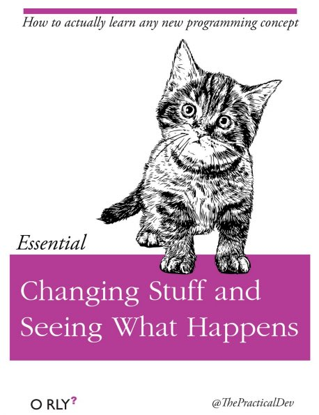

```{r, echo=FALSE, purl=FALSE, message=FALSE}
source("setup.R")
```

:::::::::::::::::::::::::::::::::::::: questions 

- Why should you use R and RStudio?
- How do you get started working in R and RStudio?

::::::::::::::::::::::::::::::::::::::::::::::::

::::::::::::::::::::::::::::::::::::: objectives

- Understand the difference between R and RStudio
- Describe the purpose of the different RStudio panes
- Organize files and directories into R Projects
- Use the RStudio help interface to get help with R functions
- Be able to format questions to get help in the broader R community

::::::::::::::::::::::::::::::::::::::::::::::::

## What is R? What is RStudio?

The term "`R`" is used to refer to both the programming language and the
software that interprets the scripts written using it.

[RStudio](https://rstudio.com) is a popular way to write R scripts and interact with the R software.
To function correctly, RStudio needs R and therefore both need to be installed on your computer.

## Why learn R?

### R does not involve lots of pointing and clicking, and that's a good thing

In R, the results of your analysis rely on a series of written commands, and not
on remembering a succession of pointing and clicking. That is a good thing!
So, if you want to redo your analysis because you collected more data, you don't
have to remember which button you clicked in which order to obtain your results.
With a stored series of commands in an R script, you can repeat running them and
R will process the new dataset exactly the same way as before.

Working with scripts makes the steps you used in your analysis clear, and the
code you write can be inspected by someone else who can give you feedback and
spot mistakes.

Working with scripts forces you to have a deeper understanding of what you are
doing, and facilitates your learning and comprehension of the methods you use.

### R code is great for reproducibility

Reproducibility is when someone else, including your future self, can obtain the
same results from the same dataset when using the same analysis.

R integrates with other tools to generate manuscripts from your code. If you
collect more data, or fix a mistake in your dataset, the figures and the
statistical tests in your manuscript are updated automatically.

R is widely used in academia and in industries such as pharma and biotech.
These organisations expect analyses to be reproducible, so knowing R will give you an
edge with these requirements.

### R is interdisciplinary and extensible

With 10,000+ packages that can be installed to extend its capabilities, R
provides a framework that allows you to combine statistical approaches from many
scientific disciplines to best suit the analytical framework you need to analyze
your data. For instance, R has packages for image analysis, GIS, time series,
population genetics, and a lot more.

### R works on data of all shapes and sizes

The skills you learn with R scale easily with the size of your dataset. Whether
your dataset has hundreds or millions of lines, it won't make much difference to
you.

R is designed for data analysis. It comes with special data structures and data
types that make handling of missing data and statistical factors convenient.

R can connect to spreadsheets, databases, and many other data formats, on your
computer or on the web.

### R produces high-quality graphics

The plotting functionalities in R are endless, and allow you to adjust any
aspect of your graph to visualize your data more effectively.

### R has a large and welcoming community

Thousands of people use R daily. Many of them are willing to help you through
mailing lists and websites such as [Stack Overflow](https://stackoverflow.com/),
[RStudio community](https://community.rstudio.com/), and Slack channels such as  
the R for Data Science online community ([https://www.rfordatasci.com/](https://www.rfordatasci.com/)). In addition,
there are numerous online and in person meetups organised globally through organisations
such as R Ladies Global ([https://rladies.org/](https://rladies.org/)).

### Not only is R free, but it is also open-source and cross-platform

Anyone can inspect the source code to see how R works. Because of this
transparency, there is less chance for mistakes, and if you (or someone else)
find some, you can report and fix bugs.

## Knowing your way around RStudio

Let's start by learning about [RStudio](https://www.rstudio.com/), which is an
Integrated Development Environment (IDE) for working with R.

The RStudio IDE open-source product is free under the [Affero General Public
License (AGPL) v3](https://www.gnu.org/licenses/agpl-3.0.en.html). The RStudio
IDE is also available with a commercial license and priority email support from
RStudio, PBC.

We will use RStudio IDE to write code, navigate the files on our computer,
inspect the variables we are going to create, and visualize the plots we will
generate. RStudio can also be used for other things (e.g., version control,
developing packages, writing Shiny apps) that we will not cover during the
workshop.

{alt="RStudio interface screenshot. Clockwise from top left: Source,Environment/History, Files/Plots/Packages/Help/Viewer,Console."}

RStudio is divided into 4 "panes":

- The **Source** for your scripts and documents (top-left, in the default
  layout)
- Your **Environment/History** (top-right) which shows all the objects in
  your working space (Environment) and your command history (History)
- Your **Files/Plots/Packages/Help/Viewer** (bottom-right)
- The R **Console** (bottom-left)

The placement of these panes and their content can be customized (see menu,
`Tools --> Global Options --> Pane Layout`). For ease of use, settings such as
background color, font color, font size, and zoom level can also be adjusted in
this menu (`Global Options --> Appearance`).

One of the advantages of using RStudio is that all the information you need to
write code is available in a single window. Additionally, with many shortcuts,
autocompletion, and highlighting for the major file types you use while
developing in R, RStudio will make typing easier and less error-prone.

## Getting set up

It is good practice to keep a set of related data, analyses, and text
self-contained in a single folder, called the **working directory**. All of the
scripts within this folder can then use *relative paths* to files that indicate
where inside the project a file is located (as opposed to absolute paths, which
point to where a file is on a specific computer). Working this way allows you to
move your project around on your computer and share it with others
without worrying about whether or not the underlying scripts will still work.

RStudio provides a helpful set of tools to do this through its "Projects"
interface, which not only creates a working directory for you, but also
remembers its location (allowing you to quickly navigate to it) and optionally
preserves custom settings and (re-)open files to assist resume work after
a break. Go through the steps for creating an "R Project" for this tutorial
below.

1. Start RStudio.
2. Under the `File` menu, click on `New Project`. Choose `New Directory`, then
  `New Project`.
3. Enter a name for this new folder (or "directory"), and choose a convenient
  location for it. This will be your **working directory** for the rest of the
  day (e.g., `~/r-ecology`).
4. Click on `Create Project`.

A workspace is your current working environment in R which includes any
user-defined object. By default, all of these objects will be saved, and
automatically loaded, when you reopen your project. Saving a workspace to
`.RData` can be cumbersome, especially if you are working with larger datasets,
and it can lead to hard to debug errors by having objects in memory you forgot
you had. Therefore, it is often a good idea to turn this off. To do so, go to
`Tools --> Global Options` and **uncheck** `Restore .RData into workspace at startup`
and select the **'Never'** option for `Save workspace to .RData' on exit`.

{alt="Set 'Save workspace to .RData on exit' to'Never'"}

### Organizing your working directory

Using a consistent folder structure across your projects will help keep things
organized, and will help you to find/file things in the future. This
can be especially helpful when you have multiple projects. In general, you may
create directories (folders) for **scripts**, **data**, and **documents**.

- **`data_raw/` \& `data/`** Use these folders to store raw data and
  intermediate datasets you may create for the need of a particular analysis.
  For the sake of transparency and
  [provenance](https://en.wikipedia.org/wiki/Provenance), you should *always*
  keep a copy of your raw data accessible and do as much of your data cleanup
  and preprocessing programmatically (i.e., with scripts, rather than
  manually) as possible. Separating raw data from processed data is also a
  good idea. For example, you could have files
  `data_raw/tree_survey.plot1.txt` and `...plot2.txt` kept separate from a
  `data/tree.survey.csv` file generated by the
  `scripts/01.preprocess.tree_survey.R` script.
- **`documents/`** This would be a place to keep outlines, drafts, and other
  text.
- **`scripts/`** This would be the location to keep your R scripts for
  different analyses or plotting, and potentially a separate folder for your
  functions (more on that later).
- **Additional (sub)directories** depending on your project needs.

For this workshop, we will need a `data_raw/` folder to store our raw data, and
we will use `data/` for when we learn how to export data as CSV files, and a
`fig/` folder for the figures that we will save.

- Under the `Files` tab on the right of the screen, click on `New Folder` and
  create a folder named `data_raw` within your newly created working directory
  (e.g., `~/data-carpentry/`). (Alternatively, type `dir.create("data_raw")`
  at your R console.) Repeat these operations to create a `data` and a `fig`
  folder.

We are going to keep the script in the root of our working directory because we
are only going to use one file. Later, when you start create more
complex projects, it might make sense to organize scripts in sub-directories.

Your working directory should now look like this:

```{r, results="markup", fig.cap="How it should look like at the beginning of this lesson", echo=FALSE, purl=FALSE, out.width="100%", fig.align="center"}
knitr::include_graphics("fig/r-starting-how-it-should-look-like.png")
```

## Interacting with R

The basis of programming is that we write down instructions for the computer to follow,
and then we tell the computer to follow those instructions. We write these instructions
in the form of *code*, which is a common language that is understood by the computer and
humans (after some practice). We call these instructions *commands*, and we tell the
computer to follow the instructions by *running* (also called *executing*) the commands.

### Console vs. script

You can run commands directly in the R console, or you can write them into an R script.
It may help to think of working in the console vs. working in a script as something like
cooking. The console is like making up a new recipe, but not writing anything down. You
can carry out a series of steps and produce a nice, tasty dish at the end. However, because
you didn't write anythingdown, it's harder to figure out exactly what you did, and in what order. 

Writing a script is like taking nice notes while cooking- you can tweak and edit the recipe all you want, you can come back in 6 months and try it again, and you don't have to try to remember what went well and what didn't. It's actually even easier than cooking, since you can hit one button and the computer "cooks" the whole recipe for you!

An additional benefit of scripts is that you can leave **comments** for yourself or others to read. Lines that start with `#` are considered comments and will not be interpreted as R code.

#### Console

- The R console is where code is run/executed
- The **prompt**, which is the `>` symbol, is where you can type commands 
- By pressing <kbd>Enter</kbd>, R will execute those commands and print the result.
- You can work here, and your history is saved in the History pane, but you can't access it in the future

#### Script

- A script is a record of commands to send to R, preserved in a plain text file with a `.R` extension
- You can make a new R script by clicking `File → New File → R Script`, clicking the green `+` button in the top left corner of RStudio, or pressing <kbd>Shift+Cmd+N</kbd> (Mac) or <kbd>Shift+Ctrl+N</kbd> (Windows). It will be unsaved, and called "Untitled1"
- If you type out lines of R code in a script, you can send them to the R console to be evaluated
  - <kbd>Cmd+Enter</kbd> (Mac) or <kbd>Ctrl+Enter</kbd> (Windows) will run the line of code that your cursor is on
  - If you highlight multiple lines of code, you can run all of them by pressing <kbd>Cmd+Enter</kbd> (Mac) or <kbd>Ctrl+Enter</kbd> (Windows)
  - By preserving commands in a script, you can edit and rerun them quickly, save them for later, and share them with others
  - You can leave comments for yourself by starting a line with a `#` or placing `#` after a line of code.
  
#### Example

Let's try running some code in the console and in a script. First, click down in the Console pane, and type out `1+1`. Hit <kbd>Enter</kbd> to run the code. You should see your code echoed, and then the value of `2` returned.

Now click into your blank script, and type out `1+1`. With your cursor on that line, hit <kbd>Cmd+Enter</kbd> (Mac) or <kbd>Ctrl+Enter</kbd> (Windows) to run the code. You will see that your code was sent from the script to the console, where it returned a value of `2`, just like when you ran your code directly in the console.

Now save and name the script that we will be working on for the rest of the workshop. You might name it `intro.R`. Try to choose simple, memorable names for your scripts and avoid using spaces.

## Seeking help

### Searching function documentation with `?` and `??`

If you need help with a specific function, let's say `mean()`, you can type
`?mean` or press <kbd>F1</kbd> while your cursor is on the function name. If you
are looking for a function to do a particular task, but don't know the function
name, you can use the double question mark `??`, for example `??kruskall`. Both
commands will open matching help files in RStudio's help panel in the lower
right corner. You can also use the help panel to search help directly, as seen
in the screenshot.

{alt="RStudio help panel. When typing a word in the search field, it will showrelated suggestions."}

### Automatic code completion

When you write code in RStudio, you can use its automatic code completion to
remind yourself of a function's name or arguments. Start typing the function
name and pay attention to the suggestions that pop up. Use the up and down arrow
to select a suggested code completion and <kbd>Tab</kbd> to apply it. You can
also use code completion to complete function's argument names, object, names
and file names. It even works if you don't get the spelling 100% correct.

### Package vignettes and cheat sheets

In addition to the documentation for individual functions, many packages have
*vignettes* -- instructions for how to use the package to do certain tasks.
Vignettes are great for learning by example. Vignettes are accessible via the
package help and by using the function `browseVignettes()`.

There is also a Help menu at the top of the RStudio window, that has cheat
sheets for popular packages, RStudio keyboard shortcuts, and more.

### Finding more functions and packages

RStudio's help only searches the packages that you have installed on your
machine, but there are many more available on
[CRAN](https://cran.r-project.org/) and [GitHub](https://github.com/). To search
across all available R packages, you can use the website
[rdocumentation.org](https://www.rdocumentation.org). Often, a generic Google or
internet search "R \<task>" will send you to the appropriate package
documentation or a forum where someone else has already asked your question.
Many packages also have websites with additional help, tutorials, news and more
(for example [tidyverse.org](https://www.tidyverse.org/)).

### Dealing with error messages

Don't get discouraged if your code doesn't run immediately! Error messages are
common when programming, and fixing errors is part of any programmer's daily
work. Often, the problem is a small typo in a variable name or a missing
parenthesis. Watch for the red x's next to your code in RStudio. These may
provide helpful hints about the source of the problem.

{alt="RStudio shows a red x next to a line of code that R doesn't understand."}

If you can't fix an error yourself, start by googling it. Some error messages
are too generic to diagnose a problem (e.g. "subscript out of bounds"). In that
case it might help to include the name of the function or package you're using
in your query.

### Asking for help

If your Google search is unsuccessful, you may want to ask other R users for
help. There are different places where you can ask for help. During this
workshop, don't hesitate to talk to your neighbor, compare your answers, and ask
for help. You might also be interested in organizing regular meetings following
the workshop to keep learning from each other. If you have a friend or colleague
with more experience than you, they might also be able and willing to help you.

Learning to search for help is probably the most useful skill for any R user. The key skill is figuring out what you should actually search for. It's often a good idea to start your search with `R` or `R programming`. If you have the name of a package you want to use, start with `R package_name`. 

Many of the answers you find will be from a website called Stack Overflow, where people ask programming questions and others provide answers.

#### Generative AI Help

::::::::::::::::::::::::::::: instructor

### Choose how to teach this section
The section on generative AI is intended to be concise but Instructors may choose to devote more time to the topic in a workshop.
Depending on your own level of experience and comfort with talking about and using these tools, you could choose to do any of the following:

* Explain how large language models work and are trained, and/or the difference between generative AI, other forms of AI that currently exist, and the limits of what LLMs can do (e.g., they can't "reason").
* Demonstrate how you recommend that learners use generative AI.
* Discuss the ethical concerns listed below, as well as others that you are aware of, to help learners make an informed choice about whether or not to use generative AI tools.

This is a fast-moving technology. 
If you are preparing to teach this section and you feel it has become outdated, please open an issue on the lesson repository to let the Maintainers know and/or a pull request to suggest updates and improvements.

::::::::::::::::::::::::::::::::::::::::

In addition to the resources we've already mentioned for getting help with R, it's becoming increasingly common to turn to _generative AI_ chatbots such as ChatGPT to get help while coding. You will probably receive some useful guidance by presenting your error message to the chatbot and asking it what went wrong.

However, the way this help is provided by the chatbot is different. Answers on Stack Overflow have (probably) been given by a human as a direct response to the question asked. But generative AI chatbots, which are based on an advanced statistical model, respond by generating the _most likely_ sequence of text that would follow the prompt they are given.

While responses from generative AI tools can often be helpful, they are not always reliable. 
These tools sometimes generate plausible but incorrect or misleading information, so (just as with an answer found on the internet) it is essential to verify their accuracy.
You need the knowledge and skills to be able to understand these responses, to judge whether or not they are accurate, and to fix any errors in the code it offers you.

In addition to asking for help, programmers can use generative AI tools to generate code from scratch; extend, improve and reorganise existing code; translate code between programming languages; figure out what terms to use in a search of the internet; and more.
However, there are drawbacks that you should be aware of.

The models used by these tools have been "trained" on very large volumes of data, much of it taken from the internet, and the responses they produce reflect that training data, and may recapitulate its inaccuracies or biases.
The environmental costs (energy and water use) of LLMs are a lot higher than other technologies, both during development (known as training) and when an individual user uses one (also called inference). For more information see the [AI Environmental Impact Primer](https://huggingface.co/blog/sasha/ai-environment-primer) developed by researchers at HuggingFace, an AI hosting platform. 
Concerns also exist about the way the data for this training was obtained, with questions raised about whether the people developing the LLMs had permission to use it.
Other ethical concerns have also been raised, such as reports that workers were exploited during the training process.

**We recommend that you avoid getting help from generative AI during the workshop** for several reasons:

1. For most problems you will encounter at this stage, help and answers can be found among the first results returned by searching the internet.
2. The foundational knowledge and skills you will learn in this lesson by writing and fixing your own programs  are essential to be able to evaluate the correctness and safety of any code you receive from online help or a generative AI chatbot. 
   If you choose to use these tools in the future, the expertise you gain from learning and practising these fundamentals on your own will help you use them more effectively.
3. As you start out with programming, the mistakes you make will be the kinds that have also been made -- and overcome! -- by everybody else who learned to program before you. 
  Since these mistakes and the questions you are likely to have at this stage are common, they are also better represented than other, more specialised problems and tasks in the data that was used to train generative AI tools.
  This means that a generative AI chatbot is _more likely to produce accurate responses_ to questions that novices ask, which could give you a false impression of how reliable they will be when you are ready to do things that are more advanced.

## How to learn more after the workshop?

The material we cover during this workshop will give you a taste of how you can
use R to analyze data for your own research. However, to do advanced operations
such as cleaning your dataset, using statistical methods, or creating beautiful
graphics you will need to learn more.

The best way to become proficient and efficient at R, as with any other tool, is
to use it to address your actual research questions. As a beginner, it can feel
daunting to have to write a script from scratch, and given that many people make
their code available online, modifying existing code to suit your purpose might
get first hands-on experience using R for your own work and help you become
comfortable eventually creating your own scripts.

```{r kitten-img, results="markup", echo=FALSE, purl=FALSE, out.width="400px", fig.align="center"}

```

## More resources

#### More about R

- [Hadley Wickham, Mine Çetinkaya-Rundel, and Garrett Grolemund, R for Data Science, Second edition (2023)](https://r4ds.hadley.nz)
- [R-bloggers](https://www.r-bloggers.com/)
- [Tidyverse](https://www.tidyverse.org/) - Website for the tidyverse packages, full of the documentation and vignettes.
- [Posit Community](https://forum.posit.co) - Good place to look for answers to questions about R.
- [Tidy Tuesday](https://github.com/rfordatascience/tidytuesday) - Weekly social data project. New data every week.
- [R Graph Gallery](https://r-graph-gallery.com/)


#### How to ask good programming questions?

- The rOpenSci community call "How to ask questions so they get answered",
  ([rOpenSci site](https://ropensci.org/commcalls/2017-03-07/) and [video
  recording](https://vimeo.com/208749032)) includes a presentation of the
  reprex package and of its philosophy.
- [blog.Revolutionanalytics.com](https://blog.revolutionanalytics.com/2014/01/how-to-ask-for-r-help.html)
  and [this blog post by Jon Skeet](https://codeblog.jonskeet.uk/2010/08/29/writing-the-perfect-question/)
  have comprehensive advice on how to ask programming questions.


