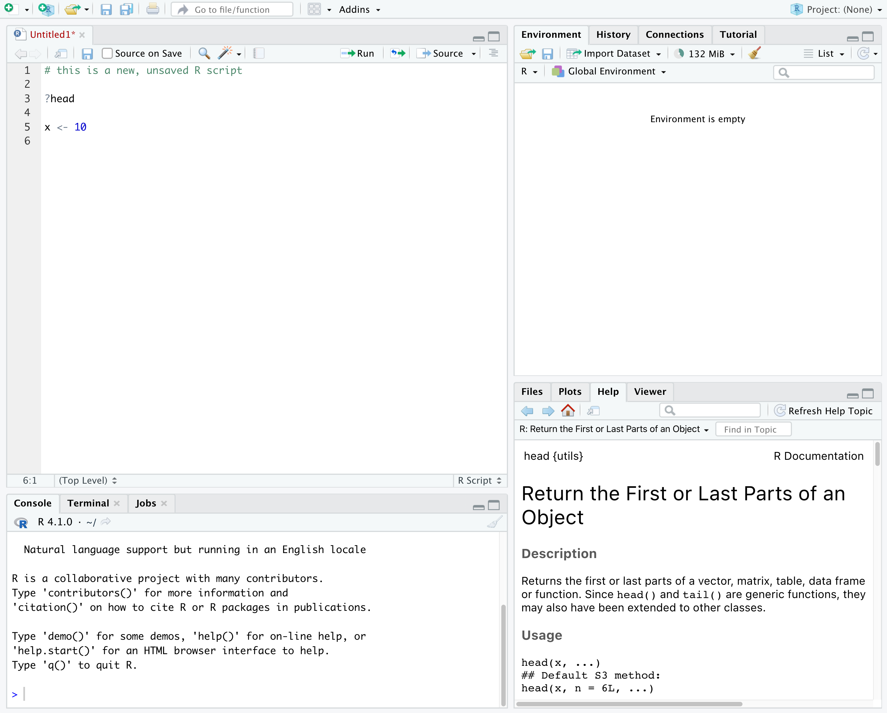

:::::::::::::::::::::::::::::::::::::: questions 

- Why should you use R and RStudio?
- How do you get started working in R and RStudio?

::::::::::::::::::::::::::::::::::::::::::::::::

::::::::::::::::::::::::::::::::::::: objectives

- Understand the difference between R and RStudio
- Describe the purpose of the different RStudio panes
- Organize files and directories into R Projects
- Use the RStudio help interface to get help with R functions
- Be able to format questions to get help in the broader R community

::::::::::::::::::::::::::::::::::::::::::::::::

## What are R and RStudio?

R refers to a programming language as well as the software that runs R code.

[RStudio](https://rstudio.com) is a software interface that can make it easier to write R scripts and interact with the R software. It's a very popular platform, and RStudio also maintains the [`tidyverse`](https://www.tidyverse.org/) series of packages we will use in this lesson.

## Why learn R?

<br>

:::::::::::::::::::::::: instructor

You can walk through this analogy if you want, or skip over it if you don't find it useful.

::::::::::::::::::::::::

:::::::::::::::::::::::: solution

## Your new pedantic collaborator...

You're working on a project when your advisor suggests that you begin working with one of their long-time collaborators. According to your advisor, this collaborator is very talented, but only speaks a language that you don't know. Your advisor assures you that this is ok, the collaborator won't judge you for starting to learn the language, and will happily answer your questions. However, the collaborator is also quite pedantic. While they don't mind that you don't speak their language fluently yet, they are always going to answer you quite literally.

You decide to reach out to the collaborator. You find that they email you back very quickly, almost immediately most of the time. Since you're just learning their language, you often make mistakes. Sometimes, they tell you that you've made a grammatical error or warn you that what you asked for doesn't make a lot of sense. Sometimes these warnings are difficult to understand, because you don't really have a grasp of the underlying grammar. Sometimes you get an answer back, with no warnings, but you realize that it doesn't make sense, because what you asked for isn't quite what you *wanted*. Since this collaborator responds almost immediately, without tiring, you can quickly reformulate your question and send it again.

In this way, you begin to learn the language your collaborator speaks, as well as the particular way they think about your work. Eventually, the two of you develop a good working relationship, where you understand how to ask them questions effectively, and how to work through any issues in communication that might arise.

This collaborator's name is R.

When you send commands to R, you get a response back. Sometimes, when you make mistakes, you will get back a nice, informative error message or warning. However, sometimes the warnings seem to reference a much "deeper" level of R than you're familiar with. Or, even worse, you may get the wrong answer with no warning because the command you sent is perfectly valid, but isn't what you actually want. While you may first have some success working with R by memorizing certain commands or reusing other scripts, this is akin to using a collection of tourist phrases or pre-written statements when having a conversation. You might make a mistake (like getting directions to the library when you need a bathroom), and you are going to be limited in your flexibility (like furiously paging through a tourist guide looking for the term for "thrift store").

This is all to say that we are going to spend a bit of time digging into some of the more fundamental aspects of the R language, and these concepts may not feel as immediately useful as, say, learning to make plots with `ggplot2`. However, learning these more fundamental concepts will help you develop an understanding of how R thinks about data and code, how to interpret error messages, and how to flexibly expand your skills to new situations.

:::::::::::::::::::::::::::::

### R does not involve lots of pointing and clicking, and that's a good thing

Since R is a programming language, the results of your analysis do not rely on remembering a succession of pointing and clicking, but instead on a series of written commands, and that's a good thing! So, if you want to redo your analysis because you collected more data, you don't have to remember which button you clicked in which order to obtain your results; you just have to run your script again.

Working with scripts makes the steps you used in your analysis clear, and the code you write can be inspected by someone else who can give you feedback and spot mistakes. 

Working with scripts forces you to have a deeper understanding of what you are doing, and facilitates your learning and comprehension of the methods you use. 

### R code is great for reproducibility

Reproducibility is when someone else (including your future self) can obtain the same results from the same dataset when using the same analysis. 

R integrates with other tools to generate manuscripts from your code. If you collect more data, or fix a mistake in your dataset, the figures and the statistical tests in your manuscript are updated automatically. 

An increasing number of journals and funding agencies expect analyses to be reproducible, so knowing R will give you an edge with these requirements.  

### R is interdisciplinary and extensible

With tens of thousands of packages that can be installed to extend its capabilities, R provides a framework that allows you to combine statistical approaches from many scientific disciplines to best suit the analytical framework you need to analyze your data. For instance, R has packages for image analysis, GIS, time series, population genetics, and a lot more.  

### R works on data of all shapes and sizes

The skills you learn with R scale easily with the size of your dataset. Whether your dataset has hundreds or millions of lines, it won't make much difference to you. 

R is designed for data analysis. It comes with special data structures and data types that make handling of missing data and statistical factors convenient. 

R can read data from many different file types, including geospatial data, and connect to local and remote databases.

### R produces high-quality graphics

R has well-developed plotting capabilities, and the `ggplot2` package is one of, if not the most powerful pieces of plotting software available today. We will begin learning to use `ggplot2` in the next episode.

### R has a large and welcoming community

Thousands of people use R daily. Many of them are willing to help you through mailing lists and websites such as [Stack Overflow](https://stackoverflow.com/), or on the [RStudio community](https://community.rstudio.com/).

Since R is very popular among researchers, most of the help communities and learning materials are aimed towards other researchers. Python is a similar language to R, and can accomplish many of the same tasks, but is widely used by software developers and software engineers, so Python resources and communities are not as oriented towards researchers.
  
### Not only is R free, but it is also open-source and cross-platform

Anyone can inspect the source code to see how R works. Because of this transparency, there is less chance for mistakes, and if you (or someone else) find some, you can report and fix bugs.

## Navigating RStudio

We will use the RStudio integrated development environment (IDE) to write code into scripts, run code in R, navigate files on our computer, inspect objects we create in R, and look at the plots we make. RStudio has many other features that can help with things like version control, developing R packages, and writing Shiny apps, but we won't cover those in the workshop.

{alt='Screenshot of RStudio showing the 4 "panes".'}

In the above screenshot, we can see 4 "panes" in the default layout:

- Top-Left: the **Source** pane that displays scripts and other files. 
  - If you only have 3 panes, and the Console pane is in the top left, press <kbd>Shift+Cmd+N</kbd> (Mac) or <kbd>Shift+Ctrl+N</kbd> (Windows) to open a blank R script, which should make the Source pane appear.
- Top-Right: the **Environment/History** pane, which shows all the objects in your current R session (Environment) and your command history (History)
  - there are some other tabs here, including Connections, Build, Tutorial, and possibly Git
  - we won't cover any of the other tabs, but RStudio has lots of other useful features
- Bottom-Left: the **Console** pane, where you can interact directly with an R console, which interprets R commands and prints the results
  - There are also tabs for Terminal and Jobs
- Bottom-Right: the **Files/Plots/Help/Viewer** pane to navigate files or view plots and help pages

You can customize the layout of these panes, as well as many settings such as RStudio color scheme, font, and even keyboard shortcuts. You can access these settings by going to the menu bar, then clicking on Tools → Global Options.

RStudio puts most of the things you need to work in R into a single window, and also includes features like keyboard shortcuts, autocompletion of code, and syntax highlighting (different types of code are colored differently, making it easier to navigate your code).

## Getting set up in RStudio

It is a good practice to organize your projects into self-contained folders right from the start, so we will start building that habit now. A well-organized project is easier to navigate, more reproducible, and easier to share with others. Your project should start with a top-level folder that contains everything necessary for the project, including data, scripts, and images, all organized into sub-folders.

RStudio provides a "Projects" feature that can make it easier to work on individual projects in R. We will create a project that we will keep everything for this workshop.

1. Start RStudio (you should see a view similar to the screenshot above).
2. In the top right, you will see a blue 3D cube and the words "Project: (None)". Click on this icon.
3. Click **New Project** from the dropdown menu.
4. Click **New Directory**, then **New Project**.
5. Type out a name for the project, we recommend `R-Ecology-Workshop`.
6. Put it in a convenient location using the "Create project as a subdirectory of:" section. We recommend your `Desktop`. You can always move the project somewhere else later, because it will be self-contained.
7. Click **Create Project** and your new project will open.

Next time you open RStudio, you can click that 3D cube icon, and you will see options to open existing projects, like the one you just made.

One of the benefits to using RStudio Projects is that they automatically set the **working directory** to the top-level folder for the project. The working directory is the folder where R is working, so it views the location of all files (including data and scripts) as being relative to the working directory. You may come across scripts that include something like `setwd("/Users/YourUserName/MyCoolProject")`, which directly sets a working directory. This is usually much less portable, since that specific directory might not be found on someone else's computer (they probably don't have the same username as you). Using RStudio Projects means we don't have to deal with manually setting the working directory.

There are a few settings we will need to adjust to improve the reproducibility of our work. Go to your menu bar, then click Tools → Global Options to open up the Options window.

{alt='Screenshot of the RStudio Global Options, with "Restore .RData into workspace at startup" unchecked, and "Save workspace to .RData on exit" set to "Never".'}

Make sure your settings match those highlighted in yellow. We don't want RStudio to store the current status of our R session and reload it the next time we start R. This might sound convenient, but for the sake of reproducibility, we want to start with a clean, empty R session every time we work. That means that we have to record everything we do into scripts, save any data we need into files, and store outputs like images as files. We want to get used to everything we generate in a single R session being *disposable*. We want our scripts to be able to regenerate things we need, other than "raw materials" like data.

## Organizing your project directory

:::::::::::::::::::::::::::::::::::::::::::: instructor
If you are teaching remotely and sharing only the RStudio window, the new windows that pop up while creating folders will not be shared via Zoom. You can switch to sharing your entire screen, which will allow learners to see the popup windows.
::::::::::::::::::::::::::::::::::::::::::::

Using a consistent folder structure across all your new projects will help keep a growing project organized, and make it easy to find files in the future. This is especially beneficial if you are working on multiple projects, since you will know where to look for particular kinds of files.

We will use a basic structure for this workshop, which is often a good place to start, and can be extended to meet your specific needs. Here is a diagram describing the structure:

```
R-Ecology-Workshop
│
└── scripts
│
└── data
│    └── cleaned
│    └── raw
│
└─── images
│
└─── documents
```

Within our project folder (`R-Ecology-Workshop`), we first have a `scripts` folder to hold any scripts we write. We also have a `data` folder containing `cleaned` and `raw` subfolders. In general, you want to keep your `raw` data completely untouched, so once you put data into that folder, you do not modify it. Instead, you read it into R, and if you make any modifications, you write that modified file into the `cleaned` folder. We also have an `images` folder for plots we make, and a `documents` folder for any other documents you might produce.

Let's start making our new folders. Go to the **Files** pane (bottom right), and check the current directory, highlighted in yellow below. You should be in the directory for the project you just made, in our case `R-Ecology-Workshop`. You shouldn't see any folders in here yet.

{alt='RStudio Files pane with current directory path highlighted.'}

Next, click the **New Folder** button, and type in `scripts` to generate your `scripts` folder. It should appear in the Files list now. Repeat the process to make your `data`, `images`, and `documents` folders. Then, click on the `data` folder in the Files pane. This will take you into the `data` folder, which will be empty. Use the **New Folder** button to create `raw` and `cleaned` folders. To return to the `R-Ecology-Workshop` folder, click on it in the file path, which is highlighted in yellow in the previous image. It's worth noting that the **Files** pane helps you create, find, and open files, but moving through your files won't change where the **working directory** of your project is.

## Working in R and RStudio

The basis of programming is that we write down instructions for the computer to follow, and then we tell the computer to follow those instructions. We write these instructions in the form of *code*, which is a common language that is understood by the computer and humans (after some practice). We call these instructions *commands*, and we tell the computer to follow the instructions by *running* (also called *executing*) the commands.

### Console vs. script

You can run commands directly in the R console, or you can write them into an R script. It may help to think of working in the console vs. working in a script as something like cooking. The console is like making up a new recipe, but not writing anything down. You can carry out a series of steps and produce a nice, tasty dish at the end. However, because you didn't write anything down, it's harder to figure out exactly what you did, and in what order. 

Writing a script is like taking nice notes while cooking- you can tweak and edit the recipe all you want, you can come back in 6 months and try it again, and you don't have to try to remember what went well and what didn't. It's actually even easier than cooking, since you can hit one button and the computer "cooks" the whole recipe for you!

An additional benefit of scripts is that you can leave **comments** for yourself or others to read. Lines that start with `#` are considered comments and will not be interpreted as R code.

#### Console

- The R console is where code is run/executed
- The **prompt**, which is the `>` symbol, is where you can type commands 
- By pressing <kbd>Enter</kbd>, R will execute those commands and print the result.
- You can work here, and your history is saved in the History pane, but you can't access it in the future

#### Script

- A script is a record of commands to send to R, preserved in a plain text file with a `.R` extension
- You can make a new R script by clicking `File → New File → R Script`, clicking the green `+` button in the top left corner of RStudio, or pressing <kbd>Shift+Cmd+N</kbd> (Mac) or <kbd>Shift+Ctrl+N</kbd> (Windows). It will be unsaved, and called "Untitled1"
- If you type out lines of R code in a script, you can send them to the R console to be evaluated
  - <kbd>Cmd+Enter</kbd> (Mac) or <kbd>Ctrl+Enter</kbd> (Windows) will run the line of code that your cursor is on
  - If you highlight multiple lines of code, you can run all of them by pressing <kbd>Cmd+Enter</kbd> (Mac) or <kbd>Ctrl+Enter</kbd> (Windows)
  - By preserving commands in a script, you can edit and rerun them quickly, save them for later, and share them with others
  - You can leave comments for yourself by starting a line with a `#`
  
#### Example

Let's try running some code in the console and in a script. First, click down in the Console pane, and type out `1+1`. Hit <kbd>Enter</kbd> to run the code. You should see your code echoed, and then the value of `2` returned.

Now click into your blank script, and type out `1+1`. With your cursor on that line, hit <kbd>Cmd+Enter</kbd> (Mac) or <kbd>Ctrl+Enter</kbd> (Windows) to run the code. You will see that your code was sent from the script to the console, where it returned a value of `2`, just like when you ran your code directly in the console.

::::::::::::::::::::::::::::::::::::: keypoints 

- R is a programming language and software used to run commands in that language
- RStudio is software to make it easier to write and run code in R
- Use R Projects to keep your work organized and self-contained
- Write your code in scripts for reproducibility and portability

::::::::::::::::::::::::::::::::::::::::::::::::
