:::::::::::::::::::::::::::::::::::::: questions 

- How do you make plots using R?
- How do you customize and modify plots?

::::::::::::::::::::::::::::::::::::::::::::::::

::::::::::::::::::::::::::::::::::::: objectives

- Produce scatter plots and boxplots using `ggplot2`.
- Represent data variables with plot components.
- Modify the scales of plot components.
- Iteratively build and modify `ggplot2` plots by adding layers.
- Change the appearance of existing `ggplot2` plots using premade and customized themes.
- Describe what faceting is and apply faceting in `ggplot2`.
- Save plots as image files.

::::::::::::::::::::::::::::::::::::::::::::::::

## Setup


We are going to be using **functions** from the **`ggplot2`** package to create visualizations of data. Functions are predefined bits of code that automate more complicated actions. R itself has many built-in functions, but we can access many more by loading other **packages** of functions and data into R.

If you don't have a blank, untitled script open yet, go ahead and open one with <kbd>Shift+Cmd+N</kbd> (Mac) or <kbd>Shift+Ctrl+N</kbd> (Windows). Then save the file to your `scripts/` folder, and title it `workshop_code.R`.

Earlier, you had to **install** the `ggplot2` package by running `install.packages("ggplot2")`. That installed the package onto your computer so that R can access it. In order to use it in our current session, we have to **load** the package using the `library()` function.

::::::::::::::::::::::::::::: callout

If you do not have `ggplot2` installed, you can run `install.packages("ggplot2")` in the **console**. 

It is a good practice not to put `install.packages()` into a script. This is because every time you run that whole script, the package will be reinstalled, which is typically unnecessary. You want to install the package to your computer once, and then load it with `library()` in each script where you need to use it.

:::::::::::::::::::::::::::::::::::::


``` r
library(ggplot2)
```

Later we will learn how to read data from external files into R, but for now we are going to use a clean and ready-to-use dataset that is provided by the **`ratdat`** data package. To make our dataset available, we need to load this package too.


``` r
library(ratdat)
```

The `ratdat` package contains data from the [Portal Project](https://github.com/weecology/PortalData), which is a long-term dataset from Portal, Arizona, in the Chihuahuan desert. 

We will be using a dataset called `complete_old`, which contains older years of survey data. Let's try to learn a little bit about the data. We can use a `?` in front of the name of the dataset, which will bring up the help page for the data.


``` r
?complete_old
```

Here we can read descriptions of each variable in our data.

To actually take a look at the data, we can use the `View()` function to open an interactive viewer, which behaves like a simplified version of a spreadsheet program. It's a handy function, but somewhat limited when trying to view large datasets.


``` r
View(complete_old)
```

If you hover over the tab for the interactive `View()`, you can click the "x" that appears, which will close the tab.

We can find out more about the dataset by using the `str()` function to examine the **str**ucture of the data.


``` r
str(complete_old)
```

``` output
tibble [16,878 × 13] (S3: tbl_df/tbl/data.frame)
 $ record_id      : int [1:16878] 1 2 3 4 5 6 7 8 9 10 ...
 $ month          : int [1:16878] 7 7 7 7 7 7 7 7 7 7 ...
 $ day            : int [1:16878] 16 16 16 16 16 16 16 16 16 16 ...
 $ year           : int [1:16878] 1977 1977 1977 1977 1977 1977 1977 1977 1977 1977 ...
 $ plot_id        : int [1:16878] 2 3 2 7 3 1 2 1 1 6 ...
 $ species_id     : chr [1:16878] "NL" "NL" "DM" "DM" ...
 $ sex            : chr [1:16878] "M" "M" "F" "M" ...
 $ hindfoot_length: int [1:16878] 32 33 37 36 35 14 NA 37 34 20 ...
 $ weight         : int [1:16878] NA NA NA NA NA NA NA NA NA NA ...
 $ genus          : chr [1:16878] "Neotoma" "Neotoma" "Dipodomys" "Dipodomys" ...
 $ species        : chr [1:16878] "albigula" "albigula" "merriami" "merriami" ...
 $ taxa           : chr [1:16878] "Rodent" "Rodent" "Rodent" "Rodent" ...
 $ plot_type      : chr [1:16878] "Control" "Long-term Krat Exclosure" "Control" "Rodent Exclosure" ...
```

`str()` will tell us how many observations/rows (obs) and variables/columns we have, as well as some information about each of the variables. We see the name of a variable (such as `year`), followed by the kind of variable (**int** for integer, **chr** for character), and the first 10 entries in that variable. We will talk more about different data types and structures later on.

## Plotting with **`ggplot2`**

:::::::::::::::::::::::::::::::::::::::::::: instructor

Probably worth mentioning that people often just say **ggplot** when referring to the package `ggplot2`.

::::::::::::::::::::::::::::::::::::::::::::

**`ggplot2`** is a powerful package that allows you to create complex plots from tabular data (data in a table format with rows and columns). The **`gg`** in **`ggplot2`** stands for "grammar of graphics", and the package uses consistent vocabulary to create plots of widely varying types. Therefore, we only need small changes to our code if the underlying data changes or we decide to make a box plot instead of a scatter plot. This approach helps you create publication-quality plots with minimal adjusting and tweaking.

**`ggplot2`** is part of the **`tidyverse`** series of packages, which tend to like data in the "long" or "tidy" format, which means each column represents a single variable, and each row represents a single observation. Well-structured data will save you lots of time making figures with **`ggplot2`**. For now, we will use data that are already in this format. We start learning R by using **`ggplot2`** because it relies on concepts that we will need when we talk about data transformation in the next lessons.

**`ggplot`** plots are built step by step by adding new layers, which allows for extensive flexibility and customization of plots.

::::::::::::::::::::::::::::: callout

Some languages, like Python, require certain spacing or indentation for code to run properly. This isn't the case in R, so if you see spaces or indentation in the code from this lesson, it is to improve readability.

:::::::::::::::::::::::::::::

To build a plot, we will use a basic template that can be used for different types of plots:

```r
ggplot(data = <DATA>, mapping = aes(<MAPPINGS>)) + <GEOM_FUNCTION>()
```

We use the `ggplot()` function to create a plot. In order to tell it what data to use, we need to specify the `data` **argument**. An argument is an input that a function takes, and you set arguments using the `=` sign.


``` r
ggplot(data = complete_old)
```


We get a blank plot because we haven't told `ggplot()` which variables we want to correspond to parts of the plot. We can specify the "mapping" of variables to plot elements, such as x/y coordinates, size, or shape, by using the `aes()` function. We'll also add a comment, which is any line starting with a `#`. It's a good idea to use comments to organize your code or clarify what you are doing.


``` r
# adding a mapping to x and y axes
ggplot(data = complete_old, mapping = aes(x = weight, y = hindfoot_length))
```


Now we've got a plot with x and y axes corresponding to variables from `complete_old`. However, we haven't specified how we want the data to be displayed. We do this using `geom_` functions, which specify the type of `geom`etry we want, such as points, lines, or bars. We can add a `geom_point()` layer to our plot by using the `+` sign. We indent onto a new line to make it easier to read, and we have to **end** the first line with the `+` sign.


``` r
ggplot(data = complete_old, mapping = aes(x = weight, y = hindfoot_length)) +
  geom_point()
```

``` warning
Warning: Removed 3081 rows containing missing values or values outside the scale range
(`geom_point()`).
```


You may notice a warning that missing values were removed. If a variable necessary to make the plot is missing from a given row of data (in this case, `hindfoot_length` or `weight`), it can't be plotted. `ggplot2` just uses a warning message to let us know that some rows couldn't be plotted.


::::::::::::::::::::::::::::: callout

**Warning** messages are one of a few ways R will communicate with you. Warnings can be thought of as a "heads up". Nothing necessarily went *wrong*, but the author of that function wanted to draw your attention to something. In the above case, it's worth knowing that some of the rows of your data were not plotted because they had missing data.

A more serious type of message is an **error**. Here's an example:


``` r
ggplot(data = complete_old, mapping = aes(x = weight, y = hindfoot_length)) +
  geom_poit()
```

``` error
Error in geom_poit(): could not find function "geom_poit"
```

As you can see, we only get the error message, with no plot, because something has actually gone wrong. This particular error message is fairly common, and it happened because we misspelled `point` as `poit`. Because there is no function named `geom_poit()`, R tells us it can't find a function with that name.

:::::::::::::::::::::::::::::

## Changing aesthetics

Building **`ggplot`** plots is often an iterative process, so we'll continue developing the scatter plot we just made. You may have noticed that parts of our scatter plot have many overlapping points, making it difficult to see all the data. We can adjust the transparency of the points using the `alpha` argument, which takes a value between 0 and 1:


``` r
ggplot(data = complete_old, mapping = aes(x = weight, y = hindfoot_length)) +
  geom_point(alpha = 0.2)
```


We can also change the color of the points:


``` r
ggplot(data = complete_old, mapping = aes(x = weight, y = hindfoot_length)) +
  geom_point(alpha = 0.2, color = "blue")
```

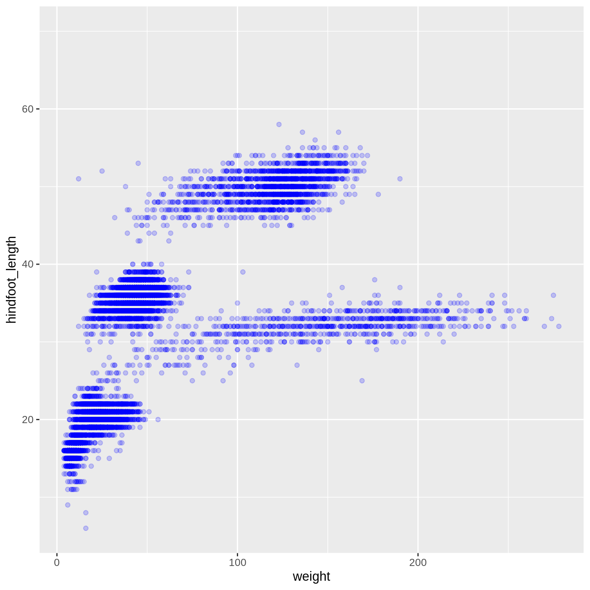

::::::::::::::::::::::::::::: callout

Two common issues you might run into when working in R are forgetting a closing bracket or a closing quote. Let's take a look at what each one does.

Try running the following code:


``` r
ggplot(data = complete_old, mapping = aes(x = weight, y = hindfoot_length)) +
  geom_point(color = "blue", alpha = 0.2
```

You will see a `+` appear in your console. This is R telling you that it expects more input in order to finish running the code. It is missing a closing bracket to end the `geom_point` function call. You can hit <kbd>Esc</kbd> in the console to reset it.

Something similar will happen if you run the following code:


``` r
ggplot(data = complete_old, mapping = aes(x = weight, y = hindfoot_length)) +
  geom_point(color = "blue, alpha = 0.2)
```

A missing quote at the end of `blue` means that the rest of the code is treated as part of the quote, which is a bit easier to see since RStudio displays character strings in a different color.

You will get a different error message if you run the following code:


``` r
ggplot(data = complete_old, mapping = aes(x = weight, y = hindfoot_length)) +
  geom_point(color = "blue", alpha = 0.2))
```

This time we have an extra closing `)`, which R doesn't know what to do with. It tells you there is an unexpected `)`, but it doesn't pinpoint exactly where. With enough time working in R, you will get better at spotting mismatched brackets.

:::::::::::::::::::::::::::::

### Adding another variable

Let's try coloring our points according to the sampling plot type (plot here refers to the physical area where rodents were sampled and has nothing to do with making graphs). Since we're now mapping a variable (`plot_type`) to a component of the ggplot2 plot (`color`), we need to put the argument inside `aes()`:


``` r
ggplot(data = complete_old, mapping = aes(x = weight, y = hindfoot_length, color = plot_type)) +
  geom_point(alpha = 0.2)
```

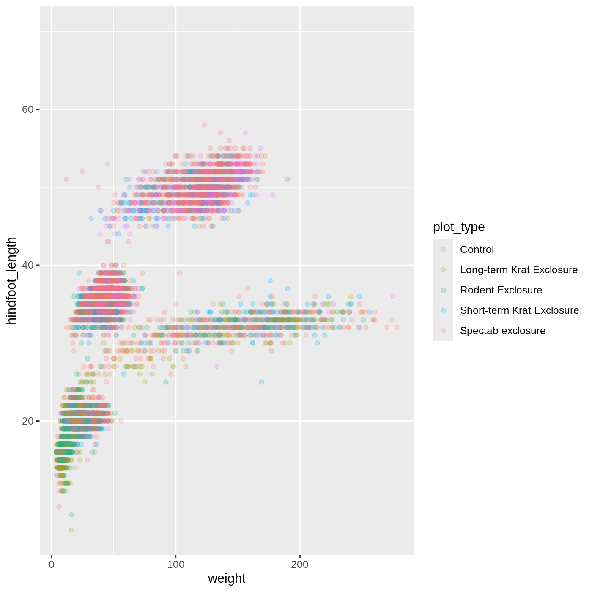

::::::::::::::::::::::::::::::::::::: challenge 

## Challenge 1: Modifying plots

1. Try modifying the plot so that the `shape` of the point varies by `sex`. You will set the `shape` the same way you set the `color`.

Do you think this is a good way to represent `sex` with these data?

:::::::::::::::::::::::: solution 


``` r
ggplot(data = complete_old, 
       mapping = aes(x = weight, y = hindfoot_length, shape = sex)) +
  geom_point(alpha = 0.2)
```


::::::::::::::::::::::::

2. Now try changing the plot so that the `color` of the points vary by `year`. Do you notice a difference in the color scale compared to changing color by plot type? Why do you think this happened?

:::::::::::::::::::::::: solution 


``` r
ggplot(data = complete_old, 
       mapping = aes(x = weight, y = hindfoot_length, color = year)) +
  geom_point(alpha = 0.2)
```


 
- For Part 2, the color scale is different compared to using `color = plot_type` because `plot_type` and `year` are different variable types. `plot_type` is a categorical variable, so `ggplot2` defaults to use a **discrete** color scale, whereas `year` is a numeric variable, so `ggplot2` uses a **continuous** color scale.

::::::::::::::::::::::::
::::::::::::::::::::::::::::::::::::::::::::::::

## Changing scales

The default discrete color scale isn't always ideal: it isn't friendly to viewers with colorblindness and it doesn't translate well to grayscale. However, **`ggplot2`** comes with quite a few other color scales, including the fantastic `viridis` scales, which are designed to be colorblind and grayscale friendly. We can change scales by adding `scale_` functions to our plots:


``` r
ggplot(data = complete_old, mapping = aes(x = weight, y = hindfoot_length, color = plot_type)) +
  geom_point(alpha = 0.2) +
  scale_color_viridis_d()
```

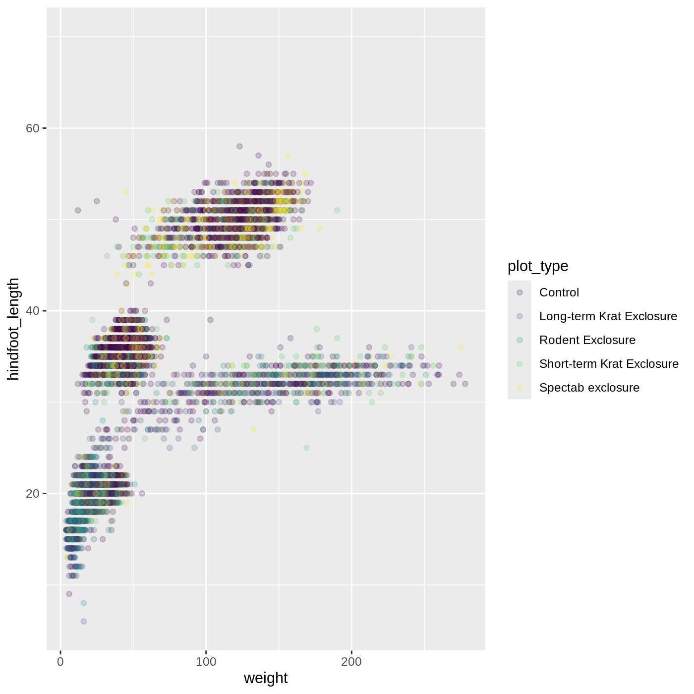

Scales don't just apply to colors- any plot component that you put inside `aes()` can be modified with `scale_` functions. Just as we modified the scale used to map `plot_type` to `color`, we can modify the way that `weight` is mapped to the `x` axis by using the `scale_x_log10()` function:


``` r
ggplot(data = complete_old, mapping = aes(x = weight, y = hindfoot_length, color = plot_type)) +
  geom_point(alpha = 0.2) +
  scale_x_log10()
```

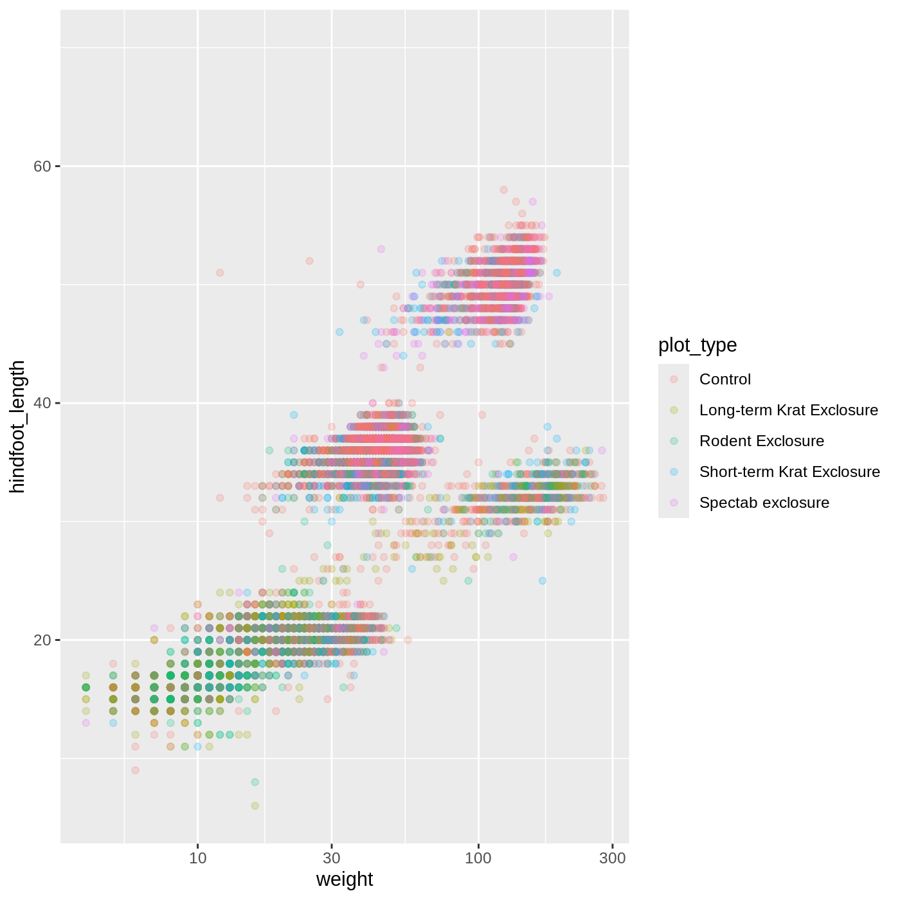

One nice thing about `ggplot` and the `tidyverse` in general is that groups of functions that do similar things are given similar names. Any function that modifies a `ggplot` scale starts with `scale_`, making it easier to search for the right function.

## Boxplot

Let's try making a different type of plot altogether. We'll start off with our same basic building blocks using `ggplot()` and `aes()`.


``` r
ggplot(data = complete_old, mapping = aes(x = plot_type, y = hindfoot_length))
```


This time, let's try making a boxplot, which will have `plot_type` on the x axis and `hindfoot_length` on the y axis. We can do this by adding `geom_boxplot()` to our `ggplot()`:


``` r
ggplot(data = complete_old, mapping = aes(x = plot_type, y = hindfoot_length)) +
  geom_boxplot()
```

``` warning
Warning: Removed 2733 rows containing non-finite outside the scale range
(`stat_boxplot()`).
```


Just as we colored the points before, we can color our boxplot by `plot_type` as well:


``` r
ggplot(data = complete_old, mapping = aes(x = plot_type, y = hindfoot_length, color = plot_type)) +
  geom_boxplot()
```


It looks like `color` has only affected the outlines of the boxplot, not the rectangular portions. This is because the `color` only impacts 1-dimensional parts of a `ggplot`: points and lines. To change the color of 2-dimensional parts of a plot, we use `fill`:


``` r
ggplot(data = complete_old, mapping = aes(x = plot_type, y = hindfoot_length, fill = plot_type)) +
  geom_boxplot()
```

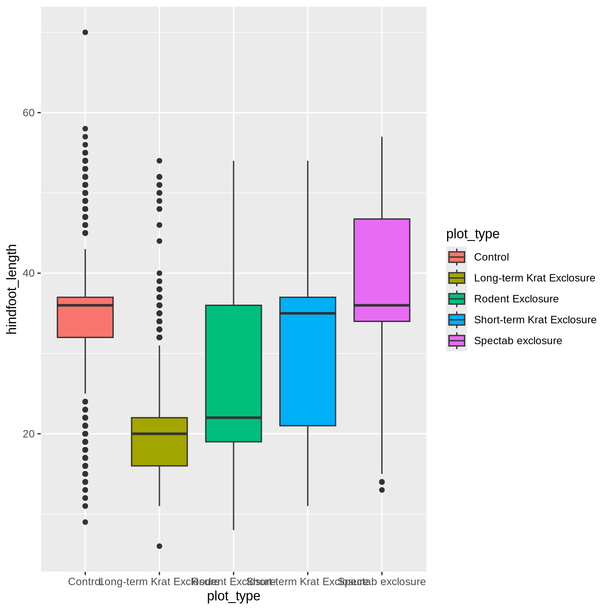

::::::::::::::::::::::::::::: callout

One thing you may notice is that the axis labels are overlapping each other, depending on how wide your plot viewer is. One way to help make them more legible is to **wrap** the text. We can do that by modifying the **labels** for the `x` axis `scale`.

We use the `scale_x_discrete()` function because we have a discrete axis, and we modify the `labels` argument. The function `label_wrap_gen()` will wrap the text of the labels to make them more legible.


``` r
ggplot(data = complete_old, mapping = aes(x = plot_type, y = hindfoot_length, fill = plot_type)) +
  geom_boxplot() +
  scale_x_discrete(labels = label_wrap_gen(width = 10))
```

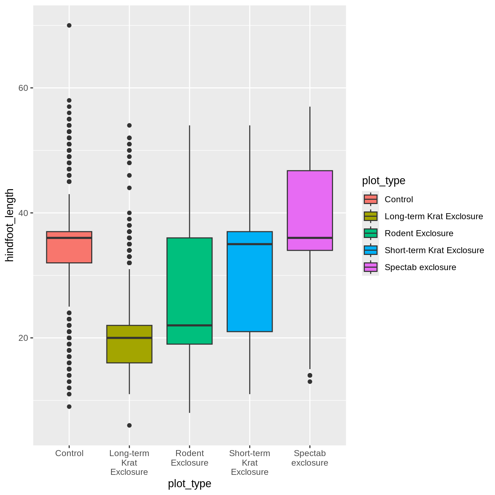

:::::::::::::::::::::::::::::

## Adding geoms

One of the most powerful aspects of **`ggplot`** is the way we can add components to a plot in successive layers. While boxplots can be very useful for summarizing data, it is often helpful to show the raw data as well. With **`ggplot`**, we can easily add another `geom_` to our plot to show the raw data. 

Let's add `geom_point()` to visualize the raw data. We will modify the `alpha` argument to help with overplotting.


``` r
ggplot(data = complete_old, mapping = aes(x = plot_type, y = hindfoot_length)) +
  geom_boxplot() +
  geom_point(alpha = 0.2)
```


Uh oh... all our points for a given `x` axis category fall exactly on a line, which isn't very useful. We can shift to using `geom_jitter()`, which will add points with a bit of random noise added to the positions to prevent this from happening.


``` r
ggplot(data = complete_old, mapping = aes(x = plot_type, y = hindfoot_length)) +
  geom_boxplot() +
  geom_jitter(alpha = 0.2)
```


You may have noticed that some of our data points are now appearing on our plot twice: the outliers are plotted as black points from `geom_boxplot()`, but they are also plotted with `geom_jitter()`. Since we don't want to represent these data multiple times in the same form (points), we can stop `geom_boxplot()` from plotting them. We do this by setting the `outlier.shape` argument to `NA`, which means the outliers don't have a shape to be plotted.


``` r
ggplot(data = complete_old, mapping = aes(x = plot_type, y = hindfoot_length)) +
  geom_boxplot(outlier.shape = NA) +
  geom_jitter(alpha = 0.2)
```

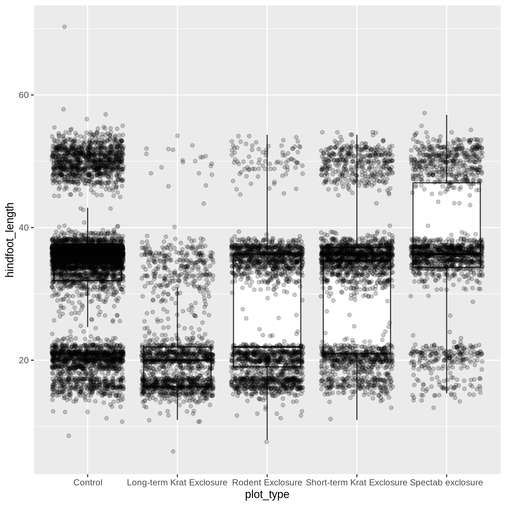

Just as before, we can map `plot_type` to `color` by putting it inside `aes()`.


``` r
ggplot(data = complete_old, mapping = aes(x = plot_type, y = hindfoot_length, color = plot_type)) +
  geom_boxplot(outlier.shape = NA) +
  geom_jitter(alpha = 0.2)
```


Notice that both the color of the points and the color of the boxplot lines changed. Any time we specify an `aes()` mapping inside our initial `ggplot()` function, that mapping will apply to all our `geom`s.

If we want to limit the mapping to a single `geom`, we can put the mapping into the specific `geom_` function, like this:


``` r
ggplot(data = complete_old, mapping = aes(x = plot_type, y = hindfoot_length)) +
  geom_boxplot(outlier.shape = NA) +
  geom_jitter(aes(color = plot_type), alpha = 0.2)
```

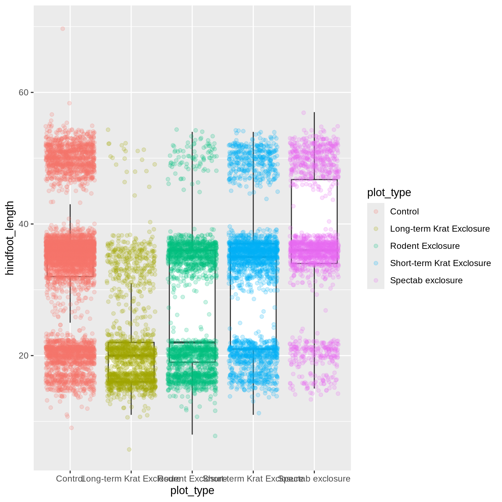

Now our points are colored according to `plot_type`, but the boxplots are all the same color. One thing you might notice is that even with `alpha = 0.2`, the points obscure parts of the boxplot. This is because the `geom_point()` layer comes after the `geom_boxplot()` layer, which means the points are plotted on top of the boxes. To put the boxplots on top, we switch the order of the layers:


``` r
ggplot(data = complete_old, mapping = aes(x = plot_type, y = hindfoot_length)) +
  geom_jitter(aes(color = plot_type), alpha = 0.2) +
  geom_boxplot(outlier.shape = NA)
```

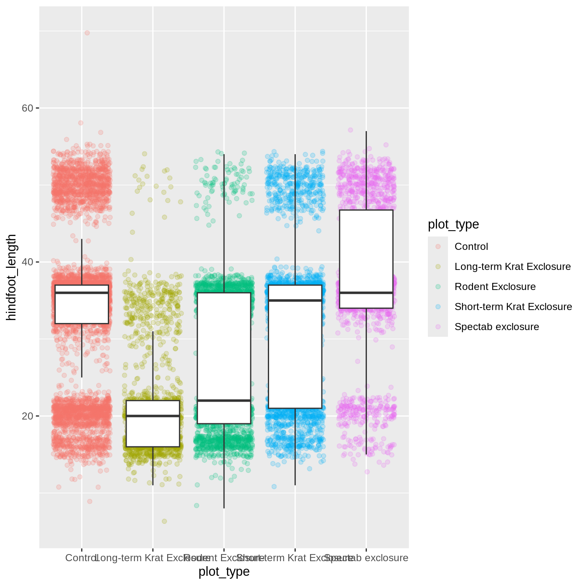

Now we have the opposite problem! The white `fill` of the boxplots completely obscures some of the points. To address this problem, we can remove the `fill` from the boxplots altogether, leaving only the black lines. To do this, we set `fill` to `NA`:


``` r
ggplot(data = complete_old, mapping = aes(x = plot_type, y = hindfoot_length)) +
  geom_jitter(aes(color = plot_type), alpha = 0.2) +
  geom_boxplot(outlier.shape = NA, fill = NA)
```

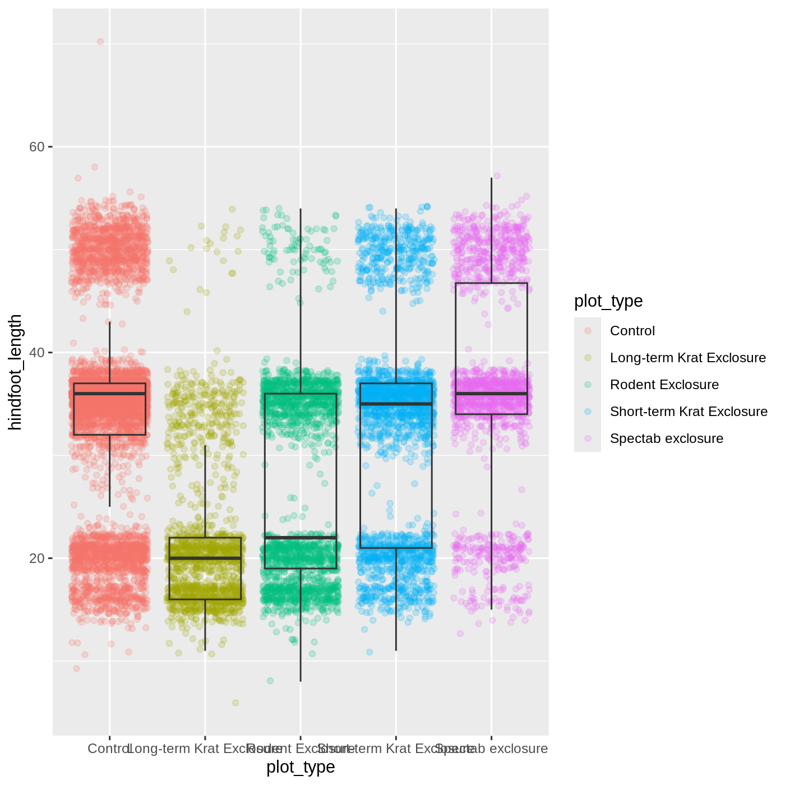

Now we can see all the raw data and our boxplots on top.

::::::::::::::::::::::::::::::::::::: challenge 

## Challenge 2: Change `geom`s

Violin plots are similar to boxplots- try making one using `plot_type` and `hindfoot_length` as the x and y variables. Remember that all geom functions start with `geom_`, followed by the type of geom.

This might also be a place to test your search engine skills. It is often useful to search for `R package_name stuff you want to search`. So for this example we might search for `R ggplot2 violin plot`.

:::::::::::::::::::::::: solution 


``` r
ggplot(data = complete_old, 
       mapping = aes(x = plot_type, 
                     y = hindfoot_length,
                     color = plot_type)) +
  geom_jitter(alpha = 0.2) +
  geom_violin(fill = "white")
```


::::::::::::::::::::::::

For an *extra challenge*, , make the color of the points and outlines of the violins vary by `plot_type`, and set the fill of the violins to white. Try playing with the order of the layers to see what looks best.

:::::::::::::::::::::::: solution 


``` r
ggplot(data = complete_old, 
       mapping = aes(x = plot_type, 
                     y = hindfoot_length,
                     color = plot_type)) +
  geom_jitter(alpha = 0.2) +
  geom_violin(fill = "white")
```

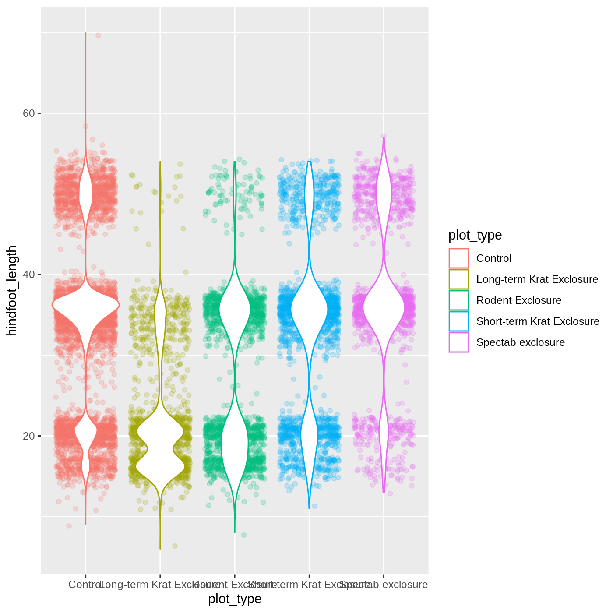

::::::::::::::::::::::::
::::::::::::::::::::::::::::::::::::::::::::::::

## Changing themes

So far we've been changing the appearance of parts of our plot related to our data and the `geom_` functions, but we can also change many of the non-data components of our plot. 

At this point, we are pretty happy with the basic layout of our plot, so we can **assign** it to a plot to a named **object**. We do this using the **assignment arrow** `<-`. What we are doing here is taking the result of the code on the right side of the arrow, and assigning it to an object whose name is on the left side of the arrow.

We will create an object called `myplot`. If you run the name of the `ggplot2` object, it will show the plot, just like if you ran the code itself.


``` r
myplot <- ggplot(data = complete_old, mapping = aes(x = plot_type, y = hindfoot_length)) +
  geom_jitter(aes(color = plot_type), alpha = 0.2) +
  geom_boxplot(outlier.shape = NA, fill = NA)

myplot
```

``` warning
Warning: Removed 2733 rows containing non-finite outside the scale range
(`stat_boxplot()`).
```

``` warning
Warning: Removed 2733 rows containing missing values or values outside the scale range
(`geom_point()`).
```

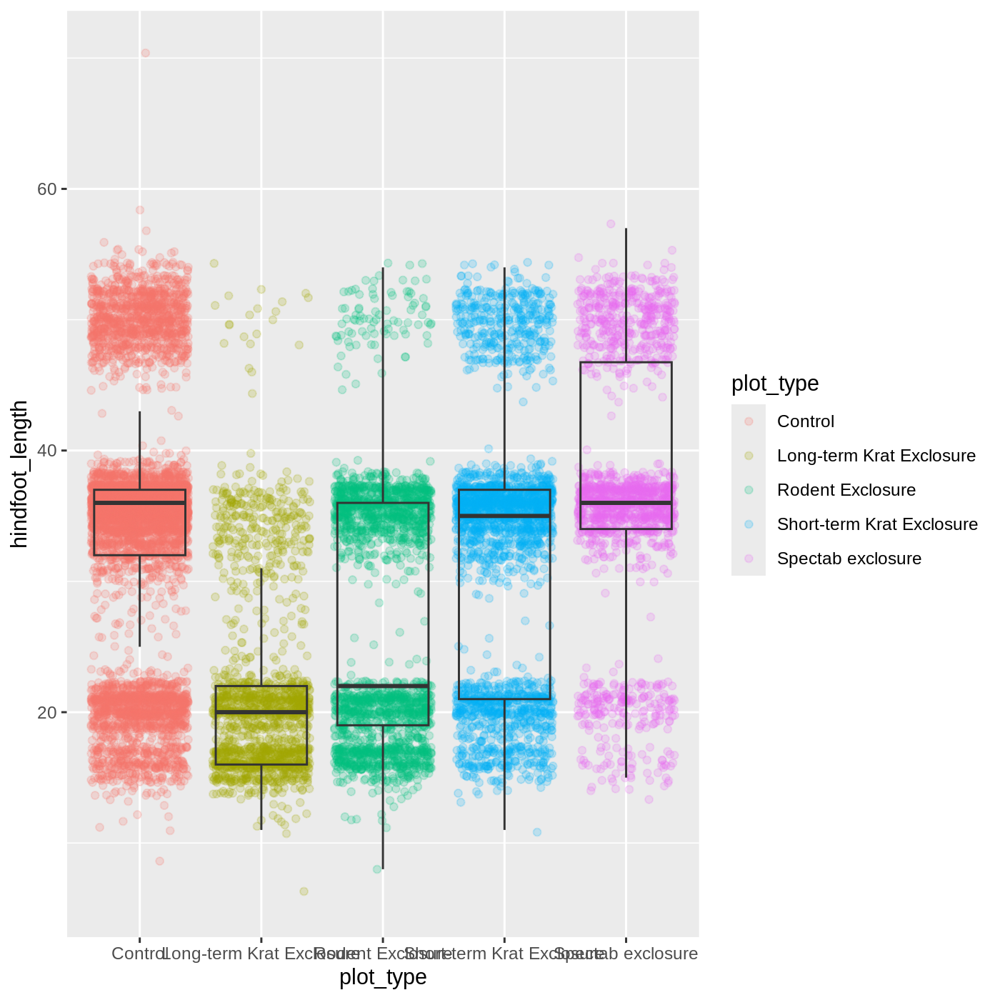

This process of assigning something to an **object** is not specific to `ggplot2`, but rather a general feature of R. We will be using it a lot in the rest of this lesson. We can now work with the `myplot` object as if it was a block of `ggplot2` code, which means we can use `+` to add new components to it.

We can change the overall appearance using `theme_` functions. Let's try a black-and-white theme by adding `theme_bw()` to our plot:


``` r
myplot + theme_bw()
```

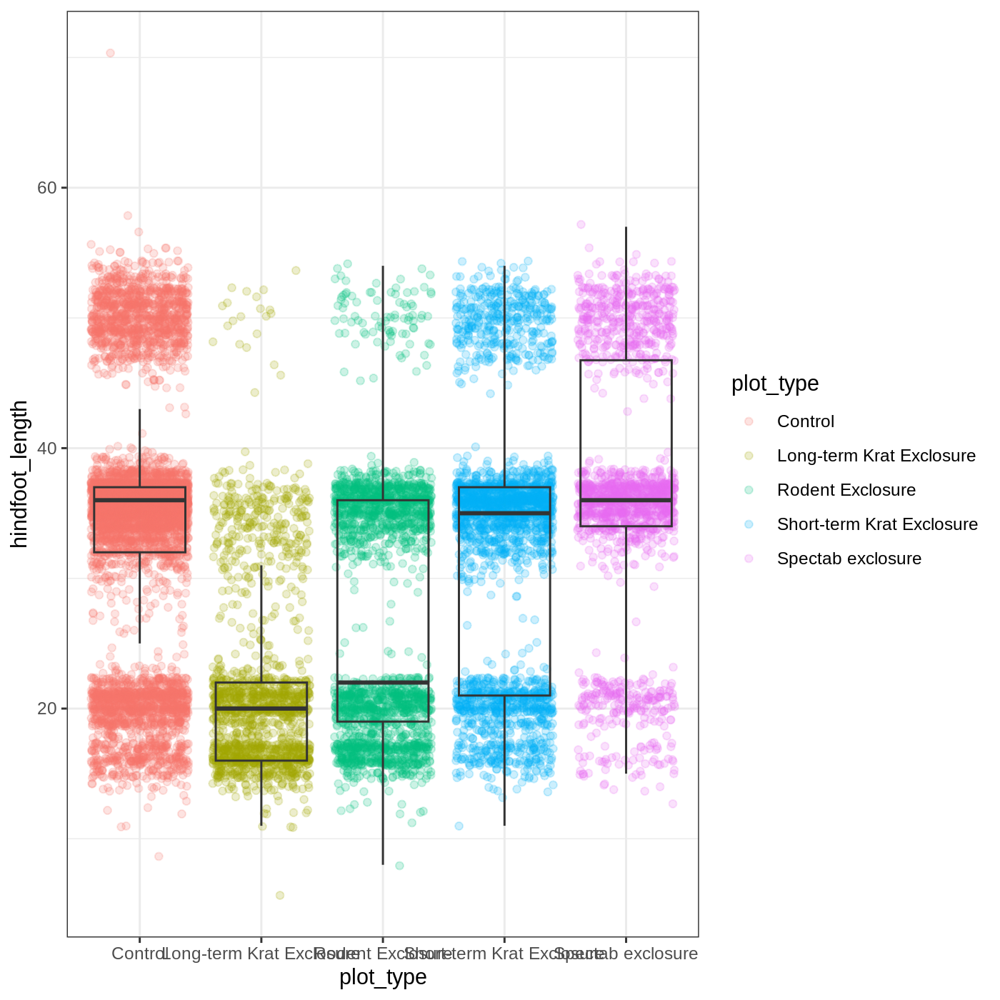

As you can see, a number of parts of the plot have changed. `theme_` functions usually control many aspects of a plot's appearance all at once, for the sake of convenience. To individually change parts of a plot, we can use the `theme()` function, which can take many different arguments to change things about the text, grid lines, background color, and more. Let's try changing the size of the text on our axis titles. We can do this by specifying that the `axis.title` should be an `element_text()` with `size` set to 14.


``` r
myplot +
  theme_bw() +
  theme(axis.title = element_text(size = 14))
```


Another change we might want to make is to remove the vertical grid lines. Since our x axis is categorical, those grid lines aren't useful. To do this, inside `theme()`, we will change the `panel.grid.major.x` to an `element_blank()`.


``` r
myplot +
  theme_bw() +
  theme(axis.title = element_text(size = 14), 
        panel.grid.major.x = element_blank())
```

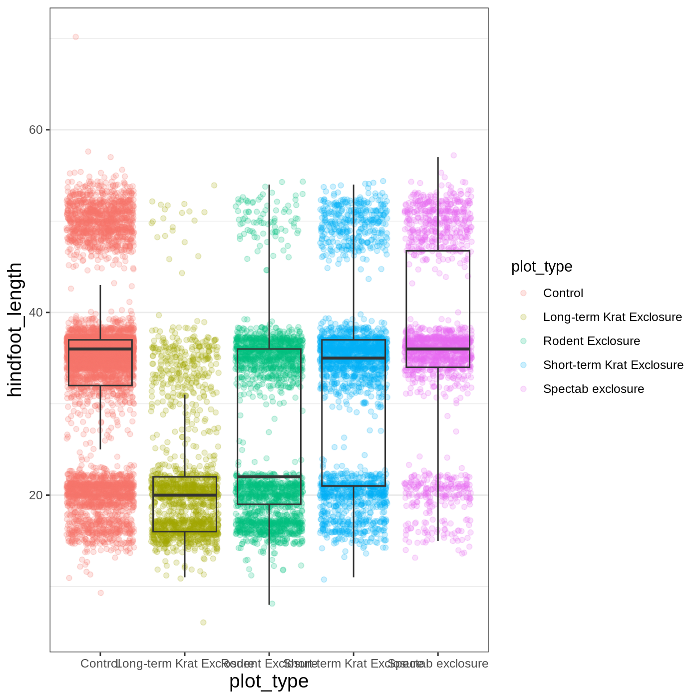

Another useful change might be to remove the color legend, since that information is already on our x axis. For this one, we will set `legend.position` to "none". 


``` r
myplot +
  theme_bw() +
  theme(axis.title = element_text(size = 14), 
        panel.grid.major.x = element_blank(), 
        legend.position = "none")
```


::::::::::::::::::::::::::::: callout

Because there are so many possible arguments to the `theme()` function, it can sometimes be hard to find the right one. Here are some tips for figuring out how to modify a plot element:

- type out `theme()`, put your cursor between the parentheses, and hit <kbd>Tab</kbd> to bring up a list of arguments
    - you can scroll through the arguments, or start typing, which will shorten the list of potential matches
- like many things in the `tidyverse`, similar argument start with similar names
    - there are `axis`, `legend`, `panel`, `plot`, and `strip` arguments
- arguments have hierarchy
    - `text` controls all text in the whole plot
    - `axis.title` controls the text for the axis titles
    - `axis.title.x` controls the text for the x axis title

:::::::::::::::::::::::::::::

::::::::::::::::::::::::::::: callout

You may have noticed that we have used 3 different approaches to getting rid of something in `ggplot`: 

- `outlier.shape = NA` to remove the outliers from our boxplot
- `panel.grid.major.x = element_blank()` to remove the x grid lines
- `legend.position = "none"` to remove our legend

Why are there so many ways to do what seems like the same thing?? This is a common frustration when working with R, or with any programming language. There are a couple reasons for it:

1. Different people contribute to different packages and functions, and they may choose to do things differently.
2. Code may *appear* to be doing the same thing, when the details are actually quite different. The inner workings of `ggplot2` are actually quite complex, since it turns out making plots is a very complicated process! Because of this, things that seem the same (removing parts of a plot), may actually be operating on very different components or stages of the final plot.
3. Developing packages is a highly iterative process, and sometimes things change. However, changing too much stuff can make old code break. Let's say removing the legend was introduced as a feature of `ggplot2`, and then a lot of time passed before someone added the feature letting you remove outliers from `geom_boxplot()`. Changing the way you remove the legend, so that it's the same as the boxplot approach, could break all of the code written in the meantime, so developers may opt to keep the old approach in place.

:::::::::::::::::::::::::::::

## Changing labels

Our plot is really shaping up now. However, we probably want to make our axis titles nicer, and perhaps add a main title to the plot. We can do this using the `labs()` function:


``` r
myplot +
  theme_bw() +
  theme(axis.title = element_text(size = 14), 
        legend.position = "none") +
  labs(title = "Rodent size by plot type",
       x = "Plot type",
       y = "Hindfoot length (mm)")
```


We removed our legend from this plot, but you can also change the titles of various legends using `labs()`. For example, `labs(color = "Plot type")` would change the title of a color scale legend to "Plot type".

::::::::::::::::::::::::::::::::::::: challenge 

## Challenge 3: Customizing a plot

Modify the previous plot by adding a descriptive subtitle. Increase the font size of the plot title and make it bold.

**Hint**: "bold" is referred to as a font "face"

:::::::::::::::::::::::: solution 


``` r
myplot +
  theme_bw() +
  theme(axis.title = element_text(size = 14), legend.position = "none",
        plot.title = element_text(face = "bold", size = 20)) +
  labs(title = "Rodent size by plot type",
       subtitle = "Long-term dataset from Portal, AZ",
       x = "Plot type",
       y = "Hindfoot length (mm)")
```


::::::::::::::::::::::::
::::::::::::::::::::::::::::::::::::::::::::::::

## Faceting

One of the most powerful features of **`ggplot`** is the ability to quickly split a plot into multiple smaller plots based on a categorical variable, which is called **faceting**. 

So far we've mapped variables to the x axis, the y axis, and color, but trying to add a 4th variable becomes difficult. Changing the shape of a point might work, but only for very few categories, and even then, it can be hard to tell the differences between the shapes of small points.

Instead of cramming one more variable into a single plot, we will use the `facet_wrap()` function to generate a series of smaller plots, split out by `sex`. We also use `ncol` to specify that we want them arranged in a single column:


``` r
myplot +
  theme_bw() +
  theme(axis.title = element_text(size = 14), 
        legend.position = "none", 
        panel.grid.major.x = element_blank()) +
  labs(title = "Rodent size by plot type",
       x = "Plot type",
       y = "Hindfoot length (mm)",
       color = "Plot type") +
  facet_wrap(vars(sex), ncol = 1)
```


::::::::::::::::::::::::::::: callout

Faceting comes in handy in many scenarios. It can be useful when:

- a categorical variable has too many levels to differentiate by color (such as a dataset with 20 countries)
- your data overlap heavily, obscuring categories
- you want to show more than 3 variables at once
- you want to see each category in isolation while allowing for general comparisons between categories

:::::::::::::::::::::::::::::::::::::

## Exporting plots

Once we are happy with our final plot, we can assign the whole thing to a new object, which we can call `finalplot`.


``` r
finalplot <- myplot +
  theme_bw() +
  theme(axis.title = element_text(size = 14), 
        legend.position = "none", 
        panel.grid.major.x = element_blank()) +
  labs(title = "Rodent size by plot type",
       x = "Plot type",
       y = "Hindfoot length (mm)",
       color = "Plot type") +
  facet_wrap(vars(sex), ncol = 1)
```

After this, we can run `ggsave()` to save our plot. The first argument we give is the path to the file we want to save, including the correct file extension. This code will make an image called `rodent_size_plots.jpg` in the `images/` folder of our current project. We are making a `.jpg`, but you can save `.pdf`, `.tiff`, and other file formats. Next, we tell it the name of the plot object we want to save. We can also specify things like the width and height of the plot in inches.


``` r
ggsave(filename = "images/rodent_size_plots.jpg", plot = finalplot,
       height = 6, width = 8)
```

::::::::::::::::::::::::::::::::::::: challenge 

## Challenge 4: Make your own plot

Try making your own plot! You can run `str(complete_old)` or `?complete_old` to explore variables you might use in your new plot. Feel free to use variables we have already seen, or some we haven't explored yet.

Here are a couple ideas to get you started:

  - make a histogram of one of the numeric variables
  - try using a different color `scale_`
  - try changing the size of points or thickness of lines in a `geom`

::::::::::::::::::::::::::::::::::::::::::::::::


::::::::::::::::::::::::::::::::::::: keypoints 

- the `ggplot()` function initiates a plot, and `geom_` functions add representations of your data
- use `aes()` when mapping a variable from the data to a part of the plot
- use `scale_` functions to modify the scales used to represent variables
- use premade `theme_` functions to broadly change appearance, and the `theme()` function to fine-tune
- start simple and build your plots iteratively

::::::::::::::::::::::::::::::::::::::::::::::::
