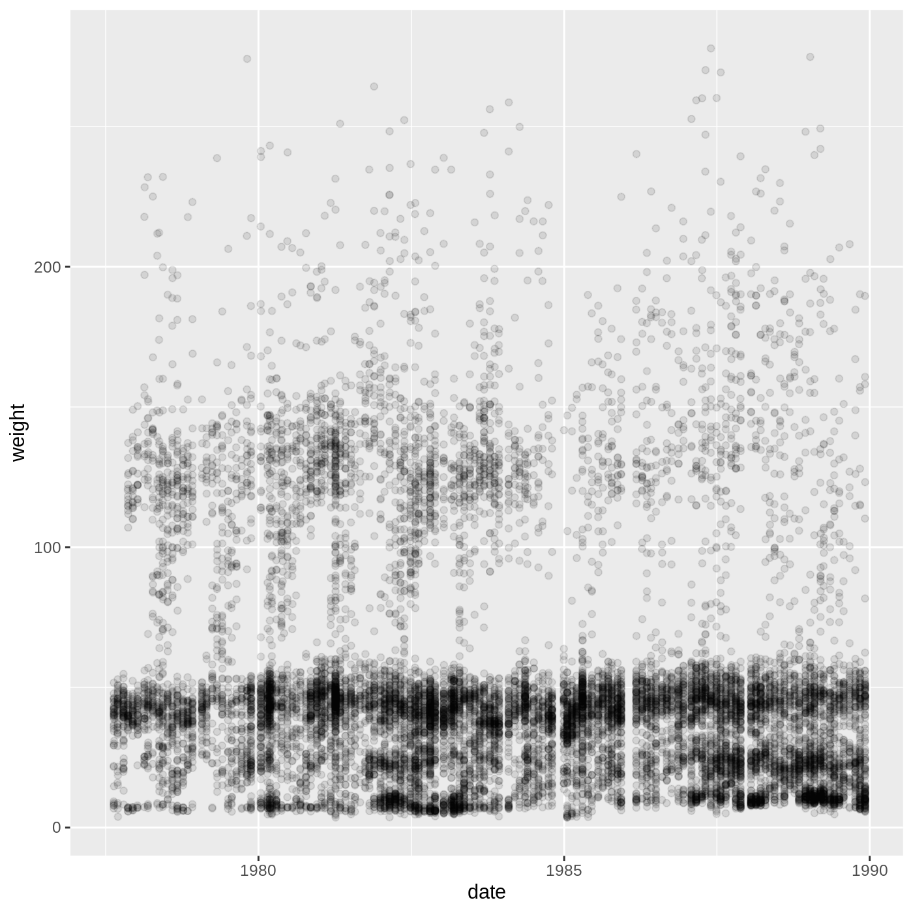
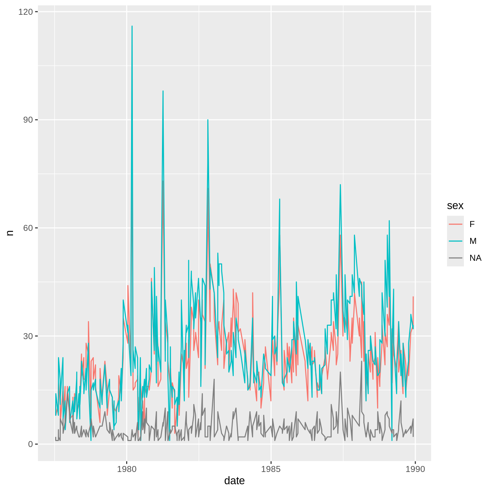
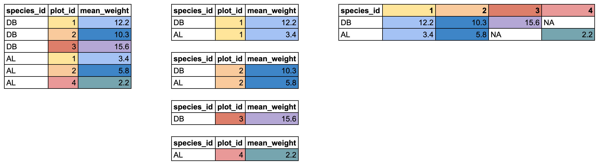
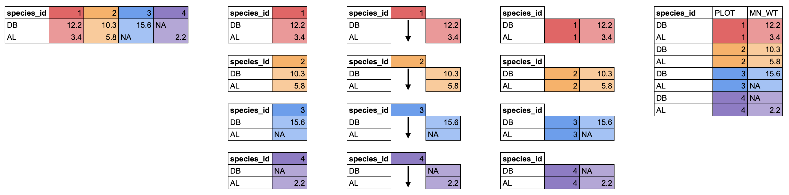

<!-- - importing complete_old CSV -->
<!--     - touch on column parsing -->
<!--     - talk about file paths and tab completion -->
<!--     - should we teach the `here()` package? -->
<!-- - base vs. tidyverse -->
<!-- - pipes -->
<!-- - select -->
<!-- - filter -->
<!--     - idea of conditional subsetting -->
<!--     - ==, >, !, |, & -->
<!--     - show %in% -->
<!-- - mutate -->
<!-- - making a date column -->
<!-- - group_by -->
<!--   - summarize -->
<!--   - mutate -->
<!--   - ungroup -->
<!-- - pivot_wider -->
<!-- - exporting data -->

<!-- Challenge ideas: -->

<!-- - plotting a time series using the date -->
<!-- - predicting # of rows before pivoting -->
<!--   - important to plan out reshaping steps in advance -->
<!-- - filter operations -->
<!--   - weight between two values -->
<!--   - maybe throw in an | example -->
<!-- - combination filter and select where doing the order wrong yields an error -->
<!--   - only has columns record_id, species_id, sex, and hindfoot_length, but weight has to be NA -->
<!-- - a couple of simple group_by operations -->
<!--   - how many combinations of plot id and genus are there -->
<!--     - could show that distinct also works here -->
<!--   - what will happen if you group by weight? -->
<!--   - an operation that requires group_by and mutate -->
<!--   - an operation that requires multiple group_by steps -->
  
:::::::::::::::::::::::::::::::::::::: questions 

- How do you manipulate tabular data in R?

::::::::::::::::::::::::::::::::::::::::::::::::

::::::::::::::::::::::::::::::::::::: objectives

- Import CSV data into R.
- Understand the difference between base R and `tidyverse` approaches.
- Subset rows and columns of data.frames.
- Use pipes to link steps together into pipelines.
- Create new data.frame columns using existing columns.
- Utilize the concept of split-apply-combine data analysis.
- Reshape data between wide and long formats.
- Export data to a CSV file.

::::::::::::::::::::::::::::::::::::::::::::::::
  


``` r
library(tidyverse)
```

## Importing data

Up until this point, we have been working with the `complete_old` dataframe contained in the `ratdat` package. However, you typically won't access data from an R package; it is much more common to access data files stored somewhere on your computer. We are going to download a CSV file containing the surveys data to our computer, which we will then read into R.

Click this link to download the file: <https://datacarpentry.org/R-ecology-lesson/data/cleaned/surveys_complete_77_89.csv>.

You will be prompted to save the file on your computer somewhere. Save it inside the `cleaned` data folder, which is in the `data` folder in your `R-Ecology-Workshop` folder. Once it's inside our project, we will be able to point R towards it.

#### File paths

When we reference other files from an R script, we need to give R precise instructions on where those files are. We do that using something called a **file path**. It looks something like this: `"Documents/Manuscripts/Chapter_2.txt"`. This path would tell your computer how to get from whatever folder contains the `Documents` folder all the way to the `.txt` file.

There are two kinds of paths: **absolute** and **relative**. Absolute paths are specific to a particular computer, whereas relative paths are relative to a certain folder. Because we are keeping all of our work in the `R-Ecology-Workshop` folder, all of our paths can be relative to this folder.

Now, let's read our CSV file into R and store it in an object named `surveys`. We will use the `read_csv` function from the `tidyverse`'s `readr` package, and the argument we give will be the **relative path** to the CSV file.


``` r
surveys <- read_csv("data/cleaned/surveys_complete_77_89.csv")
```

``` output
Rows: 16878 Columns: 13
── Column specification ────────────────────────────────────────────────────────
Delimiter: ","
chr (6): species_id, sex, genus, species, taxa, plot_type
dbl (7): record_id, month, day, year, plot_id, hindfoot_length, weight

ℹ Use `spec()` to retrieve the full column specification for this data.
ℹ Specify the column types or set `show_col_types = FALSE` to quiet this message.
```

:::::::::::::::::::::::::::::::::::::::::: callout

Typing out paths can be error prone, so we can utilize a keyboard shortcut. Inside the parentheses of `read_csv()`, type out a pair of quotes and put your cursor between them. Then hit <kbd>Tab</kbd>. A small menu showing your folders and files should show up. You can use the <kbd>↑</kbd> and <kbd>↓</kbd> keys to move through the options, or start typing to narrow them down. You can hit <kbd>Enter</kbd> to select a file or folder, and hit <kbd>Tab</kbd> again to continue building the file path. This might take a bit of getting used to, but once you get the hang of it, it will speed up writing file paths and reduce the number of mistakes you make.

::::::::::::::::::::::::::::::::::::::::::

You may have noticed a bit of feedback from R when you ran the last line of code. We got some useful information about the CSV file we read in. We can see:

- the number of rows and columns
- the **delimiter** of the file, which is how values are separated, a comma `","`
- a set of columns that were **parsed** as various vector types
  - the file has 6 character columns and 7 numeric columns
  - we can see the names of the columns for each type
  
 
When working with the output of a new function, it's often a good idea to check the `class()`:


``` r
class(surveys)
```

``` output
[1] "spec_tbl_df" "tbl_df"      "tbl"         "data.frame" 
```

Whoa! What is this thing? It has multiple classes? Well, it's called a `tibble`, and it is the `tidyverse` version of a data.frame. It *is* a data.frame, but with some added perks. It prints out a little more nicely, it highlights `NA` values and negative values in red, and it will generally communicate with you more (in terms of warnings and errors, which is a good thing).

:::::::::::::::::::::::::::::::::::::::::: callout

**`tidyverse` vs. base R**

As we begin to delve more deeply into the `tidyverse`, we should briefly pause to mention some of the reasons for focusing on the `tidyverse` set of tools. In R, there are often many ways to get a job done, and there are other approaches that can accomplish tasks similar to the `tidyverse`.

The phrase **base R** is used to refer to approaches that utilize functions contained in R's default packages. We have already used some base R functions, such as `str()`, `head()`, and `mean()`, and we will be using more scattered throughout this lesson. However, there are some key base R approaches we will not be teaching. These include square bracket subsetting and base plotting. You may come across code written by other people that looks like `surveys[1:10, 2]` or `plot(surveys$weight, surveys$hindfoot_length)`, which are base R commands. If you're interested in learning more about these approaches, you can check out other Carpentries lessons like the [Software Carpentry Programming with R](https://swcarpentry.github.io/r-novice-inflammation/) lesson.

We choose to teach the `tidyverse` set of packages because they share a similar syntax and philosophy, making them consistent and producing highly readable code. They are also very flexible and powerful, with a growing number of packages designed according to similar principles and to work well with the rest of the packages. The `tidyverse` packages tend to have very clear documentation and wide array of learning materials that tend to be written with novice users in mind. Finally, the `tidyverse` has only continued to grow, and has strong support from RStudio, which implies that these approaches will be relevant into the future.

::::::::::::::::::::::::::::::::::::::::::

## Manipulating data

One of the most important skills for working with data in R is the ability to manipulate, modify, and reshape data. The `dplyr` and `tidyr` packages in the `tidyverse` provide a series of powerful functions for many common data manipulation tasks.

We'll start off with two of the most commonly used `dplyr` functions: `select()`, which selects certain columns of a data.frame, and `filter()`, which filters out rows according to certain criteria.

:::::::::::::::::::::::::::::::::::::::::: callout

Between `select()` and `filter()`, it can be hard to remember which operates on columns and which operates on rows. `sele`**`c`**`t()` has a **c** for **c**olumns and `filte`**`r`**`()` has an **r** for **r**ows.

::::::::::::::::::::::::::::::::::::::::::

#### `select()`

To use the `select()` function, the first argument is the name of the data.frame, and the rest of the arguments are *unquoted* names of the columns you want:


``` r
select(surveys, plot_id, species_id, hindfoot_length)
```

``` output
# A tibble: 16,878 × 3
   plot_id species_id hindfoot_length
     <dbl> <chr>                <dbl>
 1       2 NL                      32
 2       3 NL                      33
 3       2 DM                      37
 4       7 DM                      36
 5       3 DM                      35
 6       1 PF                      14
 7       2 PE                      NA
 8       1 DM                      37
 9       1 DM                      34
10       6 PF                      20
# ℹ 16,868 more rows
```

The columns are arranged in the order we specified inside `select()`.

To select all columns except specific columns, put a `-` in front of the column you want to exclude:


``` r
select(surveys, -record_id, -year)
```

``` output
# A tibble: 16,878 × 11
   month   day plot_id species_id sex   hindfoot_length weight genus     species
   <dbl> <dbl>   <dbl> <chr>      <chr>           <dbl>  <dbl> <chr>     <chr>  
 1     7    16       2 NL         M                  32     NA Neotoma   albigu…
 2     7    16       3 NL         M                  33     NA Neotoma   albigu…
 3     7    16       2 DM         F                  37     NA Dipodomys merria…
 4     7    16       7 DM         M                  36     NA Dipodomys merria…
 5     7    16       3 DM         M                  35     NA Dipodomys merria…
 6     7    16       1 PF         M                  14     NA Perognat… flavus 
 7     7    16       2 PE         F                  NA     NA Peromysc… eremic…
 8     7    16       1 DM         M                  37     NA Dipodomys merria…
 9     7    16       1 DM         F                  34     NA Dipodomys merria…
10     7    16       6 PF         F                  20     NA Perognat… flavus 
# ℹ 16,868 more rows
# ℹ 2 more variables: taxa <chr>, plot_type <chr>
```

`select()` also works with numeric vectors for the order of the columns. To select the 3rd, 4th, 5th, and 10th columns, we could run the following code:


``` r
select(surveys, c(3:5, 10))
```

``` output
# A tibble: 16,878 × 4
     day  year plot_id genus      
   <dbl> <dbl>   <dbl> <chr>      
 1    16  1977       2 Neotoma    
 2    16  1977       3 Neotoma    
 3    16  1977       2 Dipodomys  
 4    16  1977       7 Dipodomys  
 5    16  1977       3 Dipodomys  
 6    16  1977       1 Perognathus
 7    16  1977       2 Peromyscus 
 8    16  1977       1 Dipodomys  
 9    16  1977       1 Dipodomys  
10    16  1977       6 Perognathus
# ℹ 16,868 more rows
```

You should be careful when using this method, since you are being less explicit about which columns you want. However, it can be useful if you have a data.frame with many columns and you don't want to type out too many names.

Finally, you can select columns based on whether they match a certain criteria by using the `where()` function. If we want all numeric columns, we can ask to `select` all the columns `where` the class `is numeric`:


``` r
select(surveys, where(is.numeric))
```

``` output
# A tibble: 16,878 × 7
   record_id month   day  year plot_id hindfoot_length weight
       <dbl> <dbl> <dbl> <dbl>   <dbl>           <dbl>  <dbl>
 1         1     7    16  1977       2              32     NA
 2         2     7    16  1977       3              33     NA
 3         3     7    16  1977       2              37     NA
 4         4     7    16  1977       7              36     NA
 5         5     7    16  1977       3              35     NA
 6         6     7    16  1977       1              14     NA
 7         7     7    16  1977       2              NA     NA
 8         8     7    16  1977       1              37     NA
 9         9     7    16  1977       1              34     NA
10        10     7    16  1977       6              20     NA
# ℹ 16,868 more rows
```

Instead of giving names or positions of columns, we instead pass the `where()` function with the name of another function inside it, in this case `is.numeric()`, and we get all the columns for which that function returns `TRUE`.

We can use this to select any columns that have any `NA` values in them:


``` r
select(surveys, where(anyNA))
```

``` output
# A tibble: 16,878 × 7
   species_id sex   hindfoot_length weight genus       species  taxa  
   <chr>      <chr>           <dbl>  <dbl> <chr>       <chr>    <chr> 
 1 NL         M                  32     NA Neotoma     albigula Rodent
 2 NL         M                  33     NA Neotoma     albigula Rodent
 3 DM         F                  37     NA Dipodomys   merriami Rodent
 4 DM         M                  36     NA Dipodomys   merriami Rodent
 5 DM         M                  35     NA Dipodomys   merriami Rodent
 6 PF         M                  14     NA Perognathus flavus   Rodent
 7 PE         F                  NA     NA Peromyscus  eremicus Rodent
 8 DM         M                  37     NA Dipodomys   merriami Rodent
 9 DM         F                  34     NA Dipodomys   merriami Rodent
10 PF         F                  20     NA Perognathus flavus   Rodent
# ℹ 16,868 more rows
```

#### `filter()`

The `filter()` function is used to select rows that meet certain criteria. To get all the rows where the value of `year` is equal to 1985, we would run the following:


``` r
filter(surveys, year == 1985)
```

``` output
# A tibble: 1,438 × 13
   record_id month   day  year plot_id species_id sex   hindfoot_length weight
       <dbl> <dbl> <dbl> <dbl>   <dbl> <chr>      <chr>           <dbl>  <dbl>
 1      9790     1    19  1985      16 RM         F                  16      4
 2      9791     1    19  1985      17 OT         F                  20     16
 3      9792     1    19  1985       6 DO         M                  35     48
 4      9793     1    19  1985      12 DO         F                  35     40
 5      9794     1    19  1985      24 RM         M                  16      4
 6      9795     1    19  1985      12 DO         M                  34     48
 7      9796     1    19  1985       6 DM         F                  37     35
 8      9797     1    19  1985      14 DM         M                  36     45
 9      9798     1    19  1985       6 DM         F                  36     38
10      9799     1    19  1985      19 RM         M                  16      4
# ℹ 1,428 more rows
# ℹ 4 more variables: genus <chr>, species <chr>, taxa <chr>, plot_type <chr>
```

The `==` sign means "is equal to". There are several other operators we can use: >, >=, <, <=, and != (not equal to). Another useful operator is `%in%`, which asks if the value on the lefthand side is found anywhere in the vector on the righthand side. For example, to get rows with specific `species_id` values, we could run:


``` r
filter(surveys, species_id %in% c("RM", "DO"))
```

``` output
# A tibble: 2,835 × 13
   record_id month   day  year plot_id species_id sex   hindfoot_length weight
       <dbl> <dbl> <dbl> <dbl>   <dbl> <chr>      <chr>           <dbl>  <dbl>
 1        68     8    19  1977       8 DO         F                  32     52
 2       292    10    17  1977       3 DO         F                  36     33
 3       294    10    17  1977       3 DO         F                  37     50
 4       311    10    17  1977      19 RM         M                  18     13
 5       317    10    17  1977      17 DO         F                  32     48
 6       323    10    17  1977      17 DO         F                  33     31
 7       337    10    18  1977       8 DO         F                  35     41
 8       356    11    12  1977       1 DO         F                  32     44
 9       378    11    12  1977       1 DO         M                  33     48
10       397    11    13  1977      17 RM         F                  16      7
# ℹ 2,825 more rows
# ℹ 4 more variables: genus <chr>, species <chr>, taxa <chr>, plot_type <chr>
```

We can also use multiple conditions in one `filter()` statement. Here we will get rows with a year less than or equal to 1988 and whose hindfoot length values are not `NA`. The `!` before the `is.na()` function means "not".


``` r
filter(surveys, year <= 1988 & !is.na(hindfoot_length))
```

``` output
# A tibble: 12,779 × 13
   record_id month   day  year plot_id species_id sex   hindfoot_length weight
       <dbl> <dbl> <dbl> <dbl>   <dbl> <chr>      <chr>           <dbl>  <dbl>
 1         1     7    16  1977       2 NL         M                  32     NA
 2         2     7    16  1977       3 NL         M                  33     NA
 3         3     7    16  1977       2 DM         F                  37     NA
 4         4     7    16  1977       7 DM         M                  36     NA
 5         5     7    16  1977       3 DM         M                  35     NA
 6         6     7    16  1977       1 PF         M                  14     NA
 7         8     7    16  1977       1 DM         M                  37     NA
 8         9     7    16  1977       1 DM         F                  34     NA
 9        10     7    16  1977       6 PF         F                  20     NA
10        11     7    16  1977       5 DS         F                  53     NA
# ℹ 12,769 more rows
# ℹ 4 more variables: genus <chr>, species <chr>, taxa <chr>, plot_type <chr>
```


::::::::::::::::::::::::::::::::::::: challenge

## Challenge 1: Filtering and selecting

1. Use the surveys data to make a data.frame that has only data with years from 1980 to 1985.

:::::::::::::::::::::::: solution


``` r
surveys_filtered <- filter(surveys, year >= 1980 & year <= 1985)
```

::::::::::::::::::::::::

2. Use the surveys data to make a data.frame that has only the following columns, in order: `year`, `month`, `species_id`, `plot_id`.

:::::::::::::::::::::::: solution


``` r
surveys_selected <- select(surveys, year, month, species_id, plot_id)
```

::::::::::::::::::::::::

::::::::::::::::::::::::::::::::::::::::::::::::

## The pipe: `%>%`

What happens if we want to both `select()` and `filter()` our data? We have a couple options. First, we could use **nested** functions:


``` r
filter(select(surveys, -day), month >= 7)
```

``` output
# A tibble: 8,244 × 12
   record_id month  year plot_id species_id sex   hindfoot_length weight genus  
       <dbl> <dbl> <dbl>   <dbl> <chr>      <chr>           <dbl>  <dbl> <chr>  
 1         1     7  1977       2 NL         M                  32     NA Neotoma
 2         2     7  1977       3 NL         M                  33     NA Neotoma
 3         3     7  1977       2 DM         F                  37     NA Dipodo…
 4         4     7  1977       7 DM         M                  36     NA Dipodo…
 5         5     7  1977       3 DM         M                  35     NA Dipodo…
 6         6     7  1977       1 PF         M                  14     NA Perogn…
 7         7     7  1977       2 PE         F                  NA     NA Peromy…
 8         8     7  1977       1 DM         M                  37     NA Dipodo…
 9         9     7  1977       1 DM         F                  34     NA Dipodo…
10        10     7  1977       6 PF         F                  20     NA Perogn…
# ℹ 8,234 more rows
# ℹ 3 more variables: species <chr>, taxa <chr>, plot_type <chr>
```

R will evaluate statements from the inside out. First, `select()` will operate on the `surveys` data.frame, removing the column `day`. The resulting data.frame is then used as the first argument for `filter()`, which selects rows with a month greater than or equal to 7.

Nested functions can be very difficult to read with only a few functions, and nearly impossible when many functions are done at once. An alternative approach is to create **intermediate** objects:


``` r
surveys_noday <- select(surveys, -day)
filter(surveys_noday, month >= 7)
```

``` output
# A tibble: 8,244 × 12
   record_id month  year plot_id species_id sex   hindfoot_length weight genus  
       <dbl> <dbl> <dbl>   <dbl> <chr>      <chr>           <dbl>  <dbl> <chr>  
 1         1     7  1977       2 NL         M                  32     NA Neotoma
 2         2     7  1977       3 NL         M                  33     NA Neotoma
 3         3     7  1977       2 DM         F                  37     NA Dipodo…
 4         4     7  1977       7 DM         M                  36     NA Dipodo…
 5         5     7  1977       3 DM         M                  35     NA Dipodo…
 6         6     7  1977       1 PF         M                  14     NA Perogn…
 7         7     7  1977       2 PE         F                  NA     NA Peromy…
 8         8     7  1977       1 DM         M                  37     NA Dipodo…
 9         9     7  1977       1 DM         F                  34     NA Dipodo…
10        10     7  1977       6 PF         F                  20     NA Perogn…
# ℹ 8,234 more rows
# ℹ 3 more variables: species <chr>, taxa <chr>, plot_type <chr>
```

This approach is easier to read, since we can see the steps in order, but after enough steps, we are left with a cluttered mess of intermediate objects, often with confusing names.

An elegant solution to this problem is an operator called the **pipe**, which looks like `%>%`. You can insert it by using the keyboard shortcut <kbd>Shift+Cmd+M</kbd> (Mac) or <kbd>Shift+Ctrl+M</kbd> (Windows). Here's how you could use a pipe to select and filter in one step:


``` r
surveys %>% 
  select(-day) %>% 
  filter(month >= 7)
```

``` output
# A tibble: 8,244 × 12
   record_id month  year plot_id species_id sex   hindfoot_length weight genus  
       <dbl> <dbl> <dbl>   <dbl> <chr>      <chr>           <dbl>  <dbl> <chr>  
 1         1     7  1977       2 NL         M                  32     NA Neotoma
 2         2     7  1977       3 NL         M                  33     NA Neotoma
 3         3     7  1977       2 DM         F                  37     NA Dipodo…
 4         4     7  1977       7 DM         M                  36     NA Dipodo…
 5         5     7  1977       3 DM         M                  35     NA Dipodo…
 6         6     7  1977       1 PF         M                  14     NA Perogn…
 7         7     7  1977       2 PE         F                  NA     NA Peromy…
 8         8     7  1977       1 DM         M                  37     NA Dipodo…
 9         9     7  1977       1 DM         F                  34     NA Dipodo…
10        10     7  1977       6 PF         F                  20     NA Perogn…
# ℹ 8,234 more rows
# ℹ 3 more variables: species <chr>, taxa <chr>, plot_type <chr>
```

What it does is take the thing on the lefthand side and insert it as the first argument of the function on the righthand side. By putting each of our functions onto a new line, we can build a nice, readable **pipeline**. It can be useful to think of this as a little assembly line for our data. It starts at the top and gets piped into a `select()` function, and it comes out modified somewhat. It then gets sent into the `filter()` function, where it is further modified, and then the final product gets printed out to our console. It can also be helpful to think of `%>%` as meaning "and then". Since many `tidyverse` functions have verbs for names, a pipeline can be read like a sentence.


:::::::::::::::::::::::::::::::::::::::::::: instructor
It's worth showing the learners that you can run a **pipeline** without highlighting the whole thing. If your cursor is on any line of a pipeline, running that line will run the whole thing.

You can also show that by highlighting a section of a pipeline, you can run only the first X steps of it.
::::::::::::::::::::::::::::::::::::::::::::

If we want to store this final product as an object, we use an assignment arrow at the start:


``` r
surveys_sub <- surveys %>% 
  select(-day) %>% 
  filter(month >= 7)
```

A good approach is to build a pipeline step by step prior to assignment. You add functions to the pipeline as you go, with the results printing in the console for you to view. Once you're satisfied with your final result, go back and add the assignment arrow statement at the start. This approach is very interactive, allowing you to see the results of each step as you build the pipeline, and produces nicely readable code.

::::::::::::::::::::::::::::::::::::: challenge

## Challenge 2: Using pipes

Use the surveys data to make a data.frame that has the columns `record_id`, `month`, and `species_id`, with data from the year 1988. Use a pipe between the function calls.

:::::::::::::::::::::::: solution


``` r
surveys_1988 <- surveys %>%
  filter(year == 1988) %>%
  select(record_id, month, species_id)
```

Make sure to `filter()` before you `select()`. You need to use the `year` column for filtering rows, but it is discarded in the `select()` step. You also need to make sure to use `==` instead of `=` when you are filtering rows where `year` is equal to 1988.

::::::::::::::::::::::::
::::::::::::::::::::::::::::::::::::::::::::::::


## Making new columns with `mutate()`

Another common task is creating a new column based on values in existing columns. For example, we could add a new column that has the weight in kilograms instead of grams:


``` r
surveys %>% 
  mutate(weight_kg = weight / 1000)
```

``` output
# A tibble: 16,878 × 14
   record_id month   day  year plot_id species_id sex   hindfoot_length weight
       <dbl> <dbl> <dbl> <dbl>   <dbl> <chr>      <chr>           <dbl>  <dbl>
 1         1     7    16  1977       2 NL         M                  32     NA
 2         2     7    16  1977       3 NL         M                  33     NA
 3         3     7    16  1977       2 DM         F                  37     NA
 4         4     7    16  1977       7 DM         M                  36     NA
 5         5     7    16  1977       3 DM         M                  35     NA
 6         6     7    16  1977       1 PF         M                  14     NA
 7         7     7    16  1977       2 PE         F                  NA     NA
 8         8     7    16  1977       1 DM         M                  37     NA
 9         9     7    16  1977       1 DM         F                  34     NA
10        10     7    16  1977       6 PF         F                  20     NA
# ℹ 16,868 more rows
# ℹ 5 more variables: genus <chr>, species <chr>, taxa <chr>, plot_type <chr>,
#   weight_kg <dbl>
```

You can create multiple columns in one `mutate()` call, and they will get created in the order you write them. This means you can even reference the first new column in the second new column:


``` r
surveys %>% 
  mutate(weight_kg = weight / 1000,
         weight_lbs = weight_kg * 2.2)
```

``` output
# A tibble: 16,878 × 15
   record_id month   day  year plot_id species_id sex   hindfoot_length weight
       <dbl> <dbl> <dbl> <dbl>   <dbl> <chr>      <chr>           <dbl>  <dbl>
 1         1     7    16  1977       2 NL         M                  32     NA
 2         2     7    16  1977       3 NL         M                  33     NA
 3         3     7    16  1977       2 DM         F                  37     NA
 4         4     7    16  1977       7 DM         M                  36     NA
 5         5     7    16  1977       3 DM         M                  35     NA
 6         6     7    16  1977       1 PF         M                  14     NA
 7         7     7    16  1977       2 PE         F                  NA     NA
 8         8     7    16  1977       1 DM         M                  37     NA
 9         9     7    16  1977       1 DM         F                  34     NA
10        10     7    16  1977       6 PF         F                  20     NA
# ℹ 16,868 more rows
# ℹ 6 more variables: genus <chr>, species <chr>, taxa <chr>, plot_type <chr>,
#   weight_kg <dbl>, weight_lbs <dbl>
```

<!-- This next part could definitely be moved to the next lesson if need be -->

We can also use multiple columns to create a single column. For example, it's often good practice to keep the components of a date in separate columns until necessary, as we've done here. This is because programs like Excel can do automatic things with dates in a way that is not reproducible and sometimes hard to notice. However, now that we are working in R, we can safely put together a date column.

To put together the columns into something that looks like a date, we can use the `paste()` function, which takes arguments of the items to paste together, as well as the argument `sep`, which is the character used to separate the items.


``` r
surveys %>% 
  mutate(date = paste(year, month, day, sep = "-"))
```

``` output
# A tibble: 16,878 × 14
   record_id month   day  year plot_id species_id sex   hindfoot_length weight
       <dbl> <dbl> <dbl> <dbl>   <dbl> <chr>      <chr>           <dbl>  <dbl>
 1         1     7    16  1977       2 NL         M                  32     NA
 2         2     7    16  1977       3 NL         M                  33     NA
 3         3     7    16  1977       2 DM         F                  37     NA
 4         4     7    16  1977       7 DM         M                  36     NA
 5         5     7    16  1977       3 DM         M                  35     NA
 6         6     7    16  1977       1 PF         M                  14     NA
 7         7     7    16  1977       2 PE         F                  NA     NA
 8         8     7    16  1977       1 DM         M                  37     NA
 9         9     7    16  1977       1 DM         F                  34     NA
10        10     7    16  1977       6 PF         F                  20     NA
# ℹ 16,868 more rows
# ℹ 5 more variables: genus <chr>, species <chr>, taxa <chr>, plot_type <chr>,
#   date <chr>
```

Since our new column gets moved all the way to the end, it doesn't end up printing out. We can use the `relocate()` function to put it after our `year` column:


``` r
surveys %>% 
  mutate(date = paste(year, month, day, sep = "-")) %>% 
  relocate(date, .after = year)
```

``` output
# A tibble: 16,878 × 14
   record_id month   day  year date     plot_id species_id sex   hindfoot_length
       <dbl> <dbl> <dbl> <dbl> <chr>      <dbl> <chr>      <chr>           <dbl>
 1         1     7    16  1977 1977-7-…       2 NL         M                  32
 2         2     7    16  1977 1977-7-…       3 NL         M                  33
 3         3     7    16  1977 1977-7-…       2 DM         F                  37
 4         4     7    16  1977 1977-7-…       7 DM         M                  36
 5         5     7    16  1977 1977-7-…       3 DM         M                  35
 6         6     7    16  1977 1977-7-…       1 PF         M                  14
 7         7     7    16  1977 1977-7-…       2 PE         F                  NA
 8         8     7    16  1977 1977-7-…       1 DM         M                  37
 9         9     7    16  1977 1977-7-…       1 DM         F                  34
10        10     7    16  1977 1977-7-…       6 PF         F                  20
# ℹ 16,868 more rows
# ℹ 5 more variables: weight <dbl>, genus <chr>, species <chr>, taxa <chr>,
#   plot_type <chr>
```

Now we can see that we have a character column that contains our date string. However, it's not truly a date column. Dates are a type of numeric variable with a defined, ordered scale. To turn this column into a proper date, we will use a function from the `tidyverse`'s `lubridate` package, which has lots of useful functions for working with dates. The function `ymd()` will parse a date string that has the order year-month-day. Let's load the package and use `ymd()`.


``` r
library(lubridate)

surveys %>% 
  mutate(date = paste(year, month, day, sep = "-"),
         date = ymd(date)) %>% 
  relocate(date, .after = year)
```

``` output
# A tibble: 16,878 × 14
   record_id month   day  year date       plot_id species_id sex  
       <dbl> <dbl> <dbl> <dbl> <date>       <dbl> <chr>      <chr>
 1         1     7    16  1977 1977-07-16       2 NL         M    
 2         2     7    16  1977 1977-07-16       3 NL         M    
 3         3     7    16  1977 1977-07-16       2 DM         F    
 4         4     7    16  1977 1977-07-16       7 DM         M    
 5         5     7    16  1977 1977-07-16       3 DM         M    
 6         6     7    16  1977 1977-07-16       1 PF         M    
 7         7     7    16  1977 1977-07-16       2 PE         F    
 8         8     7    16  1977 1977-07-16       1 DM         M    
 9         9     7    16  1977 1977-07-16       1 DM         F    
10        10     7    16  1977 1977-07-16       6 PF         F    
# ℹ 16,868 more rows
# ℹ 6 more variables: hindfoot_length <dbl>, weight <dbl>, genus <chr>,
#   species <chr>, taxa <chr>, plot_type <chr>
```

``` r
surveys %>% 
  mutate(date = paste(year, month, day, sep = "-"),
         date = as.Date(date)) %>% 
  relocate(date, .after = year)
```

``` output
# A tibble: 16,878 × 14
   record_id month   day  year date       plot_id species_id sex  
       <dbl> <dbl> <dbl> <dbl> <date>       <dbl> <chr>      <chr>
 1         1     7    16  1977 1977-07-16       2 NL         M    
 2         2     7    16  1977 1977-07-16       3 NL         M    
 3         3     7    16  1977 1977-07-16       2 DM         F    
 4         4     7    16  1977 1977-07-16       7 DM         M    
 5         5     7    16  1977 1977-07-16       3 DM         M    
 6         6     7    16  1977 1977-07-16       1 PF         M    
 7         7     7    16  1977 1977-07-16       2 PE         F    
 8         8     7    16  1977 1977-07-16       1 DM         M    
 9         9     7    16  1977 1977-07-16       1 DM         F    
10        10     7    16  1977 1977-07-16       6 PF         F    
# ℹ 16,868 more rows
# ℹ 6 more variables: hindfoot_length <dbl>, weight <dbl>, genus <chr>,
#   species <chr>, taxa <chr>, plot_type <chr>
```

<!-- This isn't strictly necessary to show, but I think it's good to reenforce what a pipe is really doing, and it's actually a useful approach with more complex mutates -->

Now we can see that our `date` column has the type `date` as well. In this example, we created our column with two separate lines in `mutate()`, but we can combine them into one:


``` r
# using nested functions
surveys %>% 
  mutate(date = ymd(paste(year, month, day, sep = "-"))) %>% 
  relocate(date, .after = year)
```

``` output
# A tibble: 16,878 × 14
   record_id month   day  year date       plot_id species_id sex  
       <dbl> <dbl> <dbl> <dbl> <date>       <dbl> <chr>      <chr>
 1         1     7    16  1977 1977-07-16       2 NL         M    
 2         2     7    16  1977 1977-07-16       3 NL         M    
 3         3     7    16  1977 1977-07-16       2 DM         F    
 4         4     7    16  1977 1977-07-16       7 DM         M    
 5         5     7    16  1977 1977-07-16       3 DM         M    
 6         6     7    16  1977 1977-07-16       1 PF         M    
 7         7     7    16  1977 1977-07-16       2 PE         F    
 8         8     7    16  1977 1977-07-16       1 DM         M    
 9         9     7    16  1977 1977-07-16       1 DM         F    
10        10     7    16  1977 1977-07-16       6 PF         F    
# ℹ 16,868 more rows
# ℹ 6 more variables: hindfoot_length <dbl>, weight <dbl>, genus <chr>,
#   species <chr>, taxa <chr>, plot_type <chr>
```

``` r
# using a pipe *inside* mutate()
surveys %>% 
  mutate(date = paste(year, month, day, 
                      sep = "-") %>% ymd()) %>% 
  relocate(date, .after = year)
```

``` output
# A tibble: 16,878 × 14
   record_id month   day  year date       plot_id species_id sex  
       <dbl> <dbl> <dbl> <dbl> <date>       <dbl> <chr>      <chr>
 1         1     7    16  1977 1977-07-16       2 NL         M    
 2         2     7    16  1977 1977-07-16       3 NL         M    
 3         3     7    16  1977 1977-07-16       2 DM         F    
 4         4     7    16  1977 1977-07-16       7 DM         M    
 5         5     7    16  1977 1977-07-16       3 DM         M    
 6         6     7    16  1977 1977-07-16       1 PF         M    
 7         7     7    16  1977 1977-07-16       2 PE         F    
 8         8     7    16  1977 1977-07-16       1 DM         M    
 9         9     7    16  1977 1977-07-16       1 DM         F    
10        10     7    16  1977 1977-07-16       6 PF         F    
# ℹ 16,868 more rows
# ℹ 6 more variables: hindfoot_length <dbl>, weight <dbl>, genus <chr>,
#   species <chr>, taxa <chr>, plot_type <chr>
```

::::::::::::::::::::::::::::::::::::: challenge 

## Challenge 3: Plotting date

Because the `ggplot()` function takes the data as its first argument, you can actually pipe data straight into `ggplot()`. Try building a pipeline that creates the date column and plots weight across date.

:::::::::::::::::::::::: solution 


``` r
surveys %>% 
  mutate(date = ymd(paste(year, month, day, sep = "-"))) %>% 
  ggplot(aes(x = date, y = weight)) +
  geom_jitter(alpha = 0.1)
```

``` warning
Warning: Removed 1692 rows containing missing values or values outside the scale range
(`geom_point()`).
```



This isn't necessarily the most useful plot, but we will learn some techniques that will help produce nice time series plots

::::::::::::::::::::::::

::::::::::::::::::::::::::::::::::::::::::::::::

## The split-apply-combine approach

Many data analysis tasks can be achieved using the split-apply-combine approach: you split the data into groups, apply some analysis to each group, and combine the results in some way. `dplyr` has a few convenient functions to enable this approach, the main two being `group_by()` and `summarize()`.

`group_by()` takes a data.frame and the name of one or more columns with categorical values that define the groups. `summarize()` then collapses each group into a one-row summary of the group, giving you back a data.frame with one row per group. The syntax for `summarize()` is similar to `mutate()`, where you define new columns based on values of other columns. Let's try calculating the mean weight of all our animals by sex.


``` r
surveys %>% 
  group_by(sex) %>% 
  summarize(mean_weight = mean(weight, na.rm = T))
```

``` output
# A tibble: 3 × 2
  sex   mean_weight
  <chr>       <dbl>
1 F            53.1
2 M            53.2
3 <NA>         74.0
```

You can see that the mean weight for males is slightly higher than for females, but that animals whose sex is unknown have much higher weights. This is probably due to small sample size, but we should check to be sure. Like `mutate()`, we can define multiple columns in one `summarize()` call. The function `n()` will count the number of rows in each group.


``` r
surveys %>% 
  group_by(sex) %>% 
  summarize(mean_weight = mean(weight, na.rm = T),
            n = n())
```

``` output
# A tibble: 3 × 3
  sex   mean_weight     n
  <chr>       <dbl> <int>
1 F            53.1  7318
2 M            53.2  8260
3 <NA>         74.0  1300
```

You will often want to create groups based on multiple columns. For example, we might be interested in the mean weight of every species + sex combination. All we have to do is add another column to our `group_by()` call.


``` r
surveys %>% 
  group_by(species_id, sex) %>% 
  summarize(mean_weight = mean(weight, na.rm = T),
            n = n())
```

``` output
`summarise()` has grouped output by 'species_id'. You can override using the
`.groups` argument.
```

``` output
# A tibble: 67 × 4
# Groups:   species_id [36]
   species_id sex   mean_weight     n
   <chr>      <chr>       <dbl> <int>
 1 AB         <NA>        NaN     223
 2 AH         <NA>        NaN     136
 3 BA         M             7       3
 4 CB         <NA>        NaN      23
 5 CM         <NA>        NaN      13
 6 CQ         <NA>        NaN      16
 7 CS         <NA>        NaN       1
 8 CV         <NA>        NaN       1
 9 DM         F            40.7  2522
10 DM         M            44.0  3108
# ℹ 57 more rows
```

Our resulting data.frame is much larger, since we have a greater number of groups. We also see a strange value showing up in our `mean_weight` column: `NaN`. This stands for "Not a Number", and it often results from trying to do an operation a vector with zero entries. How can a vector have zero entries? Well, if a particular group (like the AB species ID + `NA` sex group) has **only** `NA` values for weight, then the `na.rm = T` argument in `mean()` will remove **all** the values prior to calculating the mean. The result will be a value of `NaN`. Since we are not particularly interested in these values, let's add a step to our pipeline to remove rows where weight is `NA` **before** doing any other steps. This means that any groups with only `NA` values will disappear from our data.frame before we formally create the groups with `group_by()`.


``` r
surveys %>% 
  filter(!is.na(weight)) %>% 
  group_by(species_id, sex) %>% 
  summarize(mean_weight = mean(weight),
            n = n())
```

``` output
`summarise()` has grouped output by 'species_id'. You can override using the
`.groups` argument.
```

``` output
# A tibble: 46 × 4
# Groups:   species_id [18]
   species_id sex   mean_weight     n
   <chr>      <chr>       <dbl> <int>
 1 BA         M             7       3
 2 DM         F            40.7  2460
 3 DM         M            44.0  3013
 4 DM         <NA>         37       8
 5 DO         F            48.4   679
 6 DO         M            49.3   748
 7 DO         <NA>         44       1
 8 DS         F           118.   1055
 9 DS         M           123.   1184
10 DS         <NA>        121.     16
# ℹ 36 more rows
```

That looks better! It's often useful to take a look at the results in some order, like the lowest mean weight to highest. We can use the `arrange()` function for that:


``` r
surveys %>% 
  filter(!is.na(weight)) %>% 
  group_by(species_id, sex) %>% 
  summarize(mean_weight = mean(weight),
            n = n()) %>% 
  arrange(mean_weight)
```

``` output
`summarise()` has grouped output by 'species_id'. You can override using the
`.groups` argument.
```

``` output
# A tibble: 46 × 4
# Groups:   species_id [18]
   species_id sex   mean_weight     n
   <chr>      <chr>       <dbl> <int>
 1 PF         <NA>         6        2
 2 BA         M            7        3
 3 PF         F            7.09   215
 4 PF         M            7.10   296
 5 RM         M            9.92   678
 6 RM         <NA>        10.4      7
 7 RM         F           10.7    629
 8 RF         M           12.4     16
 9 RF         F           13.7     46
10 PP         <NA>        15        2
# ℹ 36 more rows
```

If we want to reverse the order, we can wrap the column name in `desc()`:


``` r
surveys %>% 
  filter(!is.na(weight)) %>% 
  group_by(species_id, sex) %>% 
  summarize(mean_weight = mean(weight),
            n = n()) %>% 
  arrange(desc(mean_weight))
```

``` output
`summarise()` has grouped output by 'species_id'. You can override using the
`.groups` argument.
```

``` output
# A tibble: 46 × 4
# Groups:   species_id [18]
   species_id sex   mean_weight     n
   <chr>      <chr>       <dbl> <int>
 1 NL         M           168.    355
 2 NL         <NA>        164.      9
 3 NL         F           151.    460
 4 SS         M           130       1
 5 DS         M           123.   1184
 6 DS         <NA>        121.     16
 7 DS         F           118.   1055
 8 SH         F            79.2    61
 9 SH         M            67.6    34
10 SF         F            58.3     3
# ℹ 36 more rows
```

You may have seen several messages saying `summarise() has grouped output by 'species_id'. You can override using the .groups argument.` These are warning you that your resulting data.frame has retained some group structure, which means any subsequent operations on that data.frame will happen at the group level. If you look at the resulting data.frame printed out in your console, you will see these lines:

```
# A tibble: 46 × 4
# Groups:   species_id [18]
```

They tell us we have a data.frame with 46 rows, 4 columns, and a group variable `species_id`, for which there are 18 groups. We will see something similar if we use `group_by()` alone:


``` r
surveys %>% 
  group_by(species_id, sex)
```

``` output
# A tibble: 16,878 × 13
# Groups:   species_id, sex [67]
   record_id month   day  year plot_id species_id sex   hindfoot_length weight
       <dbl> <dbl> <dbl> <dbl>   <dbl> <chr>      <chr>           <dbl>  <dbl>
 1         1     7    16  1977       2 NL         M                  32     NA
 2         2     7    16  1977       3 NL         M                  33     NA
 3         3     7    16  1977       2 DM         F                  37     NA
 4         4     7    16  1977       7 DM         M                  36     NA
 5         5     7    16  1977       3 DM         M                  35     NA
 6         6     7    16  1977       1 PF         M                  14     NA
 7         7     7    16  1977       2 PE         F                  NA     NA
 8         8     7    16  1977       1 DM         M                  37     NA
 9         9     7    16  1977       1 DM         F                  34     NA
10        10     7    16  1977       6 PF         F                  20     NA
# ℹ 16,868 more rows
# ℹ 4 more variables: genus <chr>, species <chr>, taxa <chr>, plot_type <chr>
```

What we get back is the entire `surveys` data.frame, but with the grouping variables added: 67 groups of `species_id` + `sex` combinations. Groups are often maintained throughout a pipeline, and if you assign the resulting data.frame to a new object, it will also have those groups. This can lead to confusing results if you forget about the grouping and want to carry out operations on the whole data.frame, not by group. Therefore, it is a good habit to remove the groups at the end of a pipeline containing `group_by()`:


``` r
surveys %>% 
  filter(!is.na(weight)) %>% 
  group_by(species_id, sex) %>% 
  summarize(mean_weight = mean(weight),
            n = n()) %>% 
  arrange(desc(mean_weight)) %>% 
  ungroup()
```

``` output
`summarise()` has grouped output by 'species_id'. You can override using the
`.groups` argument.
```

``` output
# A tibble: 46 × 4
   species_id sex   mean_weight     n
   <chr>      <chr>       <dbl> <int>
 1 NL         M           168.    355
 2 NL         <NA>        164.      9
 3 NL         F           151.    460
 4 SS         M           130       1
 5 DS         M           123.   1184
 6 DS         <NA>        121.     16
 7 DS         F           118.   1055
 8 SH         F            79.2    61
 9 SH         M            67.6    34
10 SF         F            58.3     3
# ℹ 36 more rows
```

Now our data.frame just says `# A tibble: 46 × 4` at the top, with no groups.

While it is common that you will want to get the one-row-per-group summary that `summarise()` provides, there are times where you want to calculate a per-group value but keep all the rows in your data.frame. For example, we might want to know the mean weight for each species ID + sex combination, and then we might want to know how far from that mean value each observation in the group is. For this, we can use `group_by()` and `mutate()` together:


``` r
surveys %>% 
  filter(!is.na(weight)) %>% 
  group_by(species_id, sex) %>% 
  mutate(mean_weight = mean(weight),
            weight_diff = weight - mean_weight)
```

``` output
# A tibble: 15,186 × 15
# Groups:   species_id, sex [46]
   record_id month   day  year plot_id species_id sex   hindfoot_length weight
       <dbl> <dbl> <dbl> <dbl>   <dbl> <chr>      <chr>           <dbl>  <dbl>
 1        63     8    19  1977       3 DM         M                  35     40
 2        64     8    19  1977       7 DM         M                  37     48
 3        65     8    19  1977       4 DM         F                  34     29
 4        66     8    19  1977       4 DM         F                  35     46
 5        67     8    19  1977       7 DM         M                  35     36
 6        68     8    19  1977       8 DO         F                  32     52
 7        69     8    19  1977       2 PF         M                  15      8
 8        70     8    19  1977       3 OX         F                  21     22
 9        71     8    19  1977       7 DM         F                  36     35
10        74     8    19  1977       8 PF         M                  12      7
# ℹ 15,176 more rows
# ℹ 6 more variables: genus <chr>, species <chr>, taxa <chr>, plot_type <chr>,
#   mean_weight <dbl>, weight_diff <dbl>
```

Since we get all our columns back, the new columns are at the very end and don't print out in the console. Let's use `select()` to just look at the columns of interest. Inside `select()` we can use the `contains()` function to get any column containing the word "weight" in the name:


``` r
surveys %>% 
  filter(!is.na(weight)) %>% 
  group_by(species_id, sex) %>% 
  mutate(mean_weight = mean(weight),
            weight_diff = weight - mean_weight) %>% 
  select(species_id, sex, contains("weight"))
```

``` output
# A tibble: 15,186 × 5
# Groups:   species_id, sex [46]
   species_id sex   weight mean_weight weight_diff
   <chr>      <chr>  <dbl>       <dbl>       <dbl>
 1 DM         M         40       44.0      -4.00  
 2 DM         M         48       44.0       4.00  
 3 DM         F         29       40.7     -11.7   
 4 DM         F         46       40.7       5.28  
 5 DM         M         36       44.0      -8.00  
 6 DO         F         52       48.4       3.63  
 7 PF         M          8        7.10      0.902 
 8 OX         F         22       21         1     
 9 DM         F         35       40.7      -5.72  
10 PF         M          7        7.10     -0.0980
# ℹ 15,176 more rows
```

What happens with the `group_by()` + `mutate()` combination is similar to using `summarize()`: for each group, the mean weight is calculated. However, instead of reporting only one row per group, the mean weight for each group is added to each row in that group. For each row in a group (like DM species ID + M sex), you will see the same value in `mean_weight`.

::::::::::::::::::::::::::::::::::::: challenge 

## Challenge 4: Making a time series

1. Use the split-apply-combine approach to make a `data.frame` that counts the total number of animals of each sex caught on each day in the `surveys` data.

:::::::::::::::::::::::: solution 


``` r
surveys_daily_counts <- surveys %>% 
  mutate(date = ymd(paste(year, month, day, sep = "-"))) %>% 
  group_by(date, sex) %>% 
  summarize(n = n())
```

``` output
`summarise()` has grouped output by 'date'. You can override using the
`.groups` argument.
```

``` r
# shorter approach using count()
surveys_daily_counts <- surveys %>% 
  mutate(date = ymd(paste(year, month, day, sep = "-"))) %>% 
  count(date, sex)
```

::::::::::::::::::::::::

2. Now use the data.frame you just made to plot the daily number of animals of each sex caught over time. It's up to you what `geom` to use, but a `line` plot might be a good choice. You should also think about how to differentiate which data corresponds to which sex.

:::::::::::::::::::::::: solution 


``` r
surveys_daily_counts %>% 
  ggplot(aes(x = date, y = n, color = sex)) +
  geom_line()
```



::::::::::::::::::::::::

::::::::::::::::::::::::::::::::::::::::::::::::

## Reshaping data with `tidyr`

Let's say we are interested in comparing the mean weights of each species across our different plots. We can begin this process using the `group_by()` + `summarize()` approach:


``` r
sp_by_plot <- surveys %>% 
  filter(!is.na(weight)) %>% 
  group_by(species_id, plot_id) %>% 
  summarise(mean_weight = mean(weight)) %>% 
  arrange(species_id, plot_id)
```

``` output
`summarise()` has grouped output by 'species_id'. You can override using the
`.groups` argument.
```

``` r
sp_by_plot
```

``` output
# A tibble: 300 × 3
# Groups:   species_id [18]
   species_id plot_id mean_weight
   <chr>        <dbl>       <dbl>
 1 BA               3         8  
 2 BA              21         6.5
 3 DM               1        42.7
 4 DM               2        42.6
 5 DM               3        41.2
 6 DM               4        41.9
 7 DM               5        42.6
 8 DM               6        42.1
 9 DM               7        43.2
10 DM               8        43.4
# ℹ 290 more rows
```

That looks great, but it is a bit difficult to compare values across plots. It would be nice if we could reshape this data.frame to make those comparisons easier. Well, the `tidyr` package from the `tidyverse` has a pair of functions that allow you to reshape data by pivoting it: `pivot_wider()` and `pivot_longer()`. `pivot_wider()` will make the data wider, which means increasing the number of columns and reducing the number of rows. `pivot_longer()` will do the opposite, reducing the number of columns and increasing the number of rows.

In this case, it might be nice to create a data.frame where each species has its own row, and each plot has its own column containing the mean weight for a given species. We will use `pivot_wider()` to reshape our data in this way. It takes 3 arguments:

1. the name of the data.frame
2. `names_from`: which column should be used to generate the names of the new columns?
3. `values_from`: which column should be used to fill in the values of the new columns?

Any columns not used for `names_from` or `values_from` will not be pivoted.

{alt='Diagram depicting the behavior of `pivot_wider()` on a small tabular dataset.'}

In our case, we want the new columns to be named from our `plot_id` column, with the values coming from the `mean_weight` column. We can pipe our data.frame right into `pivot_wider()` and add those two arguments:


``` r
sp_by_plot_wide <- sp_by_plot %>% 
  pivot_wider(names_from = plot_id, 
              values_from = mean_weight)

sp_by_plot_wide
```

``` output
# A tibble: 18 × 25
# Groups:   species_id [18]
   species_id    `3`   `21`    `1`    `2`    `4`   `5`    `6`   `7`    `8`
   <chr>       <dbl>  <dbl>  <dbl>  <dbl>  <dbl> <dbl>  <dbl> <dbl>  <dbl>
 1 BA           8      6.5   NA     NA     NA     NA    NA     NA    NA   
 2 DM          41.2   41.5   42.7   42.6   41.9   42.6  42.1   43.2  43.4 
 3 DO          42.7   NA     50.1   50.3   46.8   50.4  49.0   52    49.2 
 4 DS         128.    NA    129.   125.   118.   111.  114.   126.  128.  
 5 NL         171.   136.   154.   171.   164.   192.  176.   170.  134.  
 6 OL          32.1   28.6   35.5   34     33.0   32.6  31.8   NA    30.3 
 7 OT          24.1   24.1   23.7   24.9   26.5   23.6  23.5   22    24.1 
 8 OX          22     NA     NA     22     NA     20    NA     NA    NA   
 9 PE          22.7   19.6   21.6   22.0   NA     21    21.6   22.8  19.4 
10 PF           7.12   7.23   6.57   6.89   6.75   7.5   7.54   7     6.78
11 PH          28     31     NA     NA     NA     29    NA     NA    NA   
12 PM          20.1   23.6   23.7   23.9   NA     23.7  22.3   23.4  23   
13 PP          17.1   13.6   14.3   16.4   14.8   19.8  16.8   NA    13.9 
14 RF          14.8   17     NA     16     NA     14    12.1   13    NA   
15 RM          10.3    9.89  10.9   10.6   10.4   10.8  10.6   10.7   9   
16 SF          NA     49     NA     NA     NA     NA    NA     NA    NA   
17 SH          76.0   79.9   NA     88     NA     82.7  NA     NA    NA   
18 SS          NA     NA     NA     NA     NA     NA    NA     NA    NA   
# ℹ 15 more variables: `9` <dbl>, `10` <dbl>, `11` <dbl>, `12` <dbl>,
#   `13` <dbl>, `14` <dbl>, `15` <dbl>, `16` <dbl>, `17` <dbl>, `18` <dbl>,
#   `19` <dbl>, `20` <dbl>, `22` <dbl>, `23` <dbl>, `24` <dbl>
```

Now we've got our reshaped data.frame. There are a few things to notice. First, we have a new column for each `plot_id` value. There is one old column left in the data.frame: `species_id`. It wasn't used in `pivot_wider()`, so it stays, and now contains a single entry for each unique `species_id` value. 

Finally, a lot of `NA`s have appeared. Some species aren't found in every plot, but because a data.frame has to have a value in every row and every column, an `NA` is inserted. We can double-check this to verify what is going on. 

Looking in our new pivoted data.frame, we can see that there is an `NA` value for the species `BA` in plot `1`. Let's take our `sp_by_plot` data.frame and look for the `mean_weight` of that species + plot combination.


``` r
sp_by_plot %>% 
  filter(species_id == "BA" & plot_id == 1)
```

``` output
# A tibble: 0 × 3
# Groups:   species_id [0]
# ℹ 3 variables: species_id <chr>, plot_id <dbl>, mean_weight <dbl>
```

We get back 0 rows. There is no `mean_weight` for the species `BA` in plot `1`. This either happened because no `BA` were ever caught in plot `1`, or because every `BA` caught in plot `1` had an `NA` weight value and all the rows got removed when we used `filter(!is.na(weight))` in the process of making `sp_by_plot`. Because there are no rows with that species + plot combination, in our pivoted data.frame, the value gets filled with `NA`.

There is another `pivot_` function that does the opposite, moving data from a wide to long format, called `pivot_longer()`. It takes 3 arguments: `cols` for the columns you want to pivot, `names_to` for the name of the new column which will contain the old column names, and `values_to` for the name of the new column which will contain the old values.

{alt='Diagram depicting the behavior of `pivot_longer()` on a small tabular dataset.'}

We can pivot our new wide data.frame to a long format using `pivot_longer()`. We want to pivot all the columns except `species_id`, and we will use `PLOT` for the new column of plot IDs, and `MEAN_WT` for the new column of mean weight values.


``` r
sp_by_plot_wide %>% 
  pivot_longer(cols = -species_id, names_to = "PLOT", values_to = "MEAN_WT")
```

``` output
# A tibble: 432 × 3
# Groups:   species_id [18]
   species_id PLOT  MEAN_WT
   <chr>      <chr>   <dbl>
 1 BA         3         8  
 2 BA         21        6.5
 3 BA         1        NA  
 4 BA         2        NA  
 5 BA         4        NA  
 6 BA         5        NA  
 7 BA         6        NA  
 8 BA         7        NA  
 9 BA         8        NA  
10 BA         9        NA  
# ℹ 422 more rows
```

One thing you will notice is that all those `NA` values that got generated when we pivoted wider. However, we can filter those out, which gets us back to the same data as `sp_by_plot`, before we pivoted it wider.


``` r
sp_by_plot_wide %>% 
  pivot_longer(cols = -species_id, names_to = "PLOT", values_to = "MEAN_WT") %>% 
  filter(!is.na(MEAN_WT))
```

``` output
# A tibble: 300 × 3
# Groups:   species_id [18]
   species_id PLOT  MEAN_WT
   <chr>      <chr>   <dbl>
 1 BA         3         8  
 2 BA         21        6.5
 3 DM         3        41.2
 4 DM         21       41.5
 5 DM         1        42.7
 6 DM         2        42.6
 7 DM         4        41.9
 8 DM         5        42.6
 9 DM         6        42.1
10 DM         7        43.2
# ℹ 290 more rows
```

Data are often recorded in spreadsheets in a wider format, but lots of `tidyverse` tools, especially `ggplot2`, like data in a longer format, so `pivot_longer()` is often very useful.

## Exporting data

Let's say we want to send the wide version of our `sb_by_plot` data.frame to a colleague who doesn't use R. In this case, we might want to save it as a CSV file.

First, we might want to modify the names of the columns, since right now they are bare numbers, which aren't very informative. Luckily, `pivot_wider()` has an argument `names_prefix` which will allow us to add "plot_" to the start of each column.


``` r
sp_by_plot %>% 
  pivot_wider(names_from = plot_id, values_from = mean_weight,
              names_prefix = "plot_")
```

``` output
# A tibble: 18 × 25
# Groups:   species_id [18]
   species_id plot_3 plot_21 plot_1 plot_2 plot_4 plot_5 plot_6 plot_7 plot_8
   <chr>       <dbl>   <dbl>  <dbl>  <dbl>  <dbl>  <dbl>  <dbl>  <dbl>  <dbl>
 1 BA           8       6.5   NA     NA     NA      NA    NA      NA    NA   
 2 DM          41.2    41.5   42.7   42.6   41.9    42.6  42.1    43.2  43.4 
 3 DO          42.7    NA     50.1   50.3   46.8    50.4  49.0    52    49.2 
 4 DS         128.     NA    129.   125.   118.    111.  114.    126.  128.  
 5 NL         171.    136.   154.   171.   164.    192.  176.    170.  134.  
 6 OL          32.1    28.6   35.5   34     33.0    32.6  31.8    NA    30.3 
 7 OT          24.1    24.1   23.7   24.9   26.5    23.6  23.5    22    24.1 
 8 OX          22      NA     NA     22     NA      20    NA      NA    NA   
 9 PE          22.7    19.6   21.6   22.0   NA      21    21.6    22.8  19.4 
10 PF           7.12    7.23   6.57   6.89   6.75    7.5   7.54    7     6.78
11 PH          28      31     NA     NA     NA      29    NA      NA    NA   
12 PM          20.1    23.6   23.7   23.9   NA      23.7  22.3    23.4  23   
13 PP          17.1    13.6   14.3   16.4   14.8    19.8  16.8    NA    13.9 
14 RF          14.8    17     NA     16     NA      14    12.1    13    NA   
15 RM          10.3     9.89  10.9   10.6   10.4    10.8  10.6    10.7   9   
16 SF          NA      49     NA     NA     NA      NA    NA      NA    NA   
17 SH          76.0    79.9   NA     88     NA      82.7  NA      NA    NA   
18 SS          NA      NA     NA     NA     NA      NA    NA      NA    NA   
# ℹ 15 more variables: plot_9 <dbl>, plot_10 <dbl>, plot_11 <dbl>,
#   plot_12 <dbl>, plot_13 <dbl>, plot_14 <dbl>, plot_15 <dbl>, plot_16 <dbl>,
#   plot_17 <dbl>, plot_18 <dbl>, plot_19 <dbl>, plot_20 <dbl>, plot_22 <dbl>,
#   plot_23 <dbl>, plot_24 <dbl>
```

That looks better! Let's save this data.frame as a new object.


``` r
surveys_sp <- sp_by_plot %>% 
  pivot_wider(names_from = plot_id, values_from = mean_weight,
              names_prefix = "plot_")

surveys_sp
```

``` output
# A tibble: 18 × 25
# Groups:   species_id [18]
   species_id plot_3 plot_21 plot_1 plot_2 plot_4 plot_5 plot_6 plot_7 plot_8
   <chr>       <dbl>   <dbl>  <dbl>  <dbl>  <dbl>  <dbl>  <dbl>  <dbl>  <dbl>
 1 BA           8       6.5   NA     NA     NA      NA    NA      NA    NA   
 2 DM          41.2    41.5   42.7   42.6   41.9    42.6  42.1    43.2  43.4 
 3 DO          42.7    NA     50.1   50.3   46.8    50.4  49.0    52    49.2 
 4 DS         128.     NA    129.   125.   118.    111.  114.    126.  128.  
 5 NL         171.    136.   154.   171.   164.    192.  176.    170.  134.  
 6 OL          32.1    28.6   35.5   34     33.0    32.6  31.8    NA    30.3 
 7 OT          24.1    24.1   23.7   24.9   26.5    23.6  23.5    22    24.1 
 8 OX          22      NA     NA     22     NA      20    NA      NA    NA   
 9 PE          22.7    19.6   21.6   22.0   NA      21    21.6    22.8  19.4 
10 PF           7.12    7.23   6.57   6.89   6.75    7.5   7.54    7     6.78
11 PH          28      31     NA     NA     NA      29    NA      NA    NA   
12 PM          20.1    23.6   23.7   23.9   NA      23.7  22.3    23.4  23   
13 PP          17.1    13.6   14.3   16.4   14.8    19.8  16.8    NA    13.9 
14 RF          14.8    17     NA     16     NA      14    12.1    13    NA   
15 RM          10.3     9.89  10.9   10.6   10.4    10.8  10.6    10.7   9   
16 SF          NA      49     NA     NA     NA      NA    NA      NA    NA   
17 SH          76.0    79.9   NA     88     NA      82.7  NA      NA    NA   
18 SS          NA      NA     NA     NA     NA      NA    NA      NA    NA   
# ℹ 15 more variables: plot_9 <dbl>, plot_10 <dbl>, plot_11 <dbl>,
#   plot_12 <dbl>, plot_13 <dbl>, plot_14 <dbl>, plot_15 <dbl>, plot_16 <dbl>,
#   plot_17 <dbl>, plot_18 <dbl>, plot_19 <dbl>, plot_20 <dbl>, plot_22 <dbl>,
#   plot_23 <dbl>, plot_24 <dbl>
```

Now we can save this data.frame to a CSV using the `write_csv()` function from the `readr` package. The first argument is the name of the data.frame, and the second is the path to the new file we want to create, including the file extension `.csv`.


``` r
write_csv(surveys_sp, "data/cleaned/surveys_meanweight_species_plot.csv")
```

If we go look into our `data/cleaned_data` folder, we will see this new CSV file.

::::::::::::::::::::::::::::::::::::: keypoints 

- use `filter()` to subset rows and `select()` to subset columns
- build up pipelines one step at a time before assigning the result
- it is often best to keep components of dates separate until needed, then use `mutate()` to make a date column
- `group_by()` can be used with `summarize()` to collapse rows or `mutate()` to keep the same number of rows
- `pivot_wider()` and `pivot_longer()` are powerful for reshaping data, but you should plan out how to use them thoughtfully

::::::::::::::::::::::::::::::::::::::::::::::::
